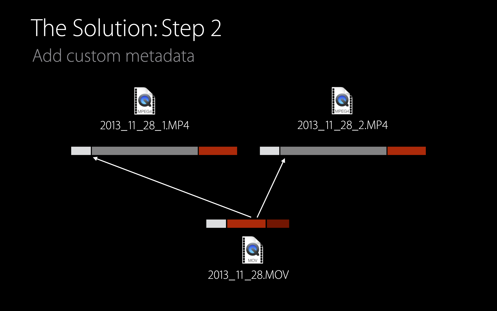

# [Editing Movies in AV Foundation](https://developer.apple.com/videos/play/wwdc2015/506/)

@ WWDC 15


### AVAsset and Its Edting Subclasses

AVAsset > AVComposition > AVMutableComposition

AVAsset > AVMovie > AVMutableMovie


### AVAssetTrack and Its Subclasses

AVAssetTrack > AVCompositionTrack > AVMutableCompositionTrack

AVMovieTrackc > AVMutableMovieTrack


### New Movie Editing Classes

* AVMoviee, AVMutableMovie
* AVMovieTrack, AVMutableMovieTrack
* AVMediaDataStorage


### QuickTime Movie Files

* A Sequence of boxes (<- box라는 표현을 사용해서 데이터들을 표현하더랑)

* File Type / Unused / Movie / Sample Data


### Movie Box

그 중에서도 Movie Box는 global settings, metadata, track information을 가짐

| Global Settings                                      | Movie Metadata                                       | Track Boxes                                                  |
| ---------------------------------------------------- | ---------------------------------------------------- | ------------------------------------------------------------ |
| Track count, duration, creation date, preferred rate | Copyright statement, Author, titlle, custom metadata | Track type, sample data location, track metadata, track associations |


### Track Box

트랙 박스는 샘플 데이터를 참조해서 트랙으로 정리한다. (Sample references) 또, 외부 샘플 데이터를 가리킬 수도 있다.


### Sample Reference Movie Files

* Provide a powerful workflow tool
* But sample reference movies are inherently fragile
* To help reduce that fragility, use relative URLs
* When it's time to deliver content, export it using AVAssetExportSession


### AVMovie

* AVMovie provides inspection and header-writing methods

  * Get a list of tracks in th movie
  * Retrieve the movie header from an existing file
  * Write a movie header into a new file

* `let movie = AVMovie(URL: inputURL, options: nil)`

* `let movie = AVMovie(data: inputData, options: nil)`

* Create a sample reference movie file

  ```swift
  let movies = AVMovie(URL: inputURL, options: nil)
  let options = AVMovieWritingOptions.TruncateDestinationToMovieHeaderOnly
  
  try movie.writeMovieHeaderToURL(outputURL, fileType: AVFileTypeQuickTimeMovie, options: options)
  ```


### AVMutableMovie

* AVMutableMovie adds editing methods:
  * Perform range-based track editing
  * Set track associations between tracks
  * Add or modify track metadata

* `func removeTimeRange(timeRange: CMTimeRange)`
* `func insertEmptyTimeRange(timeRange: CMTimeRange)`
* `func scaleTimeRange(timeRange: CMTimeRange, toDuration: CMTime)`
* `func insertTimeRange(timeRange, CMTimeRange, ofTrack: AVAssetTrack, atTiime: CMTime, copySampleData: Bool) throws`

* Setting the container for a track's new sample data

  ```swift
  track.mediaDataStorage = AVMediaDataStorage(URL: movURL, options: nil)
  ```


### AVMutableMovieTrack

* `func addTrackAssociationToTrack(movieTrack: AVMovieTrack, type: String)`

* `func removeTrackAssociatioinToTrack(movieTrack: AVMovieTrack, type: String)`

* Use case: using relative URLs to reference data

  ```swift
  let url = NSURL(fileURLWithPath: "/Users/monroe/tristo_boston/movies")
  
  for track in movies.tracks {
    track.sampleReferenceBaseURL = url
  }
  ```


### The Task: manage 1.5 terabytes of data

여기서 보여 줄 에제는 1.5 테라의 데이터를 어떻게 다룰 것인지!

* Step 1: Combine each sortie's MPEG-4 fiiles into one sampple reference movie file
* Step 2: Add indexing metadata as movie metadata
* Steep 3: Add GPS data as a timed metadata track

Do this all without modifying the original files and minimizing data copying





### Step 1

Combine camera files into a sample reference movie file

```swift
let movie = AVMutableMovie(URL: url1, options: nil)
let asset = AVURLAsset(URL: url2, options: nil)

let range = CMTimeRangeMake(kCMTimeZero, asset.duration)

try movie.insertTimeRange(range, ofAsset: asset, atTime: movie.duration, copySampleData: false)

try movie.writeMovieHeaderToURL(dstURL, fileType: AVFileTypeQuickTimeMovie, options: AVMovieWritingOptions.AddMovieHeaderToDestination)
```


### Step 2

Add custom metadata

```swift
var metadataArray = movie.metadata

var newItem = AVMutableMetadataItem()
newItem.identifier = "mdta/com.example.weather.wind"
newItm.locale = NSLocale.currentLocale()
newItem.value = averageWindSpedValue
newItem.extraAttributes = nil

metadataArray.append(newItem)
movie.metadata = metadataArray
```


### Step 3

Create a movie file containing location timed metadata

* See "Harnessing Metadata in Audiovisual Media", WWDC 2014
* Sample code: AVCaptureLocation and AVTmedAnnotationWriter


Add a timed metadata track for l!)

```swift
let vidTrack = movie.tracksWithMediaTye(AVMediaTypeVideo).first
let type = AVTrackAssociationTypeMetadataReferent

newTrack.addTrackAssociationToTrack(vidTrack, type)
```


### Summary

* New editing features pprovide accss to QuickTime movie file format
* Allows simplified editing workflows, especially when handling large amounts of data
* Sample code: `AVMovieEditor`

