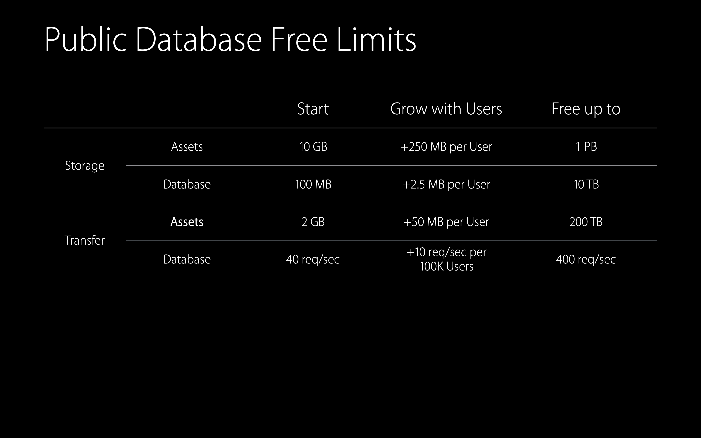

# [What's New in CloudKit](https://developer.apple.com/videos/play/wwdc2015/704/)

### CloudKit Architecture

* CloudKit Container
  * Private Database
    * User's private data
    * iCloud Photo Library
    * User's storage
  * Public Database
    * Application's public data
    * News
    * Developer's storage

### Public Database Offering

* Free offering

  

  * 유저가 많아질수록 free limit이 증가
  * free limit 초과시 과금

* Free structure

* Usage data

### CloudKit Dashboard

dashboard 이용해서 이것저것 볼 수 있다.

### CloudKit Web Services API

* Public and private database access
* Record operatoins
* Assets
* Query
* Subscriptions and notifications
* User discoverability
* Sync

### CloudKit JS

* Javascript API
* Matches native CloudKit API
* No intermediate servers
* New notes web app built with CloudKit JS

### CloudKit Web Service Offering

* iCloud Web-only accounts offer 1GB of storage for private database usage
* Public database usage is the same for iOS, OS X, and Web
* Requires a comparable application on iOS or OS X
* Available now in beta for development, releasing with iOS 9