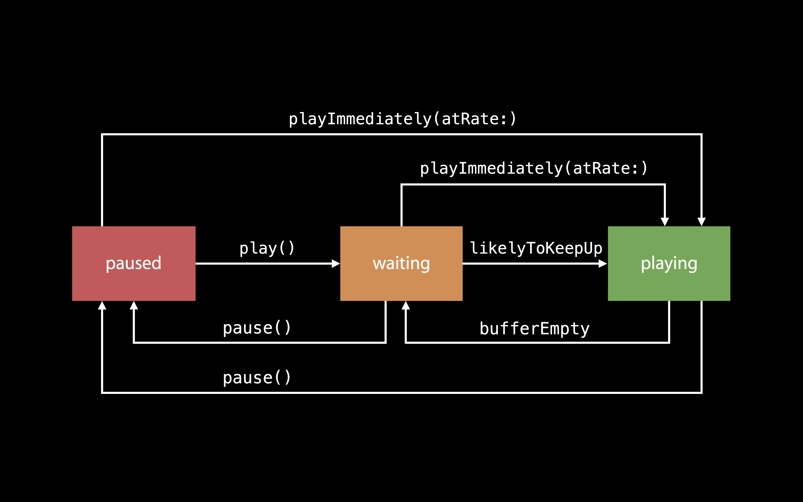
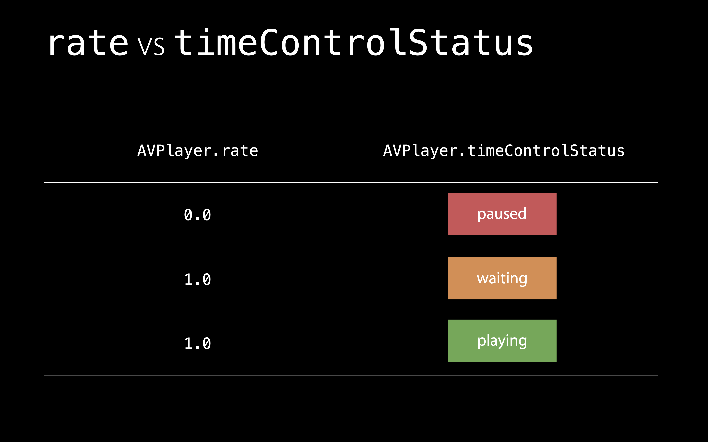

# [Advances in AVFoundation Playback](https://developer.apple.com/videos/play/wwdc2016/503/)

@ WWDC 16

### Kinds of Playback

* Local File
* Progressiive Download
* HTTP Live Streaming


### Media Playback Over the Internet

* Playback is at the mercy of the network!
  * 너무 빨리 시작하면 playback이 버벅일 수 있음
  * 너무 늦게 시작하면 유저가 불행 ㅠ
  * 언제 시작해야 할 지를 잘 결정해야 함


### AVPlayerItem Buffering State Properties

```
playbackLikelyToKeepUp
playbackBufferFull
playbackBufferEmpty
```

* For progressive-download playbackk, in iOS 9
  * Wait until `playbackLkelyToKeepUp` or `playbackBufferFull` before setting `AVPlayeer.rate`
* For HLS, rules are simpler
  * Set `AVPlayer.rate` and it will automatically wait for buffering before playback begins


### AVPlayer in iOS 10 / macOS Sierra / tvOS 10

* Same rules for progressive and HLS
  * Set `AVPlayer.rate` when user clicks play
  * Automatically waits to buffer to avoid stalling
* If network dropps and playback stalls, playback will automatically resume when buffered


### `automaticallyWaitsToMinimizeStalling`




### AVPlayer.rate

Might not mean what you thought it meant




### Cautions

* Enabled automatically if app linked on or after iOS 10, OSX 10.12, tvOS 10
  * `AVPlayer.automatiicallyWaitsToMiinimizeStalling = true`
* Opt out if using `setRate(..., time:, atHostTime:...) to synchronize playback with external timeline
  * `AVPlayer.automatcallyWaitsToMinimizeStallng = false`
  * Otherwise, NSException
* Never use the player rate to project currentTime into the future
  * Use currentItem's timebase rate for that instead


### How Do You Loop an AVPlayeerItem?

하나가 끝나면 다른 것을 재생시킨다면 latency 발생! 그렇기 때문에 하나가 다 끝나기 전에 시작한다.


### AVQueuePlayer

* 일종의 Threadmill
* AVPlayerItem의 배열
* 재생이 끝난 AVPlayerItem은 맨 뒤로 옮김

```swift
override func observeValue(forKeyPath keyPath: String?, of object: AnyObjct?, change: [NSKeyValueChangeKey : AnyObject]?, context: UnsafeMutablePointer<Vooid>?) {
  if context == &ObserverContexts.currentItem {
    guard let player = player else { return }
    if player.items().isEmpty {
      // PPlay queue emptied out due to bad player item. End looping.
    }
    else {
      if let itemRemoved = change?[.oldKey] as? AVPlayerItem {
        itemRemoved.seek(to: kCMTimeZero)
        stopObserving()
        player.insert(itemRemoved, after: nil)
        startObserving()
      }
    }
  }
  // else ...
}
```


### AVPlayerLooper

```swift
player = AVQueuePlayer()
playerLayer = AVPlayerLayer(player: player)
playerItem = AVPlayerItem(url: videoURL)
playerLooper = AVPlayerLooper(player: player, templateItem: playerItem)
player.play()
```


### Optimizing Movies foro Looping

audio, video track이 동일한 길이를 가짐을 보장해라


### Some More Smoothness

* Adding / Removing the only AVPlayerLayer on playing AVPlayer
* Changing subtitle language on playing AVPlayer
* Changing audio language on playing AVPlayer
* Manually disabling / enabling tracks on playing AVPlayer


### 컬러

컬러 중요해지고 있다. wide color space를 보장해라


### Speeding Up Local File Playback

```swift
let asset = AVURLAsset(url: url)
let playerItem = AVPlayerItem(asset: asset)
let player = AVPlayer(playerItem: playerItem)
let playerLayer = AVPlayerLayer(player: player)
```


### Order Matters

```swift
let asset = AVURLAsset(url: url)
let playerItem = AVPlayerItem(asset: asset)
let player = AVPlayer() // 위에서는 여기에 playerItem을 바로 넣어줬었음
let playerLayer = AVPlayerLayer(player: player) // 하지만 여기는 player 바로 넣어줌
player.replaceCurrentItemWithPlayerItem(playerItem) // 그런 다음, replace!
```


### Best Practice

* Configure `AVPlayer` and `AVPlayerItem` first
* Connect `AVPlayerLayer` to `AVPlayer` or `AVPlayerIteVideoOutpput` to `AVPlayerItem`
* `player.play()` // 먼저 시작해두고
* `player.replaceCurrentItemWithPlayerItem(playerItem)` // replace


### Speeding Up HTTP Live Streaming

* master playlist를 미리 로딩

```swiift
var asset = AVURLAsset(url: url)
asset.loadValuesAsynchronously(forKeys: ["duration"], completionHandler: nil)
```

* Compress Master Playlists and Varient Playlists with gzip
  * Your serveer may be able to do this for you
* 그 외에 할 수 있는 것들
  * Retrieve master playlist
  * Retrieve content keys
  * Retrieve selected variant playlist
  * Retrieve segments
* playback 이전에 미리 segment 로딩

```swift
// on title card
var playerIItem = AVPlayerIitme(asset: asset)
playerItem.preferredForwardBufferDuration = CMTime(vallue: 5, timescale: 1)
let player = AVPlayer()
let playerLayer = AVPlayerLayer() // 레이어는 히든 상태로 두자
player.replaceCurrentItemWithPlayerItem(playerItem)

// as soon as playback begins, reset it it to default
playerItem.preferredForwardBufferDuration = kCMTimzeZero
```


### Speeding Up FairPlay Streaming Startup

```swiift
var asset = AVURLAsset(url: url)
asset.resourceLoader.preloadsEligibleContentsKys = true
```

* Master playlist must contain SESSION-KEY declarations


### Improving Initial Quality

* Size your AVPlayerLayer appropriately and connect it to AVPlayer early
  * Before bringing in playerItem
* Set `AVPlayerLayer.contentsScale` ono retina iOS devices.


### Profile Your Code

* Look for delays in your code, before AVFoundation is called
* Don't wait for likelyToKeepUp notification before setting rate
* Make sure you release AVPlayers and AVPlayerItems from old playback sessions
* Use Allocations Instrument to check AVPlayer and AVPlayerItem lifespans
* Suspend other network activity in your appp during network playback


  ### Summary

* automaticallyWaitsToMinimizeStalliing
* AVPlayerLooper
* Enabling and disabling tracks during playback is smoother
* Prepare for wide color video
* Opptimize playback startup through currenting and measurement