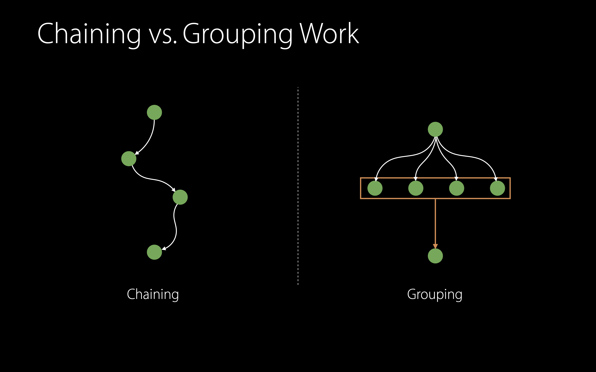

# [Concurrent Programming with GCD in Swift 3](https://developer.apple.com/videos/play/wwdc2016/720/)

### Concurrency

* Threads allow execution of code at the same time
* CPU cores can each execute a single thread at any given time
* Maintaining code invariants is more difficult with concurrency


### Dispatch Queues and Run Loops

디스패치 큐를 이용하면 스위프트의 클로저를 큐에 등록할 수 있다. 디스패치 큐는 작업을 수행하기 위해 스레드를 가져온다. 일반적인 스레드는 Run Loop을 가지고  있고, Main 스레드의 경우는 Main Run Loop과 Main 큐를 가지고  있다. 


### Asynchronous Execution

디스패치 큐에 여러 asynchronous 아이템이 등록되어 있다면 스레드를 가져와서 하나씩 처리한다.


### Synchronous Execution

synchronous 아이템을 처리하기 위해선 worker 스레드에서 다른 스레드로 넘어가서 처리를 한다. 이후 asynchronous 아이템 처리는 디스패치 큐의 worker 스레드에서 처리한다.


### Getting Work Off Your Main Thread

* Create a Dispatch Queue to whitch you submit work
* Dispatch Queues execute work items in FIFO order
* Use `.async` to execute your work on the queue

```swift
let queue = DispatchQueue(label: "com.example.imagetransform")

queue.async {
  let smallImage = iamge.resize(to: rect)
}
```


### Getting Back to Your Main Thread

* Dispatch main queue executes all items on the main thread
* Simple to chain work between queues

```swift
let queue = DispatchQueue(label: "com.example.imagetransform")

queue.async {
  let smallImage = iamge.resize(to: rect)
  
  DispatchQueue.main.async {
    imageView.image = smallImage
  }
}
```


### Controlling Concurrency

* Thread pool will limit concurrency
* Worker threads that block can cause more to spawn
* Choosing the right number of queues to use is important


### Structuring Your Application

* Identify areas of data flow in your application
* Split into distinct subsystems
* Queues at subsystem granularity


### Chaining vs. Grouping Work




### Grouping Work Together

아주 간단하게 DispatchGroup을 만들 수 있다.

`let group = DispatchGroup()`

`queue.async(group: group) { ... }`

`queue2.async(group: group) { ... }`

`queue3.async(group: group) { ... }`

`group.notify(queue: DispatchQueue.main) { ... }`


### Synchronizing Between Subsystems

* Can use subsystem serial queues for mutual exclusion
* Use `.sync` to safely access properties from subsystems
* Be aware of "lock ordering" introduced between subsystems 
  * 1 -> 2 -> 3 -> 1 이런 식으로 걸면 안 된다! deadlock

```swift
var count: Int {
  queue.sync { self.connections.count }
}
```


### Choosing a Quality of Service

* QoS provides explicit classification of work
* Indicates developer intent
* Affects execution properties of your work

#### QoS list 

* User Interactive
* User Initiated
* Utility
* Background


### Using Quality of Service Classes

* Use `.async` to submit work with a specific QoS class
* Dispatch helps resolve priority inversions
* Create single-purpose queues with a specific QoS class

```swift
queue.async(qos: .background) {
  print("Maintenance work")
}

queue.async(qos: .userInitiated) {
  print("Button tapped")
}
```


### DispatchWorkItem

* By default `.async` captures execution context at time of submission
* Create `DispatchWorkItem` from closures to control execution properties
* Use `.assignCurrentContext` to capture current QoS at time of creation

```swift
let item = DispatchWorkItem(flags: .assignCurrentContext) {
  print("Hello WWDC 2016!")
}

queue.async(execute: item)
```


### Waiting for Work Items

* Use `.wait` on work items to signal that this item needs to execute
* Dispatch elevates priority of queued work ahead
* Waiting with a `DispatchWorkItem` gives ownership information
* Semaphores and Groups do not admit a concept of ownership


### Swift 3 and Synchronization

(Synchronization is not part of the language in Swift 3)

* Global variables are initially atomically
* Class properties are not atomic
* Lazy properties are not initialized atomically

그렇기 때문에 우리는 동기화를 어떻게 시킬 수 있는지 알아야 한다! 동기화 시킬 포인트를 잘못 잡으면 앱에 크래쉬가 발생하거나 데이터가 잘못될 수 있다. 

> 세션 추천 > Thread Sanitizer and Static Analysis


### Traditional C Locks in Swift

* The Darwin module exposes traditional C lock types
  * correct use of C struct based locks such as `pthread_mutex_t` is incredibly hard


### Correct Use of Traditional Locks

* `Foundation.Lock` can be used safely because it is a class
* Derive an Objective-C base class with struct based locks as ivars

```objective-c
@implementation LockableObject {
  os_unfair_lock _lock;
}

- (instancetype)init ...;
- (void)lock		{ os_unfair_lock_lock(&_lock); }
- (void)unlock 	{ os_unfair_lock_lock(&_lock); }
@end
```


### Use GCD for Synchronization

이 방법이 lock을 사용하는 방법보다 더 좋은 방법!

* Use `DispatchQueue.sync(execute:)`
  * harder to misuse than traditional locks, more robust
  * better instrumentation (Xcode, assertions, ...)

```swift
class MyObject {
  private let internalState: Int
  private let internalQueue: DispatchQueue
  var state: Int {
    get {
      return internalQueue.sync { internalState }
    }
    set (newState) {
      internalQueue.sync { internalState = newState }
    }
  }
}
```

이 패턴은 간단하지만 다양한 상황에 확장해서 적용이 가능하다. 


### Preconditions

* GCD lets you express several preconditions
  * Code is running on a given queue
  * Code is not running on a given queue

```swift
dispatchPrecondition(.onQueue(expectedQueue))
dispatchPrecondition(.notOnQueue(unexpectedQueue))
```


### Object Lifecycle in a Concurrent World

1. Single threaded setup: 객체 생성, 객체 프로퍼티 설정
2. `activate` the concurrent state machine
3. `invalidate` the concurrent state machine
4. Single threaded deallocation

#### Setup

```swift
class BusyController: SubsystemObserving {
  init(...) { ... }
}
```

#### Activation

```swift
class BusyController: SubsystemObserving {
  init(...) { ... }
  
  func activate() {
    DataTransform.sharedInstance.register(observer: self, queue: DispatchQueue.main)
  }
}
```

#### Activate State Machine

```swift
class BusyController: SubsystemObserving {
  func systemStarted(...) { ... }
  func systemDone(...) { ... }
}
```

#### Deallocation

```swift
class BusyController: SubsystemObserving {
  deinit {
    DataTransform.sharedInstance.unregister(observer: self)
  }
}
```

#### Invalidation

```swift
class BusyController: SubsystemObserving  {
  private var invalidated: Bool = false
  
  func invalidate() {
    dispatchPrecondition(.onQueue(DispatchQueue.main))
    invalidated = true
    DataTransform.sharedInstance.unregister(observer: self)
  }
  
  func systemStarted(...) {
    if invalidated { return }
  }
  
  deinit {
    precondition(invalidated)
  }
}
```


### GCD Object Lifecycle

#### Setup

* Attributes and target queue
* Source handlers

```swift
let q = DispatchQueue(label: "com.example.queue", attributes: [[.autoreleaseWorkItem]])

let source = DispatchSource.read(fileDescriptor: fd, queue: q)

source.setEventHandler { /* handle your event here */ }
source.setCancelHandler { close(fd) }
```

#### Activation

* Properties of dispatch objects must not be mutated after activation
  * Queues can also be created inactive

```swift
extension DispatchObject {
  func activate()
}

let queue = DispatchQueue(label: "com.example.queue", attributes: [.initiallyInactive])
```

#### Cancellation

* Sources require explicit cancellation
  * Event monitoring is stopped
  * Cancellation handler runs
  * All handlers are deallocated

```swift
extension DispatchSource {
  func cancel()
}

let source = DispatchSource.read(fileDescriptor: fd, queue: q)
source.setCancelHandler { close(Fd) }
```

#### Deallocation Hygine

* GCD Objects expect to be in a defined state at deallocation
  * Activated
  * Not suspended


### Summary

* Organize your application around data flows into independent subsystems
* Synchronize state with Dispatch Queues
* Use the active/invalidate pattern