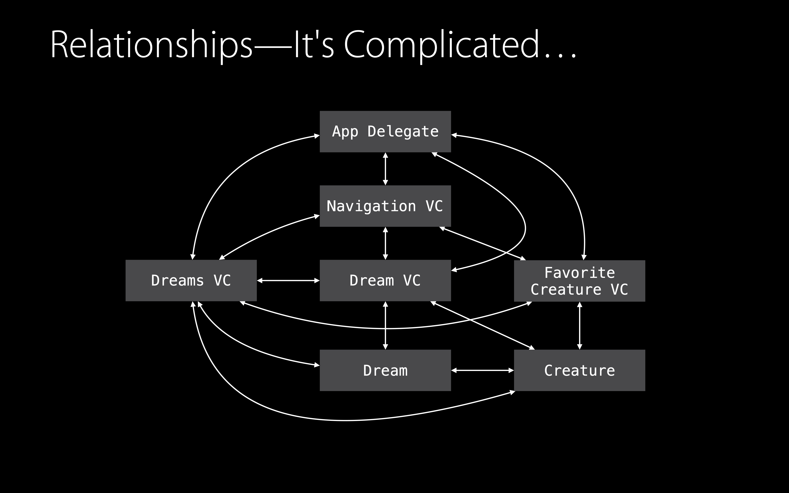
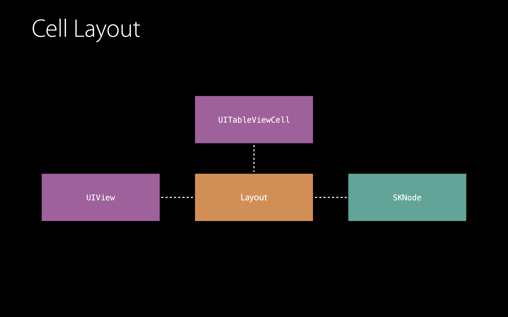
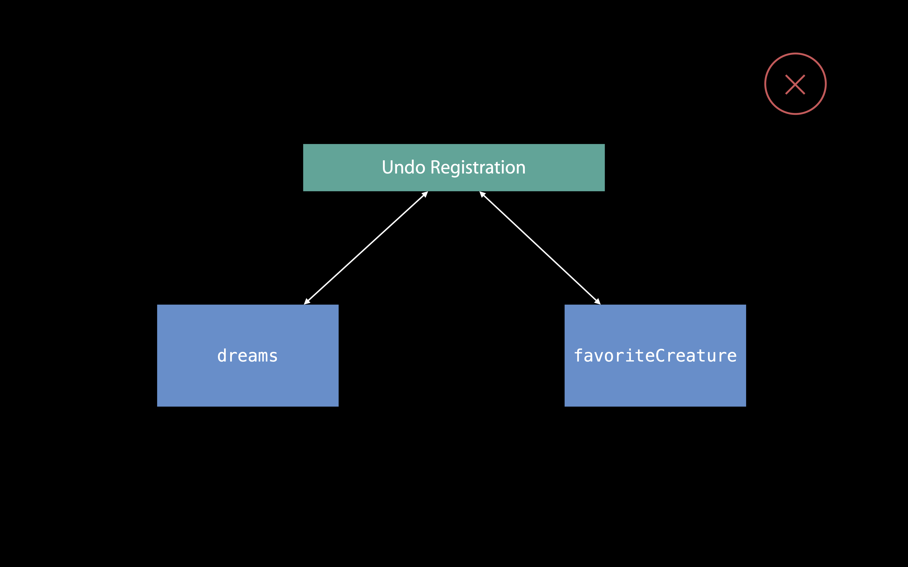
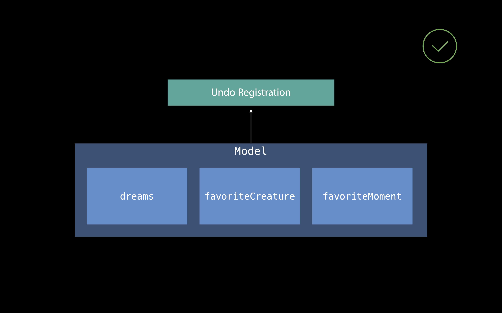
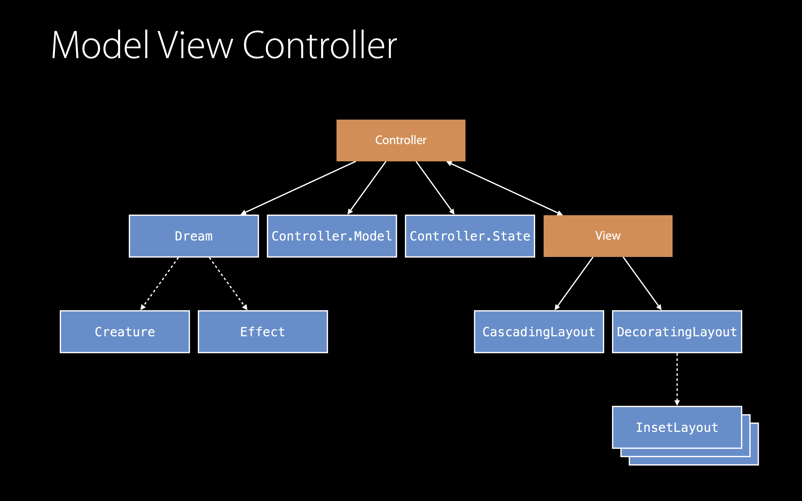

# [Protocol and Value Oriented Programming in UIKit Apps](https://developer.apple.com/videos/play/wwdc2016/419/)

@ WWDC 16


**Local Reasoning**

local reasoning이 뭐냐, 한 함수가 있다고 할 때 외부 코드들에 대해서는 생각할 필요가 없다는 것을 말함





이 앱의 현재 상태. 굉장히 복잡하다. 이를 점진적으로 개선시켜가면서 protocol과 value type에 대해 공부하는 것이 이번 세션의 목표!


### View

인터넷에서는 흔히 간단한 모델 타입들에 value 타입을 사용하라고 말하지만 이는 틀렸다! UIKit에서 value 타입을 어떻게 사용할 수 있을 지 살펴보자!




현재 cell은 UITableViewCell 이고 그 안에 UIView 들이 있을 수 있고, SKNode가 있을 수도 있다! 이걸 value 타입인 Layout을 이용해서 구조 변경을 해보자.


```swift
class DecoratingLayoutCell: UITableViewCell {
  var content: UIView
  var decoration: UIView
  
  // Perform layout...
}
```

이걸 struct로 바꿔보자.


```swift
struct DecoratingLayout {
  var content: UIView
  var decoration: UIView
  
  mutating func layout(in rect: CGRect) {
    // Perform layout...
  }
}

class DreamCell: UITableViewCell {
  ...
  override func layoutSubviews() {
    var decoratingLayout = DecoratingLayout(content: content, decoration: decoration)
    decoratingLayout.layout(in: bounds)
  }
}
```

이런 식으로 쪼끔 확장성이 생겼다. 이렇게 되면 다른 cell에서도 사용할 수 있고, 다른 뷰에서도 사용할 수 있겠지? 

```swift
func testLayout() {
  let child1 = UIView()
  let child2 = UIView()
  
  var layout = DecoratingLayout(content: child1, decoration: child2)
  layout.layout(in: CGRect(x: 0, y: 0, width: 120, height: 40))
  
  XCTAssertEqual(child1.frame, CGRect(x: 0, y: 5, width: 35, height: 30))
  XCTAssertEqual(child2.frame, CGRect(x: 35, y: 5, width: 70, height: 40))
}
```

그리고 이렇게 테스트도 가능할 거야!

Local Reasoning으로 우리는 좀 더 쉽게 이해할 수 있고, 쉽게 테스트할 수 있지!


근데 위에서 봤던 `DecoratingLayout`은 `content`와 `decoration`을 `UIView `타입으로 갖고 있어. 그럼 `SKNode` 를 `content` 나 `decoration` 으로 갖고 싶다면 또 하나의 Layout을 생성해야 돼. `NodeDecratingLayout` 이런 식으로.


하지만 이런 방법도 있지.

```swift
struct DecoratingLayout {
  var content: Layout
  var decoration: Layout
  
  mutating func layout(in rect: CGRect) {
    content.frame = ...
    decoration.frame = ...
  }
}

protocol Layout {
  var frame: CGRect { get set }
}

extension UIView: Layout {}
extension SKNode: Layout {}
```

layout을 설정해주기 위해서 우리는 `frame` 이 필요해. 그래서 `frame` 을 가지도록 하는 protocol, `Layout` 을 만들었고, 이걸 `content` 와 `decoration` 의 타입으로 사용했어.


근데 우리가 원하는 것과 약간 달라! 왜냐면 `content` 와 `decoration` 은 둘 다 `UIView` 이거나 `SKNode` 이기를 바라는데, 위의 코드에서는 `Layout` 프로토콜을 채택하고 있기만 하면 되거든.


```swift
struct DecoratingLayout<Child: Layout> {
  var content: Child
  var decoration: Child
  
  mutating func layout(in rect: CGRect) {
    content.frame = ...
    decoration.frame = ...
  }
}

protocol Layout {
  var frame: CGRect { get set }
}

extension UIView: Layout {}
extension SKNode: Layout {}
```

그래서 이렇게 Generic을 이용해서 `content` 와 `decoration`이 같은 타입이도록 만들어줬어.

Generic을 이용하면 타입들을 더 잘 컨트롤할 수 있고, 컴파일 타임에 좀 더 최적화를 시킬 수 있어.

자세한 정보는 Understanding Swift Performance를 참고하도록~~


Composition을 이용해서 우리는 코드를 local reasoning을 해치지 않고 재사용할 수 있어.

클래스 인스턴스는 힙 영역에 저장되고 비용이 비싸. 우리는 그래서 view의 composition이 아닌 value의 composition을 할거야. struct는 저렴하거든! composition은 value semantics와 함께할 때 더 좋아.


```swift
struct CascadingLayout<Child: Layout> {
  var children: [Child]
  mutating func layout(in rect: CGRect) {
    ...
  }
}

struct DecoratingLayout<Child: Layout> {
  var content: Child
  var decoration: Child
  mutating func layout(in rect: CGRect) {
    content.frame = ...
    decoration.frame = ...
  }
}

protocol Layout {
  var frame: CGRect { get set }
}
```

composition을 어떻게 해 줘야 할까? 먼저 `Layout` 프로토콜을 좀 바꿀거야.


```swift
protocol Layout {
  mutating func layout(in rect: CGRect)
}
```

이렇게!


```swift
extension UIView: Layout { ... }
extension SKNode: Layout { ... }

struct DecoratingLayout<Child: Layout, ...>: Layout { ... }
struct CascadingLayout<Child: Layout>: Layout { ... }
```

뺌~!!


```swift
let decoration = CascadingLayout(children: accessories)
var composedLayout = DecoratingLayout(content: content, decoration: decoration)
composedLayout.layout(in: rect)
```

이렇게 사용한다!


```swift
protocol Layout {
  mutating func layout(in rect: CGRect)
  
  var contents: [Layout] { get }
}
```

근데 contents가 UIView 이거나 SKNode거나 둘 중 하나였음 좋겠어. 그래서 `associatedtype` 을 이용할거야.

```swift
protocol Layout {
  mutating func layout(in rect: CGRect)
  associatedtype Content
  var contents: [Content] { get }
}

struct DecoratingLayout<Child: Layout, Decoration: Layout
								where Child.Content == Decoration.Content>: Layout {
  var content: Child
  var decoration: Decoration
  
  mutating func layout(in rect: CGRect)
  typealias Content = Child.Content
  var contents: [Content] { get }
}
```

이렇게 더 확장할 수도 있지~~! 또 이렇게 만든 Layout은 테스트하기도 쉬워


### Techniques

여기서 정리 한 번 할게욤

* Local reasoning with value types
* Generic types for fast, safe polymorphism
* Composition of values


### Controller - undo

undo를 하려고 할 때



이렇게 하지 말고



이렇게 하려고 해봐!


```swift
class DreamListViewController: UITableViewController {
  var dreams: [Dream]
  var favoriteCreature: Creature
  
	...
} // 이랬던 걸 아래처럼 모델로 분리시켜보쟈

struct Model: Equatable {
  var dreams: [Dream]
  var favoriteCreature: Creature
}
```

쭉쭉 계속해보겠습니다


```swift
class DreamListViewController: UITableViewController {
  ...
  func modelDidChange(old: Model, new: Model) {
    if old.favoriteCreature != new.favoriteCreature {
      tableView.reloadSections(...)
    }
    
    ...
    
    undoManager?.registerUndo(withTarget: self, handler: { target in
      target.model = old
    })
  }
}
```


### Benefits

요랬을 때 이점은

* Single code path
  * Better lcal reasoning
* Values compose well with other values


### Controller - UI state


```swift
class DreamListViewController: UITableViewController {
  var isInViewingMode: Bool
  var sharingDreams: [Dream]?
  var selectedRows: IndexSet?
  
  ...
}
```

이런 것들이 UI State다! 이런 State는 enum으로 관리해보자.


```swift
enum State {
  case viewing
  case sharing(dreams: [Dream])
  case selecting(selectedRows: IndexSet)
}

class DreamListViewController: UITableViewController {
  var state: State
  
  ...
}
```

그럼 value type이기에 가질 수 있는 이점들을 가져올 수 있어





### Techniques and Tools

* Customization through composition
* Protocols for generics, reusable code
* Taking advantage of value semantics
* Local reasoning <- 이건 어떤 언어를 사용하던 중요하니까 꼭 염두에 두고 프로그래밍하자구