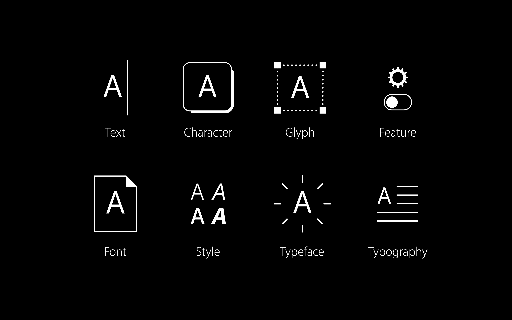
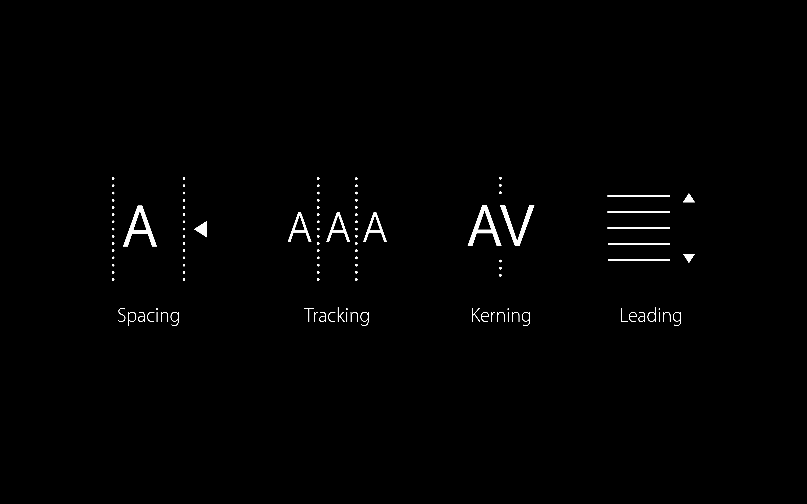
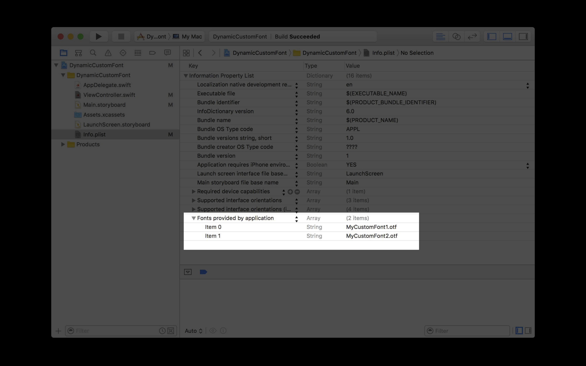
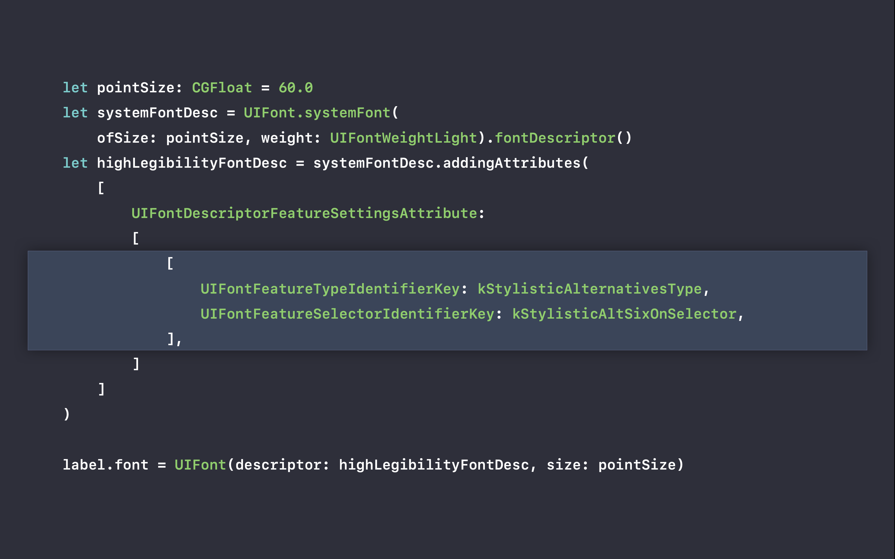
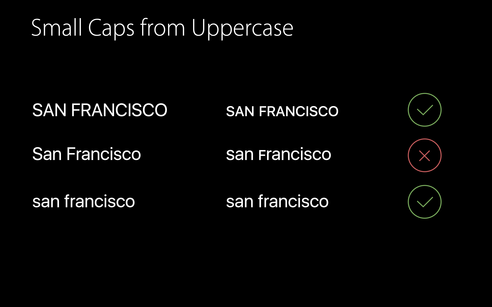
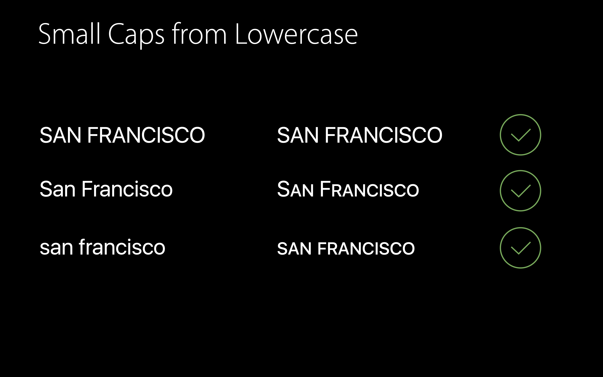
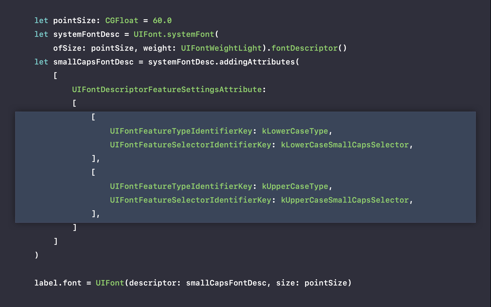

# [Typography and Fonts](https://developer.apple.com/videos/play/wwdc2016/803)

@ WWDC 16


## San Francisco

* Applied to all our platforms
* New SF Mono Family







## Concepts

* Legibility
* Scale
* Density
* Voice


## Tools

* System Font
* Dynamic Type
* Custom Fonts


### System Font

* Native to the platform

* APIs

  ```swift
  NSFont.systemFont(ofSize: 14)
  UIFont.systemFont(ofSize: 14)
  
  NSFont.systemFont(ofSize: 19, weight: NSFontWeightSemiBold)
  UIFont.systemFont(ofSize: 34, weight: UIFontWeightBlack)
  ```


### Dynamic Type

* Text Styles: `UIFont.preferredFont(forTextStyle:)`
* Content Size Categories
* With Text Styles APIs, Dynamic Type support is automatic


### Custom Fonts

1. Pick or bundle a font

   

2. Lookup table for the Content Size Categories

   ```swift
   let customDynamicType: [String: (pointSize: CGFloat, styleName: String, leading: CGFloat,  tracking: CGFloat)] = [
    UIContentSizeCategoryExtraSmall: (10.0, "Heavy", 3.0, 0.6),
   	UIContentSizeCategorySmall: (12.0, "Heavy", 2.0, 0.4), 
   	UIContentSizeCategoryMedium: (14.0, "Roman", 1.0, 0.2),
   	UIContentSizeCategoryLarge: (16.0, "Roman", 0.0, 0.0), 
   	UIContentSizeCategoryUnspecified: (16.0, "Roman", 0.0, 0.0), 
   	UIContentSizeCategoryExtraLarge: (17.0, "Roman", 0.0, 0.0), 
   	UIContentSizeCategoryExtraExtraLarge: (18.0, "Light", -1.0, 0.0), 
   	UIContentSizeCategoryExtraExtraExtraLarge: (19.0, "Light", -2.0, -0.1),
   	UIContentSizeCategoryAccessibilityMedium: (20.0, "Light", -3.0, -0.2), 
   	UIContentSizeCategoryAccessibilityLarge: (21.0, "Light", -4.0, -0.2),
   	UIContentSizeCategoryAccessibilityExtraLarge: (22.0, "Light", -4.0, -0.2), 
   	UIContentSizeCategoryAccessibilityExtraExtraLarge: (23.0, "Light", -4.0, -0.2),
   	UIContentSizeCategoryAccessibilityExtraExtraExtraLarge:  (24.0, "Light", -4.0, -0.2),
   ]
   ```

   

3. Override `traitCollectionDidChange`

   ```swift
   override func traitCollectionDidChange(_ previousTraitCollection: UITraitCollection?) {
     self.adjustFont(usedBy: self.label)
   }
   ```

   

4. Update your fonts and paragraph style

   ```swift
   func adjustFont(usedBy: UILabel) {
     let sizeCategory = self.traitCollection.preferredContentSizeCategory
     if let customFontForSizeCategory = self.customDynamicType[sizeCategory] {
       // ... actually adjust the fonts here...
     }
   }
   ```

   

5. Relayout


### Font Selection

* Easier sticking with one typeface at a time
* Understanding design intention helps in usage
* Consider defaults and knobs you can trust


## Details

### Alternates




### Small Caps






