# [Understanding Swift Performance](https://developer.apple.com/videos/play/wwdc2016/416/)

@ WWDC 16

이번 영상의 목표는 성능을 이해하기 위해서 구현을 이해하는 것!

Understand the implementation to understand performance


### Agenda

* Allocation
* Reference counting
* Method dispatch
* Protocol types
* Generic code


## Allocation

### Stack

* Decrement stack pointer to allocate
* Increment stack pointer to deallocate

스택의 성질을 생각해보면 쉽게 이해 가능. push, pop! 스택은 굉장히 간단한 자료구조이고 stack allocation은 굉장히 빠르다.

### Heap

* Advanced data structure
* Search for unused block of memory to allocate
* Reinsert block of memory to deallocate
* Thread safety overhead

힙은 동적인 생명주기를 갖게 하는 것과 같이 스택이 하지 못하는 것을 할 수 있게 해준다. 대신 더 복잡한 자료구조를 갖는다. 힙에 메모리를 할당하고자 하면, 힙 자료구조에서 적당한 사이즈의 사용할 수 있는 블락을 찾아야 한다. deallocate할 때도 해당 메모리를 적절한 위치에 다시 넣어줘야 한다. 이처럼 heap allocation에는 stack allocation이 간단했던 것과는 달리 할당과 관련된 비용이 든다. 여러 스레드에서 동시에 힙에 메모리를 할당하려고 할 수 있기 때문에 힙은 lock이나 다른 동기화 메커니즘을 이용해야 하고 이는 상당한 오버헤드다. 


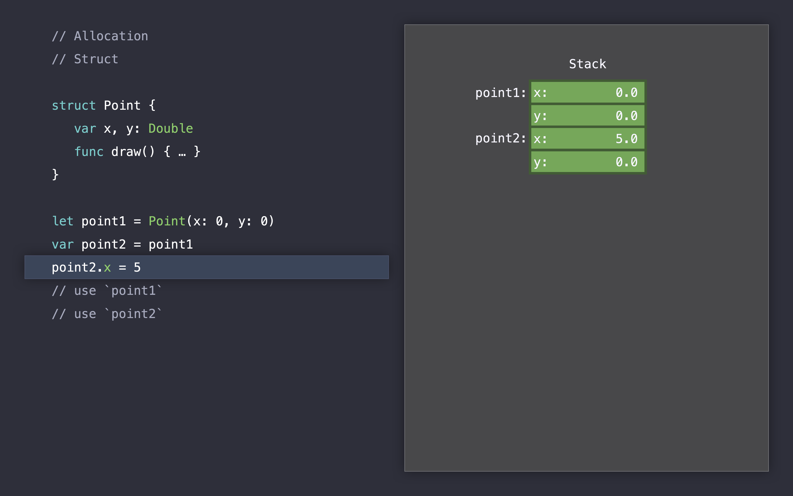

이 함수에 들어가서 어떤 코드도 실행하기 전에 이미 stack 영역에 point1과 point2를 위한 공간이 할당된다. point1이 있는 라인을 실행하면 이미 할당되어 있던 point1이 초기화되고, point2는 point1을 복사해서 초기화된다.  point2.x = 5를 실행하면 단순히 point2의 x만을 바꾼다. 이를 value semantics다! 해제할 땐 스택포인터를 증가시켜서 해제한다.


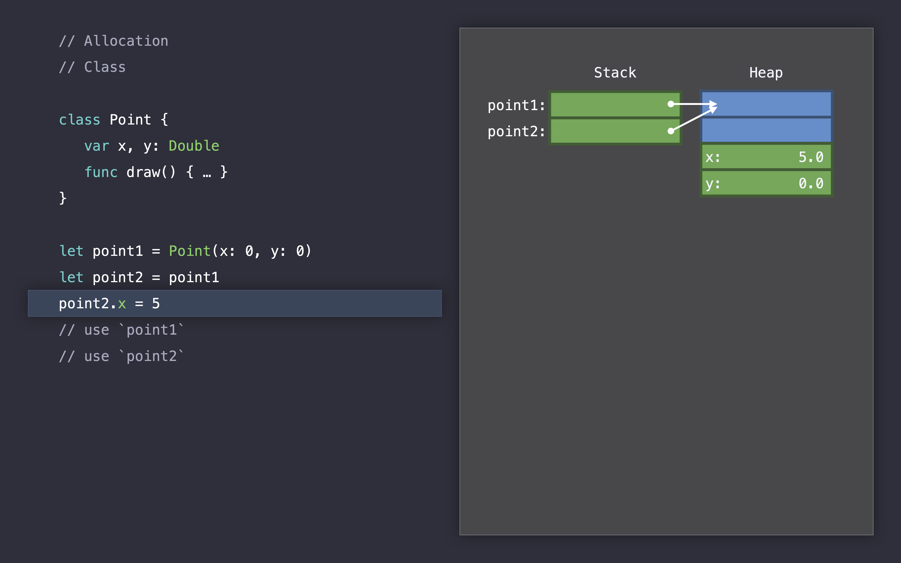

클래스를 이용했을 때도 struct를 이용했을 때와 같이 함수에 들어가면 메모리를 스택에 할당한다. 이 때 실제적인 Point의 메모리를 할당하는 것이 아니라 point1과 point2의 레퍼런스를 할당한다. (0, 0)을 생성할 때 스위프트는 힙을 lock하고 자료 구조에서 사용되지 않은 적절한 크기의 메모리 블락을 찾는다. 그리고 point1의 레퍼런스를 힙 영역에 있는 메모리의 주소로 초기화한다. struct를 사용할 때는 실제 크기대로 메모리에 할당했기 때문에 포인트를 할당할 때 2 워드만 사용했지만 클래스를 이용할 때는 4 워드가 할당된다. 관리를 위해서 2 워드가 더 할당된 것. 

point1이 초기화되고 난 다음 let point2 = point1 을 실행하면 point2는 point1의 레퍼런스를 복사한다. 그래서 point2와 point1이 완전히 같은 인스턴스를 참조하게 된다. 이것이 reference semantics다! 그리고 reference semantics는 의도하지 않게 state를 공유하게 할 수도 있다. 해제할 땐 스위프트가 힙에 lock을 걸고 메모리를 deallocate한 다음 메모리 블락을 다시 적절한 위치로 돌려놓는다. 그 다음 스택을 pop한다. 


```swift
// Modeling Techniques: Allocation

enum Color { case blue, green, gray }
enum Orientation { case left, right }
enum Tail { case none, tail, bubble }

var cache = [String : UIImage]()

func makeBalloon(_ color: Color, orientation: Orientation, tail: Tail) -> UIImage {
  let key = "\(color):\(orientation):\(tail)"
  if let image = cache[key] {
    return image
  }
  ...
}
```

위와 같이 caching을 하는 코드가 있다고 하자! String을 이용해서 key를 만드는 것은 그렇게 안전한 방법이 아니고, String은 Character를 저장할 때 간접적으로 heap allocation을 사용한다. 

그래서 이런 방식을 추천합니다!!

```swift
// Modeling Techniques: Allocation

enum Color { case blue, green, gray }
enum Orientation { case left, right }
enum Tail { case none, tail, bubble }

struct Attributes: Hashable {
  var color: Color
  var orientation: Orientation
  var tail: Tail
}

var cache = [Attributes : UIImage]()

func makeBalloon(_ color: Color, orientation: Orientation, tail: Tail) -> UIImage {
  let key = Attributes(color: color, orientation: orientation, tail: tail)
  if let image = cache[key] {
    return image
  }
  ...
}
```

String을 사용할 때보다 더 안전하고, 그 어떤 heap allocation도 없다!


## Reference Counting

* There's more to reference counting than incrementing, decrementing
  * Indirection
  * Thread safety overhead


아까 보았던 Point 코드의 reference counting을 보면 이런 느낌이다.

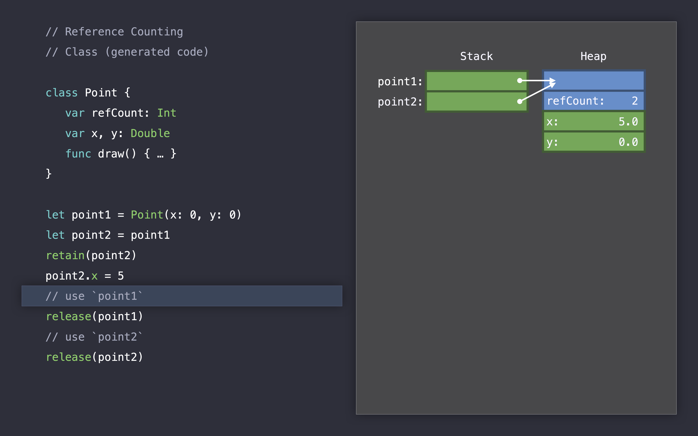

point1이 초기화될 때 refCount: 1, point2에 복사하고 retain되서 refCount: 2 이후 release되면서 refCount: 1, refCount: 0이 되고 refCount가 0이 되면 deallocate된다. struct는 reference를 하지 않기 때문에 reference counting을 하지 않는다.


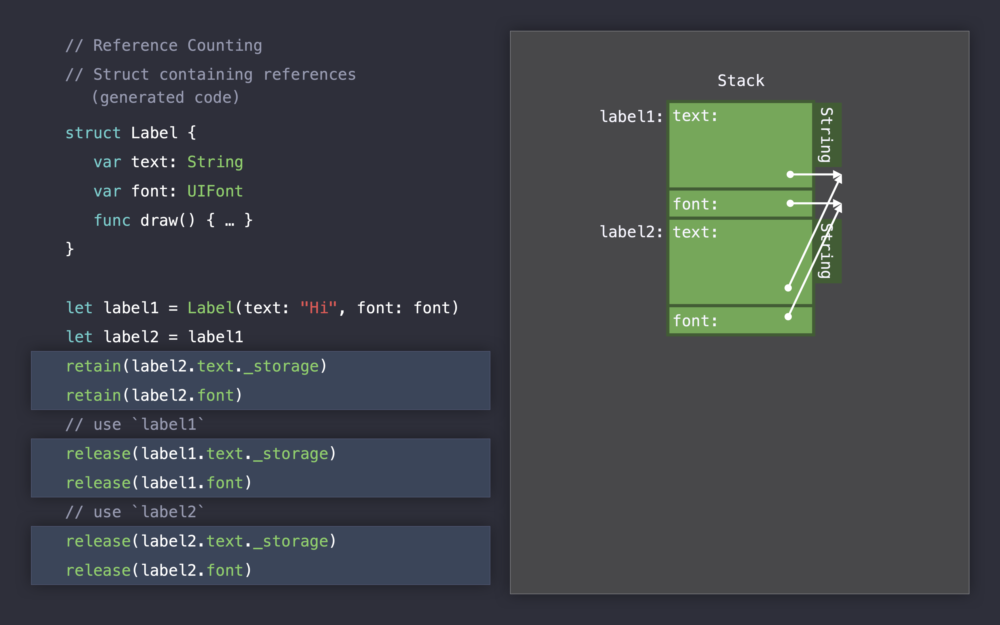

이런 경우에는 오버헤드가 많이 일어난다! struct를 사용하고 있긴 하지만 내부적으로 heap allocation이 일어나고 있기 때문에 reference counting도 많이 일어남.


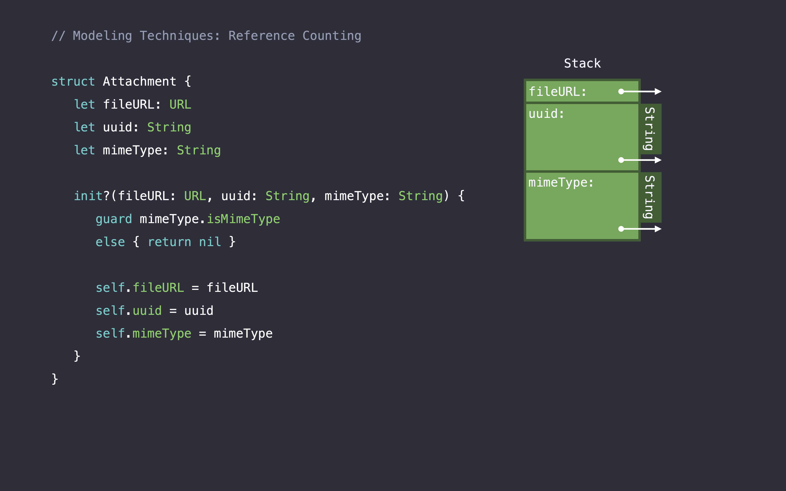

이런 구조는 어떻게 개선시킬 수 있을까? String은 앞서 말했다시피 struct이지만 내부 Character들이 heap에 할당되기 때문에 reference counting이 많이 일어난다. 


```swift
// Modeling Techniques: Reference Counting

enum MimeType: String {
  case jpeg = "image/jpeg"
  case png = "image/png"
  case gif = "image/gif"
}

struct Attachment {
  let fileURL: URL
  let uuid: UUID
  let mimeType: MimeType
  
  init?(fileURL: URL, uuid: UUID, mimeType: String) {
    guard let mimeType = MimeType(rawValue: mimeType) else { return nil }
    
    self.fileURL = fileURL
    self.uuid = uuid
    self.mimeType = mimeType
  }
}
```

uuid에는 UUID 타입을 이용하고, String 타입이었던 mimeType은 enum을 새로 만들어서 이용한다. 이렇게 함으로써 좀 더 안전하고 더 적은 reference counting을 한다! (성능이 더 좋아진다는 말이겠죠~!)


## Method Dispatch

### Static

* Jump directly to implementation at run time
* Candidate for inlining and other optimizations 
  * no call stack overhead!


### Dynamic

* Look up implementation in table at run time
* Then jump to implementation
* Prevents inlining and other optimizations


static dispatch와 dynamic dispatch 사이에는 엄청난 성능 차이가 있는 것은 아니고, 간접성 레벨이 하나 추가된다.  dynamic dispatch에는 스레드 동기화 오버헤드처럼 reference counting이나 heap allocation에서 있었던 오버헤드가 있는 것은 아니다. 하지만 컴파일 타임에서 optimization이 안 됨 ㅠ 이게 굉장히 중요한 포인트! 하나의 static dispatch와 하나의 dynamic dispatch 사이에는 큰 차이가 없지만 chaining할 경우에는 이 optimization 덕분에 많은 성능 차이가 있다. 

subclassing하지 않을 class에 대해서는 final 키워드를 붙여주자! 이렇게 하면 dynamic dispatch를 static dispatch로 바꿀 것이다.

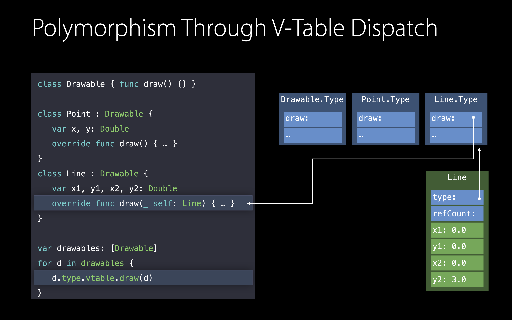

그럼 dynamic dispatch는 왜 쓸까?! polymorphism 때문이다. 


## Protocol Types

polymorphism을 inheritance나 reference semantics 없이 사용할 수 있는 방법이 있다. Protocol을 이용하는 것이다. 어떻게 이것이 가능하느냐! Existential Container를 이용하기 때문.


### Existential Container

* Inline Value Buffer: currently 3 words
* Large values stored on heap
* Reference to Value Witness Table (allocation, copy, destruction)
* Reeference to Protocol Witness Table


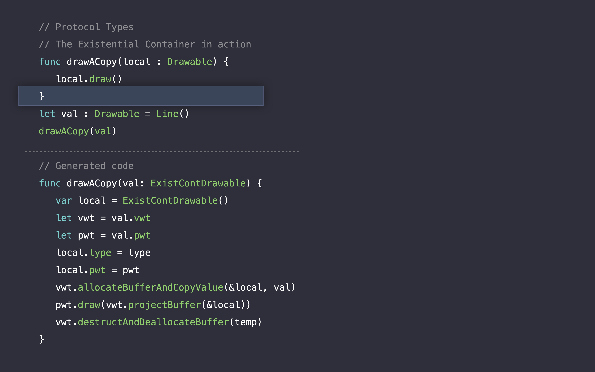

작동하는 순서는 아래에 있는 Generated code를 보면 된다. 


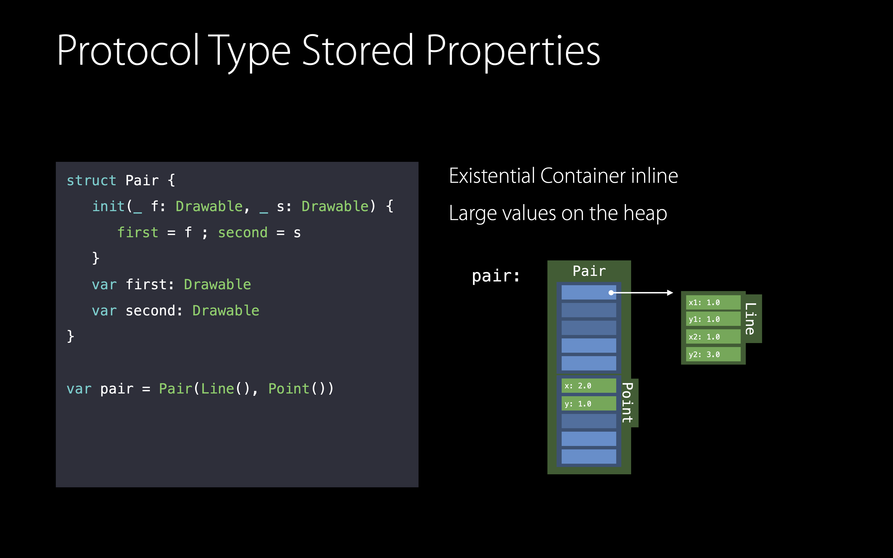

프로토콜 타입은 existential container로 표현되고, 크기가 작은 값들은 value buffer에, 크기가 큰 값은 레퍼런스로 저장한다.


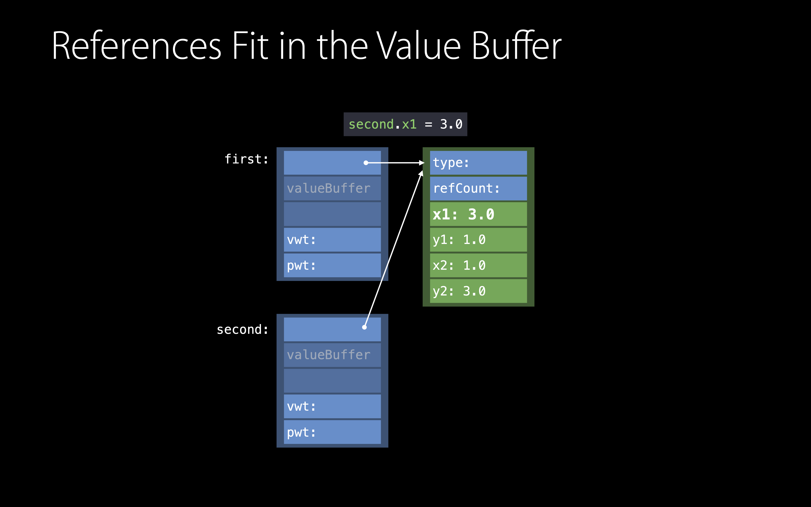

이런 값들을 복사하게 되면 copy-on-write 방식을 사용하게 된다. first와 second가 같은 레퍼런스를 가리키고 있다가 second.x1 = 3.0으로 값을 변경하게 되면 


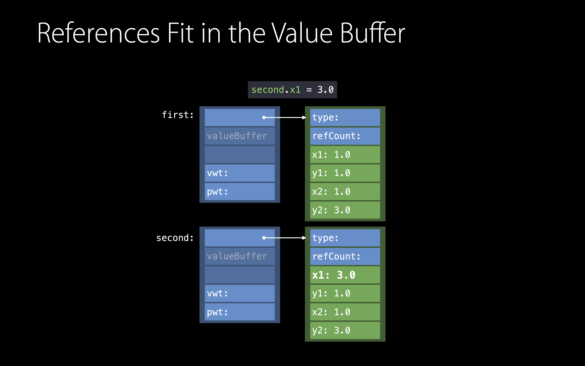

그때 새로운 메모리를 할당해서 복사한다.


### Indirect Storage with Copy-On-Write

```swift
class LineStorage { var x1, y1, x2, y2: Double }
struct Line: Drawable {
  var storage: LineStorage
  init() { storage = LineStorage(Point(), Point()) }
  func draw() { ... }
  mutating func move() {
    if !isUniquelyReferencedNoneObjc(&storage) { // unique하게 참조하고 있는 게 아닐 경우에는 새롭게 할당한다.
      storage = LineStorage(storage)
    }
    storage.start = ...
  }
}
```


### Small Value

* Fits in Value Buffer: no heap allocation
* No reference counting
* Dynamic dispatch through Protocol Witness Table (PWT)


### Large Value

* Heap allocation
* Reference counting if value contains references


### Summary

* Dynamic polymorphism
* Indirection through Witness Tables and Existential Container
* Copying of large values causes heap allocation


## Generic Code

* Static polymorphism
* One type per call context
* Type substituted down the call chain


### Implementation of Generic Methods

* One shared implementation
* Uses Protocol/Value Witness Table
* One type per call context: passes tables


### Storage of Local Variables

```swift
func drawACopy<T: Drawable>(local: T) {
  local.draw()
}

drawACopy(Point(...))
drawACopy(Line(...))
```

* Value Buffeer: currently 3 words
* Small values stored inline
* Large values stored on heap


그럼 실제로 Generic을 사용하면 더 빨라?

### Specialization of Generics

* Static polymorphism: uses type at call-site
* Creates type-specific version of method
* Version per type in use
* Can be more compact after optimization


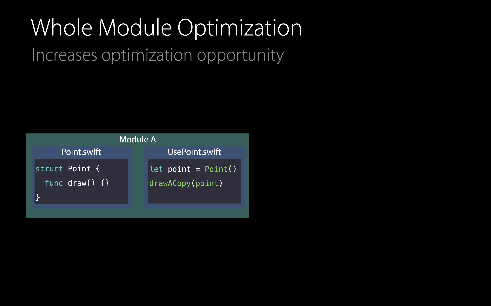

whole module optimization을 이용해서 더 최적화를 시킬 수 있다. Xcode6부터 기본!


### Generic Stored Properties

```swift
struct Pair<T: Drawable> {
  init(_ f: T, _ s: T) {
    first = f
    second = s
  }
  
  var first: T
  var second: T
}

var pair = Pair(Line(), Line())
```

* Type does not change at runtime
* Storage inline!!!!


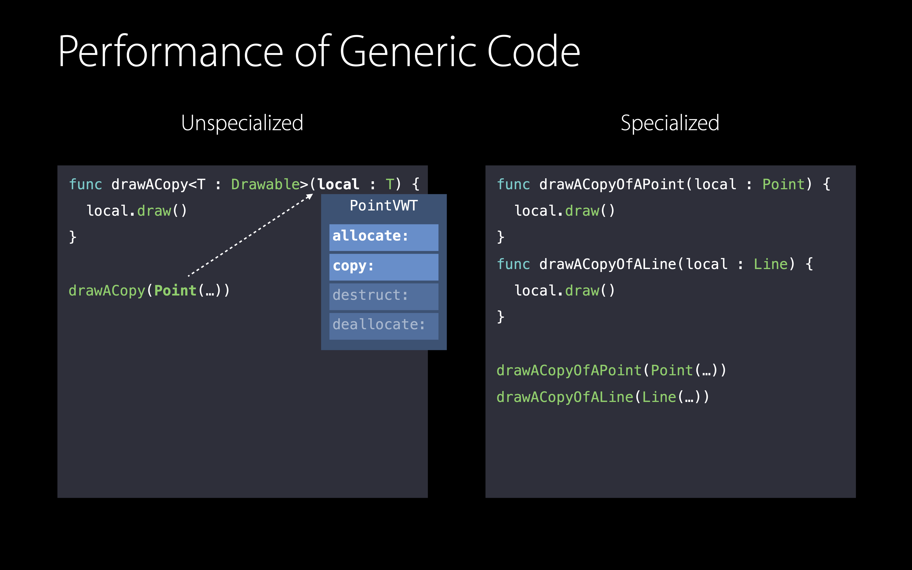


### Specialized Generics - Struct Type

* Performance characteristics like struct types
  * No heap allocation on copying
  * No reference counting
  * Static method dispatching


### Specialized Generics - Class Type

* Performance characteristics like class types
  * Heap allocation on creating an instance
  * Reference counting
  * Dynamic method dispatch through V-Table


### Unspecialized Generics - Small Value

* No heap allocation: value fits in Value Buffer
* No reference counting
* Dynamic dispatch through Protocol Witness Table


### Unspecialized Generics - Large Value

* Heap allocation (use indirect storage as a workaround)
* Reference counting if value contains references
* Dynamic dispatch through Protocol Witness Table


## Summary

* Choose fitting abstraction with the least dynamic runtime type requirements
  * struct types: value semantics
  * class type: identity or OOP style polymorphism
  * Generics: static polymorphism
  * Protocol types: dynamic polymorphism
* Use indirect storage to deal with large values