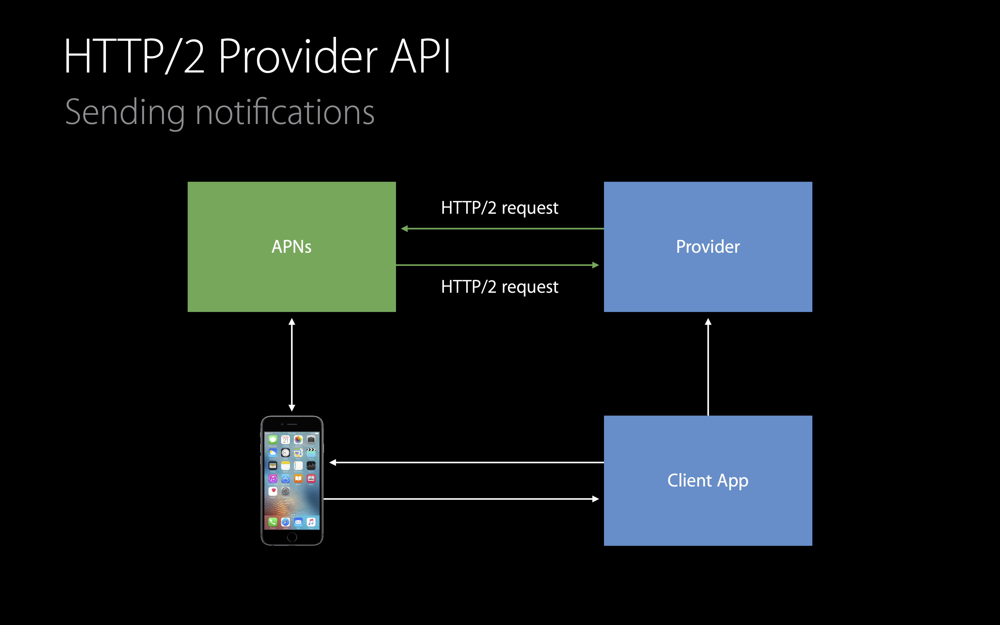

# [What's New in Apple Push Notification Service](https://developer.apple.com/videos/play/wwdc2016/724/)

@ WWDC 16

APNS라고 불리는 Appple Push Notification Service에 추가된 기능들을 살펴보자.

### Review

작년에 릴리즈된 새로운 기능들은 다음과 같다.

* HTTP/2 provider API
* Instant feedback
* Larger payload
* Simplified certificate handling

### Sending Notification

노티피케이션의 전송 이전에 developer account에 등록해야 한다. 

1. 디바이스는 앱을 대신해 APNS로부터 토큰을 요청한다. 
2. 디바이스는 앱에 토큰을 반환한다. (이 토큰은 앱에서 unique하다.)
3. 앱은 이 토큰을 provider로 넘긴다. 
4. provider service는 client certificate를 이용해 APNS에 연결된다. (표준 HTTP/2 post request 사용)
5. 별 이슈 없이 성공하면 즉각적인 응답을 보냄 (이 때 push request의 유효성을 검사)

### Simplified Certificate Handling

* Application push
* VoIP push
* Complication push
* Development and production environment

### Token Authentication

새로운 authentication 방식인 token authentication이 도입된다.

* Simplified provider authentication when connecting to APNs
* Secure
* Easy to generatee
* No more expired certificates!

### Certificate Authentication

기존의 certificate authentication은 account에서 발급받은 certificate을 상호 검증해야 했다.

### Token Authentication

token authentication을 이용하면 client certificate 없이 TLS connection을 만들 수 있다. 모든 notification message는 authentication token을 가진다. 

1. token을 이용해 provider를 authenticate하고 request를 진행
2. request가 성공적으로 진행되면 success를 알리는 response를 보냄

#### Detail

* Provision signing key via Developer Account
* Construct the token
* Sign token using ES256(ECDSA using P256 curve, SHA256 hash)
* Signed tokens need to be generated periodically
* Signing key does not expire
* Signing key can be revoked through your Account