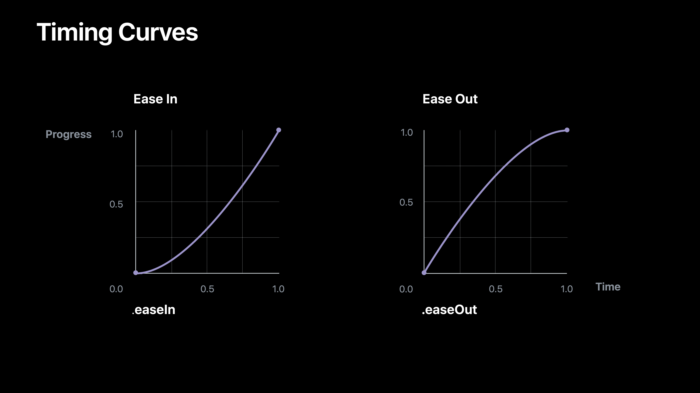
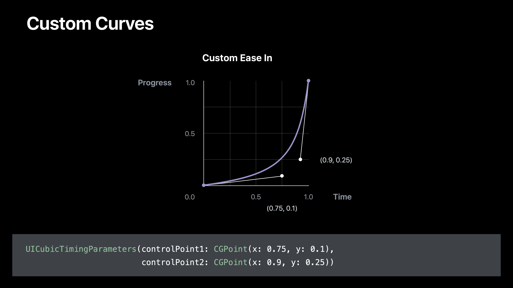
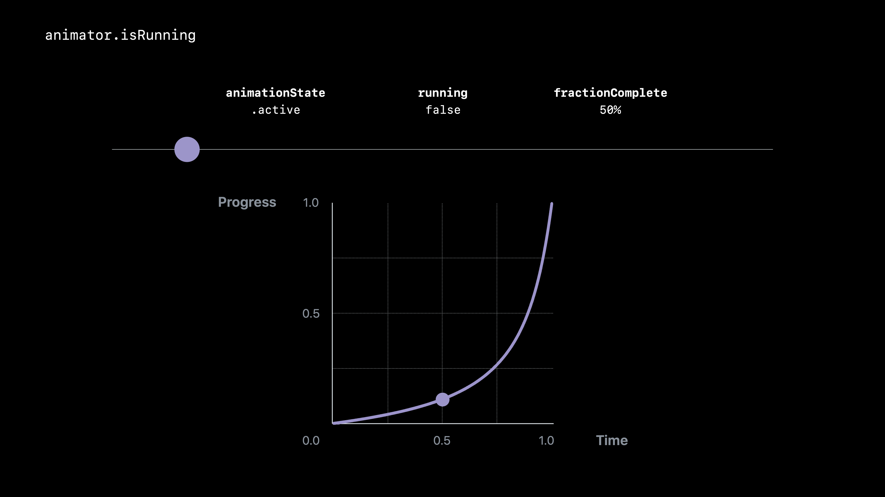
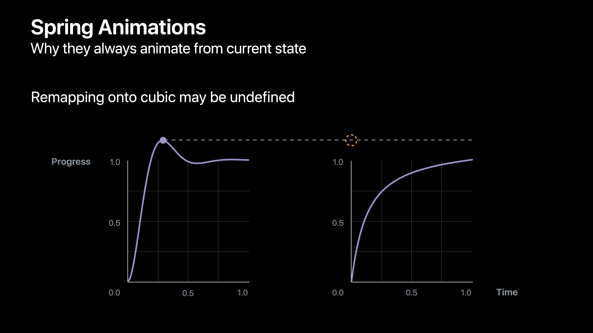
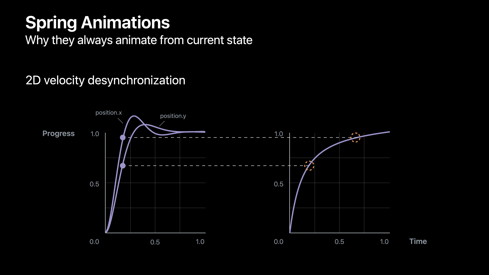
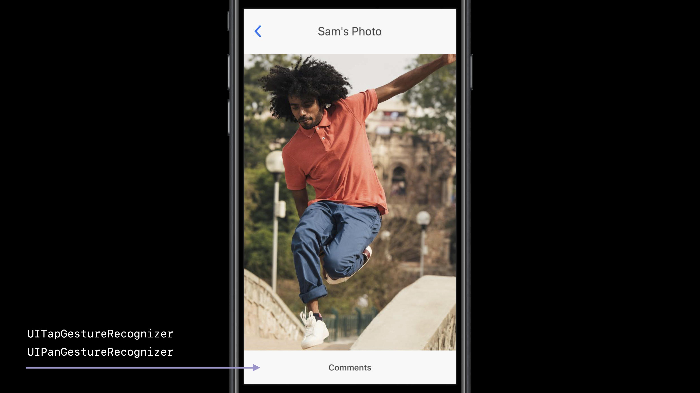
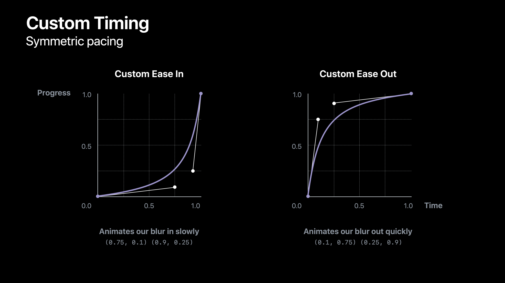
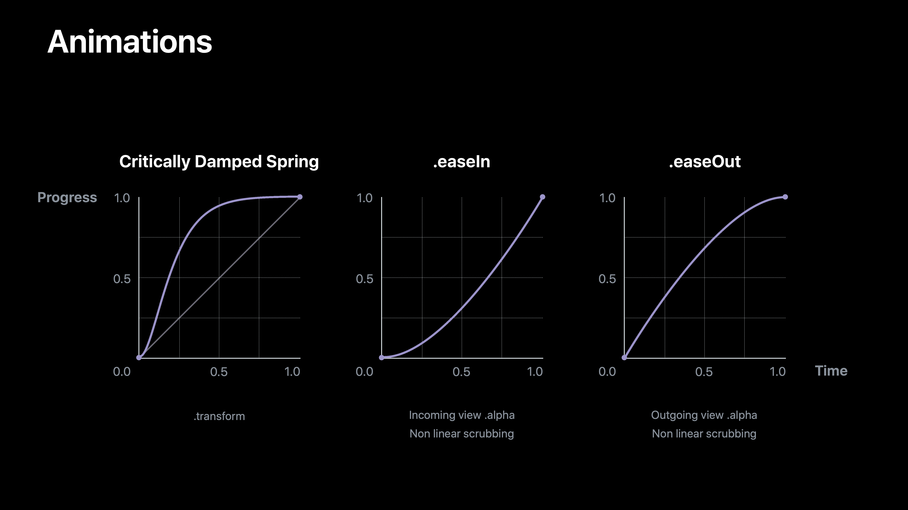
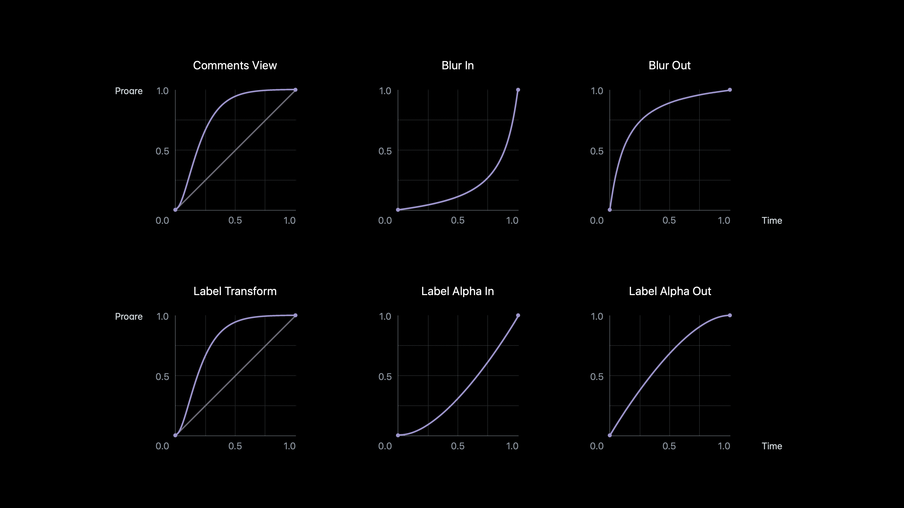

# [Advanced Animations with UIKit](https://developer.apple.com/videos/play/wwdc2017/230/)

@ WWDC 17

 

## Basics

### UIView-based Animations

```swift
UIView.animate(withDuration: 5, animations: {
  circle.frame = circle.frame.offsetBy(dx: 100, dy: 0)
}, completion: nil)
```


### UIViewPropertyAnimator

* Custom timing
* Interactive
* Interruptible
* Responsive


### UIViewPropertyAnimator

```swift
let animator = UIViewPropertyAnimator(duration: 2.5, curve: .linear) {
  circle.frame = circle.frame.offsetBy(dx: 100, dy: 0)
}
animator.startAnimator()
```


### Timing Curves




### Custom Curves




### Interactively animating

```swift
var animator: UIViewPropertyAnimator!

func handlePan(recognizer: UIPanGestureRecognizer) {
  switch recognizer.state {
    case .began:
    	animator = UIViewPropertyAnimator(duration: 1, curve: .easeOut, animations: {
        circle.frame = circle.frame.offsetBy(dx: 100, dy: 0)
      })
    	animator.pauseAnimation()
    case .changed:
    	let translation = recognizer.translation(in: circle)
    	animator.fractionComplete = translation.x / 100
    case .ended:
    	animator.continueAnimation(withTimingParameters: nil, durationFactor: 0)
  }
}
```


### Time Conversion

* Pausing: linear line 이용
* Continuing: linear line의 progress에 대응되는 지점에서 다시 시작


## Interactive and Interruptible Animations

### Interrupting an Animation

```swift
func animateTransitionIfNeeded(duration: TimeInterval) { ... }

var progressWhenInterrupted: CGFloat = 0

func handlePan(recognizer: UIPanGestureRecognizer) {
  switch recognizer.state {
    case .began:
    	animateTransitionIfNeeded(duration: 1)
    	animator.pauseAnimation()
    	progressWhenInterrupted = animator.fractionComplete
    case .change:
    	let translation = recognizer.translation(in: circle)
    	animator.fractioinComplete = (translation.x / 100) + progressWhenInterrupted
    case .ended:
    	let timing = UICubicTimingParameters(animationCrve: .easeOut)
    	animator.continueAnimatioin(withTimingParameters: timing, durationFactor: 0)
  }
}
```


## New Animator Behaviors

### UIViewPropertyAnimator

```swift
var scrubsLinearly: Bool
var pausesOnCoompletion: Bool
```

* `.scrubsLinearly`

* `.pausesOnCompletion`

  ```swift
  anmator.addObserver(self, forKeyPath: "running", options: [.new], context: nil)
  ```


### Starting as Paused

```swift
let animator = UIViewPropertyAnimator(duration: 1, curve: .easeIn)
animator.startAnimation()
// ...
animator.addAnimations {
  // will rn immediately
  circle.frame = circle.frame.offsetBy(dx: 100, dy: 0)
}
```

* No escaping for animation blocks


## Springs

### Spring Animations









### Best Practices When Interrupting Springs

* Stop and create a new property animator
* Use critically damped spring without velocity
* Decompose component velocity with multiple animators


## Coordinating Animations

### Overview

* Build a fully interactive, interruptible animated transition
* Coordinate across multiple uniquely timed animators




```swift
// Trakcs all running animators
var runningAnimators = [UIViewPropertyAnimators]()

// Perform all animations with animator if not already ruunning
func animateTransitionIfNeeded(state: State, duration: TimeIinterval) {
	if runningAnimators.isEmpty {
    let frameAnimator = UIViewPropertyAnimator(duration: duration, dampingRatio: 1) {
      switch state {
      case .Expanded:
        self.control.frame = CGRect(...)
      case .Collapsed:
        self.control.frame = CGRect(...)
      }
    }
    frameAnimator.startAnimation()
    runningAnimators.append(frameAnimator)
  }
}

// Starts transition if necessary or reverses it on tap
func animateOrReverseRunningTransitioin(state: State, duration: TimeInterval) {
	if runningAnimators.isEmpty {
    animateTransitionIfNeeded(state: state, duration: duration)
  } else {
    for animator in runningAnimators {
      animator.isReversed = !animator.isReversed
    }
  }
}

// Starts transition if necessary and pause on pan .begin
func startInteractiveTransition(state: State, duration: TimeInterval) { ... }

// Scrubs transition on pan .changed
func updateInteractiveTransitiion(fractionComplete: CGFloat) { ... }

// Coontnues or reverse transition on pan .ended
func continueInteractiveTransition(cancel: Bool) { ... }
```


### UIVisualEffectView

```swift
class UIVisualEffectView: UIView {
  var effect: UIVisualEffect // animatable
}

class UIBlurEffect: UIVisualEffect {
  init(style: UIBlurEffectStyle)
}

class UIVibrancyEffect: UIVisualEffect {
  init(blurEffect: UIBlurEffect)
}
```

```swift
func animateTransitionIfNeeded(forState state: State, duration: TimeInterval) {
  // ...
  let blurAnimator = UIViewPropertyAnimator(duration: duration, dampingRatio: 1) {
    switch state {
    case .Expanded:
      self.blureffectView.effect = UIBlurEffect(style: .dark)
    case .Collapsed:
      self.blurEffectView.effect = nil
    }
  }
  blurAnimator.startAnimation()
  runningAnimators.append(blurAnimator)
}
```


### Custom Timing



```swift
fnc animateTransitionIfNeeded(forState state: State, duration: TimeInterval) {
  // ...
  let timing: UITimingCurveProvider
  switch state {
  case .Expanded:
    timing = UICubicTimingParameters(controlPoint1: CGPoint(x: 0.75, y: 0.1),
                                     controlPoint2: CGPoint(x: 0.9, y: 0.25))
  case .Collapsed:
    timing = UICubicTimingParameters(controlPoint1: CGPoint(x: 0.1, y: 0.75),
                                     controlPoint2: CGPoint(x: 0.25, y: 0.9))
  }
  let blurAnimator = UIIViewPropertyAnimator(duration: duration, timingParameters: timing)
  blurAnimator.scrubsLinearly = false
}
```


### View Morphing

* Scaling, translation, and opacity blending of two views


### Strategy

* `.transform: CGAffineTransform`
* Compute `transform.scale` and `transform.translation`
* Prepare vieews and animate `.transform` and `.alpha`


### Animations



```swift
func animateTransitionIfNeeded(forState state: State, duration: TimeInterval) {
  // ...
  let transformAnimator = UIViewPropertyAnimator(duration: duratioin, dampingRatio: 1) {
    iinLabel.transform = CGAffineTransform.identity
    outLabel.transform = inLabelScale.concatenating(inLabelTranslation)
  }
  // ...
  let inLabelAnimator = UIViewProperttyAnimator(duration: duration, curve: .easeIn) {
    inLabel.alpha = 1
  }
  inLabelAnimator.scrubsLinearly = false
  // ...
  let outLabelAnimator = UIViewPropertyAnimator(duration: duration, curve: .easeOut) {
    outLabel.alpha = 0
  }
  outLabelAnimator.scrubsLinearly = false
}
```




## Tips and Trcks

### Animating Corner Radius

#### `.cornerRadus`

: Now animatable in UIKit

```swift
circle.clipsToBounds = true
UIViewPropertyAnimator(duration: 1, curve: .linear) {
  circle.layer.cornerRadius = 12
}.startAnimation()
```

#### `.maskedCorners`

```swift
circle.layer.maskedCorners = [.layerMiinXMnYCorner, .layerMaxXMinYCorner]
```


```swift
func animateTransitionIfNeeded(forState state: State, duration: TimeInterval) {
  // ...
  let cornerAnimator = UIViewPropertyAnimator(duration: duration, curve: .linear) {
    switch state {
    case .Expanded:
      self.control.layer.cornerRadius = 12
    case .Collapsed:
      self.control.layer.cornerRadius = 0
    }
  }
}
```


### Keyframe Animations

UIView

```swift
func animateKeyframes(withDuration duration: TimeInterval, delay: TimeInterval, options: ..., animatiions: ..., completion: ...)

func addKeyframe(withRelativeStartTime frameStartTime: Double, relativeDuration frameDuration: Double, animations: ...)
```

```swift
func animateTransitionIfNeeded(forState state: State, duration: TimeInterval) {
  // ...
  let buttonAnimator = UIViewPropertyAnimator(duration: duration, curve: .linear) {
    UIView.animateKeyframes(withDuration: 0.0, delay: 0.0, options: [], animations: {
      switch state {
      case .Expanded:
        UIView.addKeyframe(wthRelativeStartTime: 0.5, relativeDuration: 0.5) {
          // Start with delay and finish with rest of animations
          detailButton.alpha = 1
        case .Collapsed:
          UIView.addKeyframe(withRelativeStartTime: 0.0, relativeDuration: 0.5) {
            detailButton.alpha = 0
          }
        }
      }
    }, completion: nil)
  }
}
```


### Additve Animations

```swift
let animator = UIViewPropertyAniimator(duration: 5, curve: .easeInOut) {
  square.transform = CGAffineTransform(rotationAngle: CGFloat(Double.pi * 20))
}
animator.startAnimation()
```

위의 코드로 실행 시키게 되면 square는 움직이지 않는다. 최종 결과에 대해서 애니메이션이 먹히는 것이기 때문.

#### Options

* Use Core Animation
  * Low level
  * No scrubbing
* Decompose into several smaller additive rotation animations


### Additvely Animatable Properties

```swift
var transform: CGAffneTransform
var frame: CGRect
var bounds: CGRect
var center: CGPoint
var position: CGPoint
```


### Decomposed Additive Animations

```swift
let animator = UIViewPropertyAnimator(duration: 5, curve: .easeInOut, animations: {
  forr _ in 0 ..< 20 {
    let rotatioin = CGAffineTransform(rotationAngle: CGFloat(Double.pi))
    square.transform = square.transform.cooncatenating(rotation)
  }
})
animator.startAnimation()
```


## Summary

* Modern methods for making animations interactive and interruptive
* Coordinating several animations during interactive transition