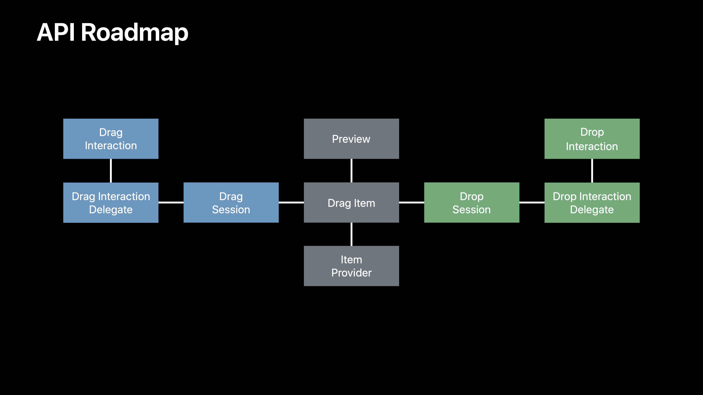
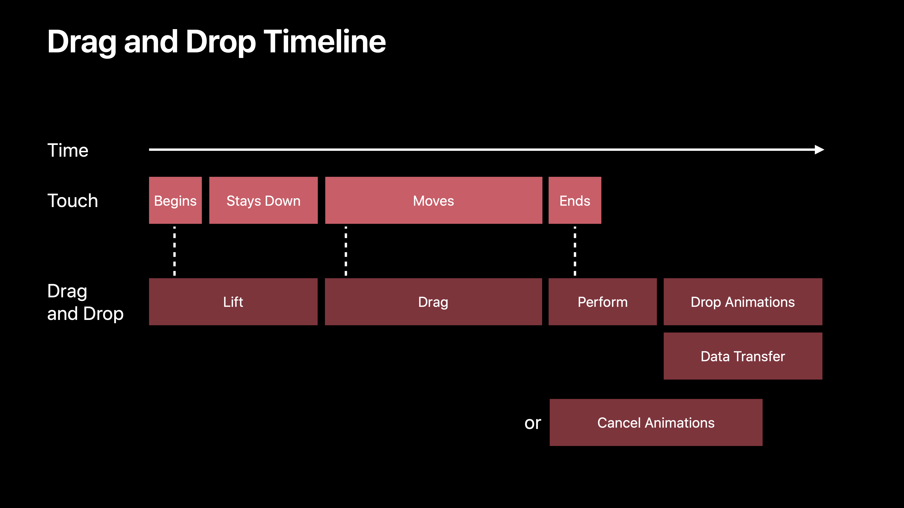
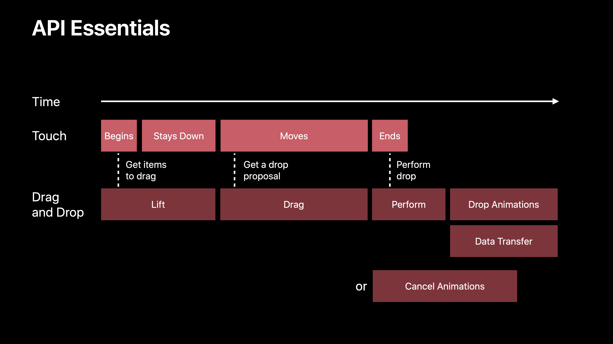
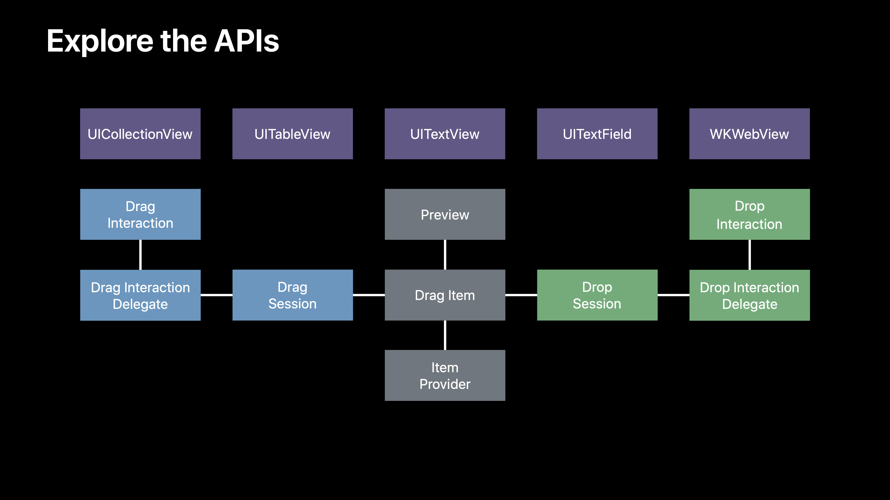

# [Introducing Drag and Drop](https://developer.apple.com/videos/play/wwdc2017/203/)

@ WWDC 17


### Phases of a drag session

Lift ➣ Drag ➣ Set Down ➣ Data Transfer 순으로 진행됨

| Lift         | Drag           | Set Down  | Data Transfer                               |
| ------------ | -------------- | --------- | ------------------------------------------- |
| Long Press   | Previews       | Cancel    | Representations                             |
| Lift preview | Tap to add     | Drop      | Lazy delivery (Background, By File Provder) |
|              | Spring-loading | Targeting | Progress                                    |


### Enabling a Drag

Concepts - UIDragInteraction

* A drag interaction is attached to a view

  drag interaction이 뷰에 추가되고, drag interaction delegate를 이용해 interaction을 다룬다.

  ```swift
  import UIKit
  
  let view: UIView = ...
  let delegate: UIDragInteractionDelegate = ...
  
  let dragInteration = UIDragInteraction(delegate: delegate)
  view.addInteraction(dragInteraction)
  ```

  

### Lift Phase

Concepts - UIDragInteraction

* The delegate provides drag items when the view lifts
* No drag items -> drag gesture fails


### Drag Items

Concepts - UIDragItem

* A drag item represents a model object
* A drag item embodies
  * Drag previews
  * Item provider


### Enabling a Drop

Concepts - UIPasteConfiguration

* UIResponders have a new paste configuration property
  ```swift
  // Indicate you can accept or paste strings
  let config = UIPasteConfiguration(typeIdentifiersAcceptingClass: NSString.self)
  
  view.pasteConfiguration = config
  ```

  ```swift
  // Will be called for both Drag and Drop, and Copy/Paste
  override func paste(itemProviders: [NSItemProvider]) {
    
  }
  ```

  

Concepts - UIDropInteraction

* A drop interaction is attached to a view

  

### Drag Phase

Conceppts - UIDropInteraction

* The delegate responds to drag events


### Set Down Phase

Concepts - UIDropInteraction

* On touch up, the drag session may be cancelled
  * The drag preview animates back
* Or the drop is accepted
  * The delegate is told to perform drop


### Data Transfer Phase

Concepts - UIDropInteraction

* Or the drop is accepted
  * The delegate is told to perform drop
* Delegate requests data representation of items

data transfer는 asynchronous하게 동작한다.








### API Essentials - 1

Get the items to drag

```swift
func dragInteraction(_ interaction: UIDragInteraction, itemsForBeginning session: UIDragSession) -> [UIDragItem] {
  let itemProvider = NSItemProvider(object: "Hello World" as NSString)
  let dragItem = UIDragItem(itemProvider: itemProvider)
  return [dragItem]
}
```


### API Essentials - 2

Get the drop proposal

```swift
func dropInteraction(_ interaction: UIDropInteraction, sessionDidUpdate session: UIDropSession) -> UIDropProposal {
  return UIDropProposal(operation: UIDropOperation)
}
```

UIDropOperation - enum

```
.cancel
.copy
.move
.forbidden
```

* `.move`
  * Delegates must cooperate to make it look like a move
  * Only within a single app
  * Drag interaction delegate must allow moves
  * Drop interaction delegate checks `UIDropSession allowsMoveOperation`


### API Essentials - 3

Perform the drop

```swift
func dropInteraction(_ interaction: UIDropInteraction, performDrop session: UIDropSession) {
  session.loadObjects(ofClass: UIImage.self) { object in
    for image in object as! [UIImage] {
      self.imageView.image = image
    }
  }
}
```

```swift
func dropInteraction(_ interaction: UIDropInteraction, performDrop session: UIDropSession) {
  for item in session.items {
    item.itemProvider.loadObject(ofClass: UIImage.self) { (object, error) n 
      if object != nil {
        DispatchQueue.main.async {
          self.imageView.image = (object as! UIImage)
        }
      } else {
        // Handle the error
      }
    }
  }
}
```




### Drag Interaction Delegate

* Lift

  ```swift
  func dragInteraction(_ interaction: UIDragInteraction, previewForLifting item: UIDragItem, session: UIDragSession) -> UITargetedDragPreview? {
    let imageView = UIImageView(image: UIImage(named: "MyDragImage"))
    let dragView = interaction.view!
    let dragPoint = session.location(in: dragView)
    let target = UIDragPreviewTarget(container: dragView, center: dragPoint)
    return UITargetedDragPreview(view: imageView, parameters: UIDragPreviewParameters(), target: target)
  }
  ```

  ```swift
  func dragInteraction(_ interaction: UIDragInteraction, willAnimateLiftWith animator: UIDragAnimating, session: UIDragSession) {
    animator.addAnimations { self.view.backgroundColor = UIColor.gray }
    animator.addCompletion { position in
    	if pposition == .end {
        // The lift ended normally, and a drag is now happening
      }
      else if position == .start {
        // The lift was cancelled and the animation retrned to the start
      }
    }
  }
  ```

* Session begins and moves

  ```swift
  func dragInteraction(_ interaction: UIDragInteraction, sessionWillBegin session: UIDragSession)
  
  func dragInteraction(_ interaction: UIDragInteraction, sessionAllowsMoveOperation session: UIDragSession) -> Bool
  
  func dragInteraction(_ interaction: UIDragInteraction, sessionDidMove session: UIDragSession)
  ```

* Adding items during the session

  ```swift
  func dragInteraction(_ interaction: UIDragInteraction, itemsForAddingTo session: UIDragSession, withTouchAt point: CGPoint) -> [UIDragItem]
  
  func dragInteraction(_ interaction: UIDragInteraction, ppreviewForLifting item: UIDragItem, session: UIDragSession) -> UITargetedDragPreview?
  ```

* The session ends

  ```swift
  func dragInteraction(_ interaction: UIDragInteraction, session: UIDragSession, willEndsWith operation: UIDropOperation)
  ```

* The session ends in a cancel

  ```swift
  func dragInteraction(_ interaction: UIDragInteraction, previewForCancelling item: UIDragItem, withDefault defaultPreview: UITargetedDragPreview) -> UITargetedDragPreview?
  
  func dragInteraction(_ interaction: UIDragInteraction, item: UIDragItem, willAnimateCancelWith animator: UIDropAnimating)
  
  func dragInteraction(_ interaction: UIDragInteraction, session: UIDragSession, didEndWith operation: UIDropOperation)
  ```

* The session ends in a copy or move

  ```swift
  func dragInteraction(_ interaction: UIDragInteraction, session: UIDragSession, didEndWith operation: UIDropOperation)
  
  func dragInteraction(_ interaction: UIDragInteraction, sessionDidTransferItems session: UIDragSession)
  ```

  

### Drop Interaction Delegate

* Session enters the view

  ```swift
  func dropInteraction(_ interaction: UIDropInteraction, canHandle session: UIDropSession) -> Bool {
    return session.canLoadObjects(ofClass: UIImage.self)
  }
  ```

  ```swift
  import MobileCoreServices
  
  func dropInteraction(_ interaction: UIDropInteraction, canHandle session: UIDropSession) -> Bool {
    return session.hasItemsConforming(toTypeIdentifiers: [kUTTypeImagePNG as String])
  }
  ```

* Session enters and exits the view

  ```swift
  func dropInteraction(_ interaction: UIDropInteraction, sessionDidEnter session: UIDropSession)
  
  func dropInteraction(_ interaction: UIDropInteraction, sessionDidUpdate session: UIDropSession) -> UIDropProposal
  
  func dropInteraction(_ interaction: UIDropInteraction, sessionDidExit session: UIDropSession)
  ```

* Session ends over a different view

  ```swift
  func dropInteraction(_ interaction: UIDropInteraction, sessionDidEnd session: UIDropSession)
  ```

* Drop animations

  ```swift
  func dropInteraction(_ interaction: UIDropInteraction, previewForDroppiing item: UIDragItem, withdefault defaultPreview: UITargetedDragPreview) -> UITargetedDragPreview?
  
  func dropInteraction(_ interaction: UIDropInteraction, item: UIDragItem, willAnimatedDropWith animator: UIDragAnimating)
  
  func dropInteraction(_ interaction: UIDropInteraction, concludeDrop session: UIDropSession)
  ```

* Data transfer

  ```swift
  let progress = item.itemProvider.loadObject(ofClass: UIImage.self) { (object, error) in
    // Closure is called when object or error are available
  }
  
  let fractionCompleted = progress.fractionCompleted
  let isFinished = progress.isFinished
  progress.cancel()
  
  let sessionProgress = session.rogress
  ```

  

### Springloading

* When session hovers over a view

  ```swift
  let button = UIButton()
  button.isSpringLoaded = true
  
  let springLoadedInteraction = UISpringLoadedInteraction { (interaction, context) in
    // Activate springloading here
  }
  view.addInteraction(springLoadedInteraction)
  ```

  

### Interaction Delegates

* Essential functions

  ```swift
  func dragInteraction(_ interaction: UIDragInteraction, itemsForBeginning session: UIDragSession) -> [UIDragItem]
  
  func dropInteraction(_ interaction: UIDropInteraction, sessionDidUpdate session: UIDropSession) -> UIDropProposal
  
  func dropInteraction(_ interaction: UIDropInteraction, performDrop session: UIDropSession)
  ```

  drag and drop을 커스텀하기 위해서는 위에서 봤던 다른 delegate들을 이용해서 커스텀한다. 필수적인 delegate method는 이 세 가지다!


### Next Steps

* Explore the system
* Try adding a drop target
* Enable a drag source
* Spring load some of your controls
* Dig deeper into the Drag and Drop APIs




뺌!!1 이런 api들 있지롱 더 공부해봐랏! 뭔가 정말 introducing drag and drop이라 소개 정도의 영상이었다!