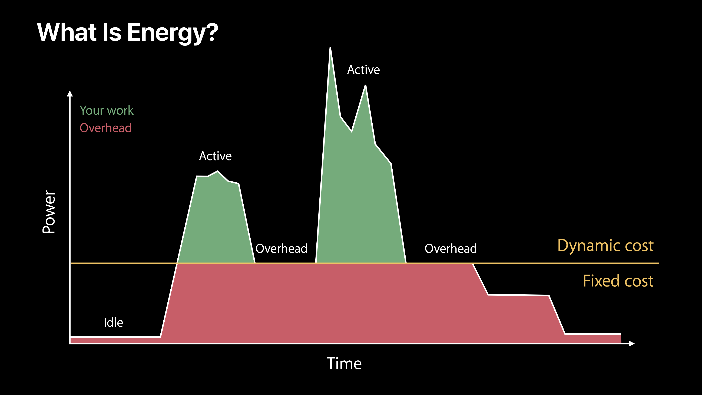
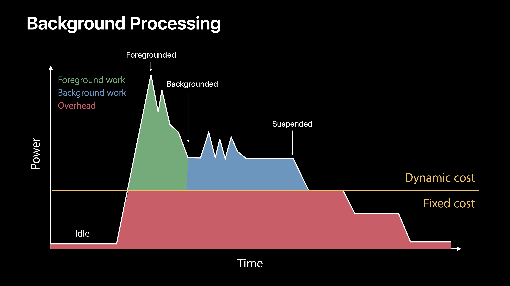

# [Writing Energy Efficient Apps](https://developer.apple.com/videos/play/wwdc2017/238)

@ WWDC 17

앱에서 배터리는 정말 중요하다. 예상하지 못한 앱이 배터리를 엄청 많이 쓰고 있다면 유저는 그 앱을 지울지도 모른다.



device가 일단 idle 상태에 벗어나게 되면 일정 양의 오버헤드는 항상 존재한다. 그렇기 때문에 앱이 생각하는 것보다 더 많은 에너지를 사용하고 있을 수 있기 때문에 energy efficient app을 만드는 것이 중요하다.


### What Consumes Energy?

* Processing
* Networking
* Location
* Graphics


### Networking

#### Social Networking App

* 소셜 네트워킹 앱이라고 가정하자. 이런 기능들이 있을 것이다.
  * Main Feed
  * Posting a photo
  * Analysis

#### Main Feed

* Reload only when needed
  * User interaction
  * Notification
* Use NSURLSession Default Session
  * New: WaitsForConnectivity
  * Cache

```swift
// Setup NSURLSession Default Session
let config = URLSessionConfiguration.default()

// Use WaitsForConnectivity
config.waitsForConnectivity = true

// NSURLSession Cache
let cachesDirectoryURL = FileManager.default().urlsForDirectory(.cachesDirectory, inDomains: .userDomainMask).first!
let cacheURL = try! cachesDirectoryURL.appendingPathComponent("MyCache")
var diskPath = cacheURL.path

let cache = URLCache(memoryCapacity: 16384, diskCapacity: 268435456, diskPath: diskPath)
config.urlCache = cache
config.requestCachePolicy = .useProtocolCachePolicy
```


#### Posting a Photo

* Use NSURLsession Default Session
  * Minimize retries
  * Set timeouts
  * Batch Transactions
* When rery limit hit
  * Use Background session

#### Analytics

* Use NSURLSession Background Session
  * Automatic retries
  * Throughput monitoring
* Properties
  * New
    * Start time
    * Workload size
  * Discretionary

```swift
// Setup NSURLSession Background Session
let config = URLSessionConfiguration.background(withIdentifier: "com.socialapp.background")
let session = URLSession(configuration: config, delegate: ..., delegateQueue: ...)

// Set discretionary property
config.discretionary = true

// Create Request and Task
var request = URLRequest(url: URL(string: "https://www.example.com/"))
request.addValue("...", forHTTPHeaderField: "...")
let task = session.downloadTask(with: request)

// Set time window
task.earliestBeginDate = Date(timeIntervalSinceNow: 2 * 60 * 60)

// Set workload size
task.countOfBytesClientExpectsToSend = 80
task.countOfBytesClientExpectsToReceive = 2048

task.resume()
```

#### WatchOS

* Use background session for screen off work
  * Complication updates
  * Background app refresh
  * Runtime when task completes

#### Networking Best Practices

* Identifiy
  * Ensure transactions not repeated
* Optimize
  * Use background session
* Coalesce
  * Batch transactions
* Reduce
  * Minimize retries


### Location

#### Location APIs

* Continuous location
* Quick location update
* Region monitoring
* Visit monitoring
* Significant location change

#### Continuous Location

* Navigate to a destination
  * Continuous location updates
  * Prevents device sleep
* Stop location updates
  * Allows device to sleep

```swift
// Create location manager
locationManager = CLLocationManager()
locationManager.delegate = self
locationManager.requestWhenInUseAuthorization()

// Set desired accuracy, auto-pause, and activity type appropriately
locationManager.desiredAccuracy = kCLLocationAccuracyThreeKilometers
locationManager.pausesLocationUpdatesAutomatically = true
locationManager.activityType = CLActivityTypeNavigation

// Set allows background if its needed
locationManager.allowsBackgroundLocationUpdates = true

// Start location updates
locationManager.startUpdatingLocation()

// Get location updates
...

// Disable background updates when no longer needed
locationManager.allowsBackgroundLocationUpdates = false

// Stop location when no longer needed
locationManager.stopUpdatingLocation()
```

#### Request Location

* Get news based on current location
  * Use quick location update

```swift
locationManager.requestLocation()
```

#### Region Monitoring

* Updating content when arriving at home
  * Use region monitoring

```swift
// Create the geographic region to be monitored.
let geoRegion = CLCircularRegion(center: overlay.coordinate, radius: radius, identifier: identifier)
locationManager.startMonitoring(for: geoRegion)
```

#### Visit Monitoring

* Updating content when arriving at frequently visited locations
  * Use visit monitoring

```swift
// Start monitoring
locationManager.startMonitoringVisits()

// Stop monitoring when no longer needed
locationManager.stopMonitoringVisits()
```

#### Significant Location Change

* Updating content based user location
  * Use significant location change

```swift
// Start monitoring
locationManager.startMonitoringSignificantLocationChanges()

// Stop monitoring when no longer needed
locationManager.stopMonitoringSignificantLocationChanges()
```

#### Location Best Practice

* Identify
  * Accuracy level needed
* Optimize
  * Use alternatives to continuous location
* Reduce
  * Stop location when not used
* Coalesce
  * Defer location updates


### Graphics

* Minimize screen updates
  * Ensure screen updates provide needed changes
* Review blur usage
  * Avoid placing blurs over updating elements

MacOS의 경우엔

* Minimize use of Discrete GPU
* Use Discrete GPU only when::
  * Animation performance suffers
  * Functionality isn't supported

#### MacOS-Metal

* MTLCreateSystemDefaultDevice()
  * Always uses Discrete GPU
* Use Integrated GPU when possible
  * MTLCopyAllDevices
    * Select device with isLowPower attribute set

#### MacOS-OpenGL

* Make your app mux-aware by either:
  * Adding `NSSupportsAutomaticGraphicsSwitching` to your info.plist
  * Creating an OpenGL context with the automatic graphics switching attribute

```swift
let attributes3: [CGLPixelFormatAttribute] = [
  kCGLPFASupportsAutomaticGraphicsSwitching,
	kCGLPFAAllowOfflineRenderers,
  CGLPixelFormatAttribute(0)
]
CGLChoosePixelFormat(attributes3, &pix, &npix)
CGLCreateContext(pPixelFmt, nil, &pContext)
```

#### Graphics Best Practice

* Identifiy
  * Blur usage
* Optimize
  * Only use discrete GPU when needed
* Reduce
  * Minimize screen updates


### Processing

#### Processing Best Practices

* Identify tasks
* Do work quickly and efficiently
* Avoid timers
* Set leeway



#### Background Processing

* Finish work quickly
* Use background app refresh
* Call completion handler

#### iOS

* PushKit API
  * Now has completion handler
  * Call after handling push

```swift
func pushRegistry(_ registry: PKPushRegistry, didReceiveIncomingPushWith payload: PKPushPayload, forType type: PKPushType, withCompletionHandler completion: @escaping () -> Void) {
  // Process the incoming push payload here...
  
  // Then signal that processing has completed
  completion()
}
```

#### WatchOS

* New: Navigation background mode
  * CPU limits like Workout
  * Minimizing networking
  * Ensure work is relevant to the user
* Use background app refresh and complication updates to refresh data

#### Background Processing

* Identify
  * Work done in the background
* Optimize
  * Use background app refresh
* Reduce
  * Limit transactions
* Coalesce
  * Use NSURLSession background session


### Final Thoughts

* Use NSURLSession Background Session
* Minimize use of continuous location
* Avoid timers
* Coalesce work
* Use energy gauges