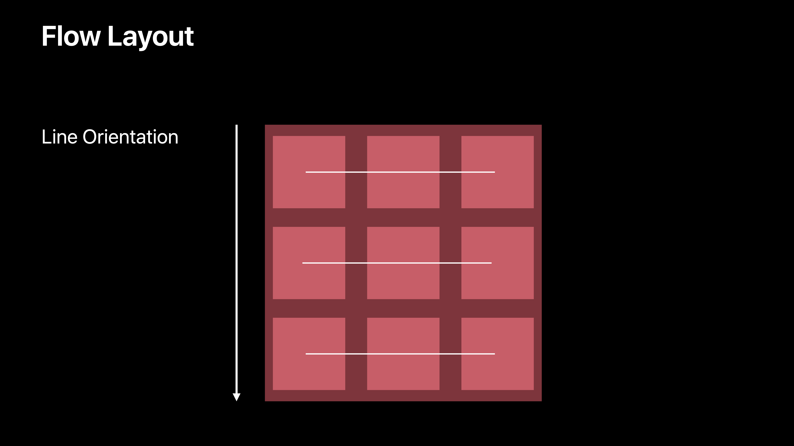
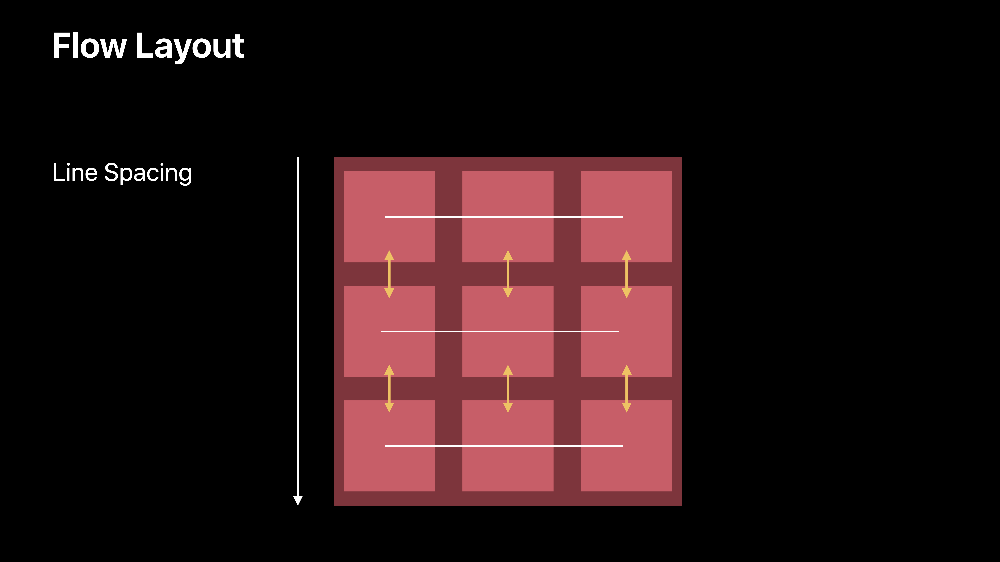
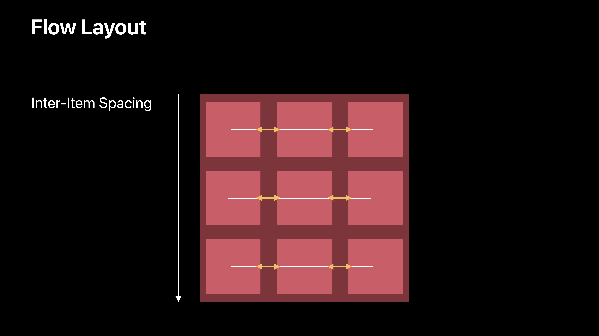
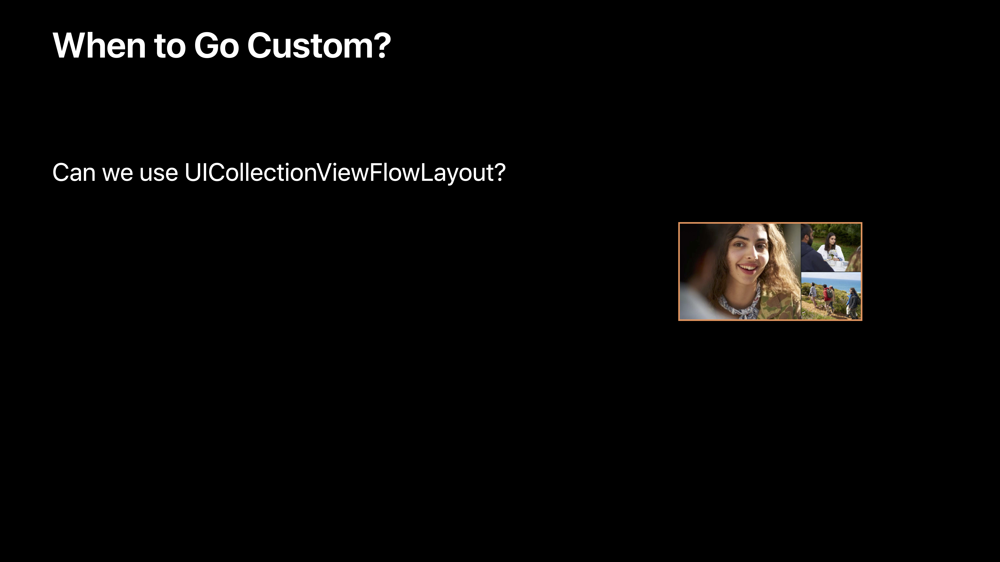
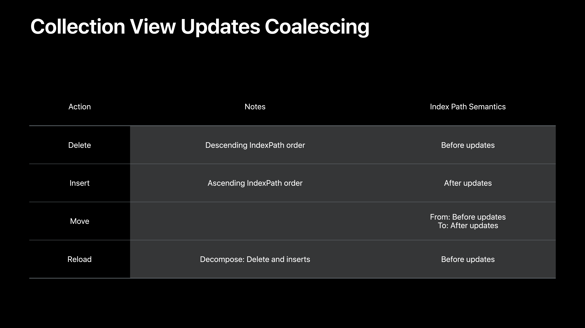

# [A Tour of UICollectionView](https://developer.apple.com/videos/play/wwdc2018/225/)

@ WWDC 18

영상에 나오는 예제 소스는 [여기](https://developer.apple.com/documentation/uikit/uicollectionview/customizing_collection_view_layouts) 를 참고!


### Key UICollectionView Concepts

* Layout
* Data source
* Delegate


### UICollectionViewLayout

* 시각적으로 컨텐츠를 정렬한다. 

* `UICollectionViewLayoutAttributes` : 레이아웃과 관련된 attributes를 관리하는 객체

* Invalidation

* Animate between layouts


### UICollectionViewFlowLayout

* Concrete subclass of UICollectionViewLayout
* `UICollectionViewDelegateFlowLayout` extends `UICollectionViewDelegate`
* Line-based layout covers a wide range of designs (Line Spacing + Inner-Item Spacing)
  * 그리드를 만들 때 사용하기 좋다.








### UICollectionViewDataSource

* 컨텐츠를 제공
* sections and item counts

```swift
optional func numberOfSections(in collectionView: UICollectionView) -> Int

func collectionView(_ collectionView: UICollectionView, numberOfItemsInSection section: Int) -> Int

func collectionView(_ collectionView: UICollectionView, cellForItemAt indexPath: IndexPath) -> UICollectionViewCell
```


### UICollectionViewDelegate

* optional
* extends `UIScrollViewDelegate`
* Fine-grained control
  * highlghting
  * selection
* View appearance events
  * `willDisplayItem`
  * `didEndDisplayingItem`


### Demo



이런 레이아웃을 구성할 때는, FlowLayout이 적절하지 않다. custom `UICollectionViewLayout`을 이용해서 구현하면 된다.


아래의 네 가지 요소들을 이용해서 custom collection view layout을 만들면 된다.


#### Providing Content Size

```swift
open var collectionViewContentSize: CGSize { get }
```

* Size of bounds which contains all items
* Needed for `UIScrollView.contentSize`


#### Providing Layout Attributes

```swift
func layoutAttributesForElement(in rect: CGRect) -> [UICollectionViewLayoutAttributes]?

func layoutAttributesForItem(at indexPath: IndexPath) -> UICollectionViewLayoutAttributes?
```

* Query by geometric region
* Query by IndexPath
* Performance matters


#### Preparing the Layout

```swift
func prepare()
```

* Called for every `invalidateLayout`
* Cache `UICollectionViewLayoutAttributes`
* Compute `collectionViewContentSize`


#### Handling Bounds Changes in Your Custom Layout

```swift
func shouldInvalidateLayout(forBoundsChange newBounds: CGRect) -> Bool
```

* Called for every bounds change
  * size change
  * origin change
* Called during scrolling
* Default implementation returns `false`


```swift
enum MosaicSegmentStyle {
    case fullWidth
    case fiftyFifty
    case twoThirdsOneThird
    case oneThirdTwoThirds
}

class MosaicLayout: UICollectionViewLayout {

    var contentBounds = CGRect.zero
    var cachedAttributes = [UICollectionViewLayoutAttributes]()
    
    /// - Tag: PrepareMosaicLayout
    override func prepare() {
        super.prepare()
        
        guard let collectionView = collectionView else { return }

        // Reset cached information.
        cachedAttributes.removeAll()
        contentBounds = CGRect(origin: .zero, size: collectionView.bounds.size)
        
        // For every item in the collection view:
        //  - Prepare the attributes.
        //  - Store attributes in the cachedAttributes array.
        //  - Combine contentBounds with attributes.frame.
        let count = collectionView.numberOfItems(inSection: 0)
        
        var currentIndex = 0
        var segment: MosaicSegmentStyle = .fullWidth
        var lastFrame: CGRect = .zero
        
        let cvWidth = collectionView.bounds.size.width
        
        while currentIndex < count {
            let segmentFrame = CGRect(x: 0, y: lastFrame.maxY + 1.0, width: cvWidth, height: 200.0)
            
            var segmentRects = [CGRect]()
            switch segment {
            case .fullWidth:
                segmentRects = [segmentFrame]
                
            case .fiftyFifty:
                let horizontalSlices = segmentFrame.dividedIntegral(fraction: 0.5, from: .minXEdge)
                segmentRects = [horizontalSlices.first, horizontalSlices.second]
                
            case .twoThirdsOneThird:
                let horizontalSlices = segmentFrame.dividedIntegral(fraction: (2.0 / 3.0), from: .minXEdge)
                let verticalSlices = horizontalSlices.second.dividedIntegral(fraction: 0.5, from: .minYEdge)
                segmentRects = [horizontalSlices.first, verticalSlices.first, verticalSlices.second]
                
            case .oneThirdTwoThirds:
                let horizontalSlices = segmentFrame.dividedIntegral(fraction: (1.0 / 3.0), from: .minXEdge)
                let verticalSlices = horizontalSlices.first.dividedIntegral(fraction: 0.5, from: .minYEdge)
                segmentRects = [verticalSlices.first, verticalSlices.second, horizontalSlices.second]
            }
            
            // Create and cache layout attributes for calculated frames.
            for rect in segmentRects {
                let attributes = UICollectionViewLayoutAttributes(forCellWith: IndexPath(item: currentIndex, section: 0))
                attributes.frame = rect
                
                cachedAttributes.append(attributes)
                contentBounds = contentBounds.union(lastFrame)
                
                currentIndex += 1
                lastFrame = rect
            }

            // Determine the next segment style.
            switch count - currentIndex {
            case 1:
                segment = .fullWidth
            case 2:
                segment = .fiftyFifty
            default:
                switch segment {
                case .fullWidth:
                    segment = .fiftyFifty
                case .fiftyFifty:
                    segment = .twoThirdsOneThird
                case .twoThirdsOneThird:
                    segment = .oneThirdTwoThirds
                case .oneThirdTwoThirds:
                    segment = .fiftyFifty
                }
            }
        }
    }

    /// - Tag: CollectionViewContentSize
    override var collectionViewContentSize: CGSize {
        return contentBounds.size
    }
    
    /// - Tag: ShouldInvalidateLayout
    override func shouldInvalidateLayout(forBoundsChange newBounds: CGRect) -> Bool {
        guard let collectionView = collectionView else { return false }
        return !newBounds.size.equalTo(collectionView.bounds.size)
    }
    
    /// - Tag: LayoutAttributesForItem
    override func layoutAttributesForItem(at indexPath: IndexPath) -> UICollectionViewLayoutAttributes? {
        return cachedAttributes[indexPath.item]
    }
    
    /// - Tag: LayoutAttributesForElements
    override func layoutAttributesForElements(in rect: CGRect) -> [UICollectionViewLayoutAttributes]? {
        var attributesArray = [UICollectionViewLayoutAttributes]()
        
        // Find any cell that sits within the query rect.
        guard let lastIndex = cachedAttributes.indices.last,
              let firstMatchIndex = binSearch(rect, start: 0, end: lastIndex) else { return attributesArray }
        
        // Starting from the match, loop up and down through the array until all the attributes
        // have been added within the query rect.
        for attributes in cachedAttributes[..<firstMatchIndex].reversed() {
            guard attributes.frame.maxY >= rect.minY else { break }
            attributesArray.append(attributes)
        }
        
        for attributes in cachedAttributes[firstMatchIndex...] {
            guard attributes.frame.minY <= rect.maxY else { break }
            attributesArray.append(attributes)
        }
        
        return attributesArray
    }
    
    // Perform a binary search on the cached attributes array.
    func binSearch(_ rect: CGRect, start: Int, end: Int) -> Int? {
        if end < start { return nil }
        
        let mid = (start + end) / 2
        let attr = cachedAttributes[mid]
        
        if attr.frame.intersects(rect) {
            return mid
        } else {
            if attr.frame.maxY < rect.minY {
                return binSearch(rect, start: (mid + 1), end: end)
            } else {
                return binSearch(rect, start: start, end: (mid - 1))
            }
        }
    }

}

```


### performBatchUpdates()

```swift
func performBatchUpdates(_ updates: (() -> Void)?, completion: ((Bool) -> Void)? = nil)
```

* Animate updates together
* Perform data source updates and collection view updates in updates closure
* Collection view updates ordering does not matter
* data source updates ordering **does matter**





#### Update Combinations That Don't Make Sense

* Exceptions will result from:
  * move and delete the same location
  * move and insert to the same location
  * move more than 1 location to the same location
  * referencing an invalid IndexPath


#### Applying Data Source Updates

* Decompose Move into Delete and Insert updates
* Combine all Delete and Insert updates
* Process Delete updates first, in descending order
* Process Insert updates last, in ascending order


```swift
    /// - Tag: PerformUpdates
    func performUpdates() {
        // This sample code uses test data to simulate updates received from a remote server. The
        // remoteUpdates array contains a collection of PersonUpdate enums representing deletions,
        // insertions, movements and reloads. Several example data sets have been included below.
        // Any rows that are reloaded will be displayed with a cyan-colored update indicator.

        // Sample remote updates showing one person being deleted.
        // let remoteUpdates = [ PersonUpdate.delete(0) ]

        // Sample remote updates showing one reload, one person being moved and one being deleted.
        // let remoteUpdates = [
        //   PersonUpdate.reload(3),
        //   PersonUpdate.move(3, 0),
        //   PersonUpdate.delete(2),
        // ]

        // Sample remote updates moving the top three people down by one and reloading the other row.
        let remoteUpdates = [
            PersonUpdate.move(0, 1),
            PersonUpdate.move(1, 2),
            PersonUpdate.move(2, 3),
            PersonUpdate.reload(3)
        ]

        // Perform any cell reloads without animation because there is no movement.
        UIView.performWithoutAnimation {
            collectionView.performBatchUpdates({
                for update in remoteUpdates {
                    if case let .reload(index) = update {
                        people[index].isUpdated = true
                        collectionView.reloadItems(at: [IndexPath(item: index, section: 0)])
                    }
                }
            })
        }

        // Animate all other update types together.
        collectionView.performBatchUpdates({
            var deletes = [Int]()
            var inserts = [(person:Person, index:Int)]()

            for update in remoteUpdates {
                switch update {
                case let .delete(index):
                    collectionView.deleteItems(at: [IndexPath(item: index, section: 0)])
                    deletes.append(index)
                    
                case let .insert(person, index):
                    collectionView.insertItems(at: [IndexPath(item: index, section: 0)])
                    inserts.append((person, index))
                    
                case let .move(fromIndex, toIndex):
                    // Updates that move a person are split into an addition and a deletion.
                    collectionView.moveItem(at: IndexPath(item: fromIndex, section: 0),
                                            to: IndexPath(item: toIndex, section: 0))
                    deletes.append(fromIndex)
                    inserts.append((people[fromIndex], toIndex))
                    
                default: break
                }
            }
            
            // Apply deletions in descending order.
            for deletedIndex in deletes.sorted().reversed() {
                people.remove(at: deletedIndex)
            }
            
            // Apply insertions in ascending order.
            let sortedInserts = inserts.sorted(by: { (personA, personB) -> Bool in
                return personA.index <= personB.index
            })
            for insertion in sortedInserts {
                people.insert(insertion.person, at: insertion.index)
            }
            
            // The update button is enabled only if the list still has people in it.
            navigationItem.rightBarButtonItem?.isEnabled = !people.isEmpty
        })
    }
```

