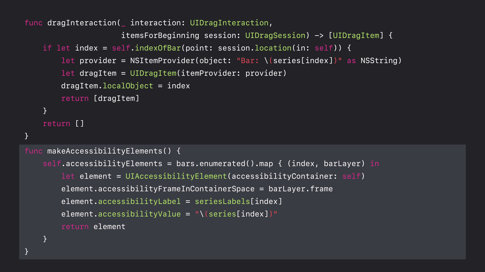
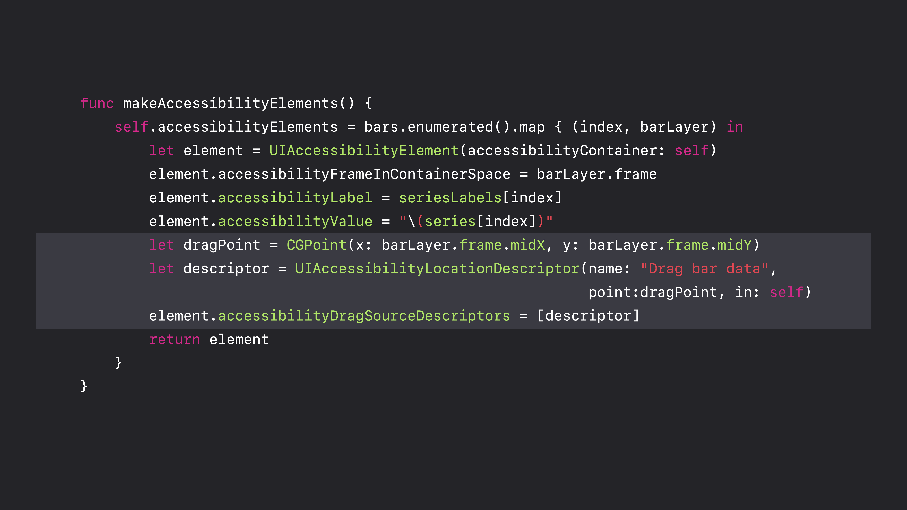
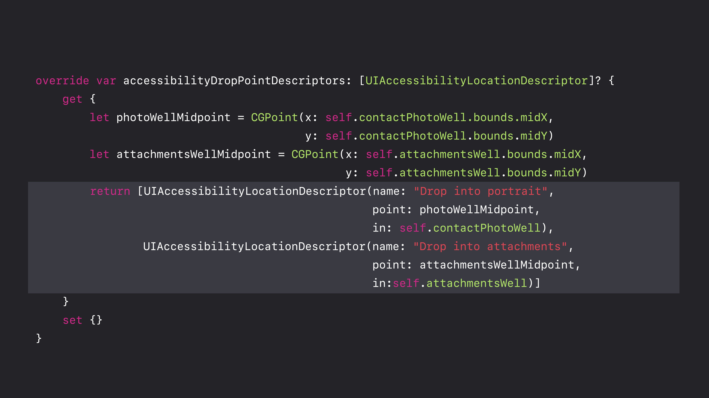

# [Accessible Drag and Drop](https://developer.apple.com/videos/play/wwdc2018/241/)

@ WWDC 18


### Drag and Drop Refresher

* Interactions are hosted by views
* Starting a drag: `UIDragInteraction`
* Accepting a drop: `UIDropInteraction`


### Accessible Drag and Drop Concepts

* Your accessibility element might not host interactions directly
  * Subviews might host interactions
  * Element might descend from a view that hosts interactions
* Solution
  * Specify logical drags and drops to Accessibility

* `UIAccessibilityDragging`: Logical drag sources and drop points

  * Drag sources describe where to start drags
  * Drop points describe where to drop

* Users active drags and drops like custom actions

  ```swift
  extension NSObject {
    @available(iOS 11.0, *)
    open var accessibilityDragSourceDescriptors: [UIAccessibilityLocationDescriptor]?
    
    @available(iOS 11.0, *)
    open var accessibilityDropPointDescriptors: [UIAccessibilityLocatioinDescriptor]?
  }
  ```

* Drags and drops often exposed automatically

  * Assigned default name
  * Only interactions in an element's subtree are exposed

* `UIAccessibiltyDragging`

  * Allows exposing exactly the interactions that make sense
  * Allows specfying a specific name for each
  * Implement for the best experience









### Summary

* Expose the drags and drops assocated with your elements to Accessibility
* `accessibilityDragSourceDescriptors` for drags
* `accessibilityDropPointDescriptors` for drops
* `UIAccessibilityLocationDescriptor` describes drags and drops to Accessibility