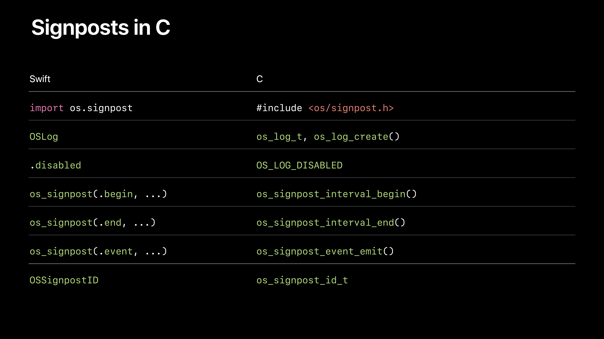

# [Measuring Performance Using Logging](https://developer.apple.com/videos/play/wwdc2018/405/)

@ WWDC 18

Your mission: Improve Performance


### Introducing Signposts

* Signposts
  * Part of the os_log family
  * Performance-focused time markers
* Instruments
  * Aggregate and analyze signpost data
  * Visualize activity over time


### Logging

```swift
let logHandle = OSLog(subsystem: "com.example.widget", category: "Setup")
```

```swift
os_log(.info, log: logHandle, "Hello, %{public}s!", world)
```

* Our new logging system was introduced at WWDC 2016
  * Built for debugging with efficiency and privacy in mind

* Signposts created for investigating performance
  * Built for performance use case and integration with developer tools


### Signpost Names

```swift
os_signpost(.begin, log: refreshLog, name: "Fetch Asset")
```

```swift
os_signpost(.end, log: refreshLog, name: "Fetch Asset")
```

* The string literal identifies signpost intervals
* The name must match at `.begin`, `.end`


### Signpost IDs

```swift
let spid = OSSignpostID(log: refreshLog)
os_signpost(.begin, log: refreshLog, name: "Fetch Asset", signpostID: spid)
```

```swift
os_singpost(.end, log: refreshLog, name: "Fetch Asset", signpostID: spid)
```

* Use signpost IDs to tell overlapping operations apart
* While running, use the same IDs for each pair of `.begin`, `.end`


### Custom Metadata in Signpost Arguments

```swift
os_signpost(.begin, log: log, name: "Compute Physics", "for particle")
os_signpost(.begin, log: log, name: "Compute Physics", "%d %d %d %d", x1, y1, x2, y2)
```

* Add context to the `.begin`, `.end`

* Pass arguments with os_log format string literal
* Pass many arguments with different types
* Pass dynamic strings
* The format string is a fixed cost, so feel free to be descriptive!


### Signpost Events

```swift
os_signpost(.event, log: log, name: "Fetch Asset", "Fetched first chunk, size %u", size)
```

```swift
os_signpost(.event, log: log, name: "Swipe", "For action 0x%x", actionCode)
```

* Marking a single point in time


### Signposts Are Lightweight

* Built to minimize observer effect
* Built for fine-grained measurement in a short time span


### Enabling and Disabling Signpost Categories

```swift
OSLog.disabled
```

* Take advantage of special log handle
* Just change the handle - can leave calling sites alone

```swift
let refreshLog: OSLog
if ProcessInfo.processInfo.environment.keys.contains("SIGNPOSTS_FOR_REFRESH") {
  refreshLog = OSLog(subsystem: "com.example.your-app", category: "RefreshOperations")
} else {
  refreshLog = .disabled
}
```


### Instrumentation-Specific Code

```swift
if refreshLog.signpostsEnabled {
  let information = copyDescription()
  os_signpost(..., information)
}
```

* For additional expensive code that is only useful for the signpost


### Signposts in C




### Instruments 10

* os_signpost
* Points of Interest
* Custom instruments


### Summary

* Annotate code with signposts
  * Easily mark intervals
  * Capture metadata of interest
* Use Instruments to view signpost data
  * Visualize where time is spent
  * Understand what program is doing