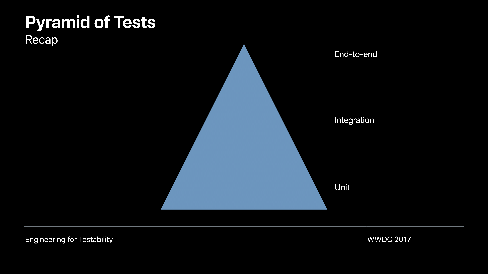
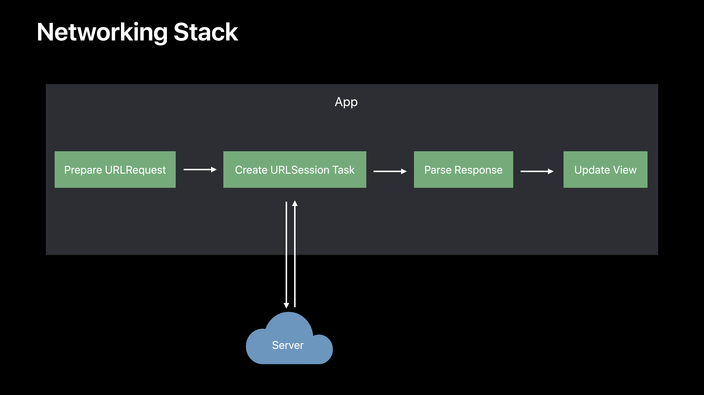
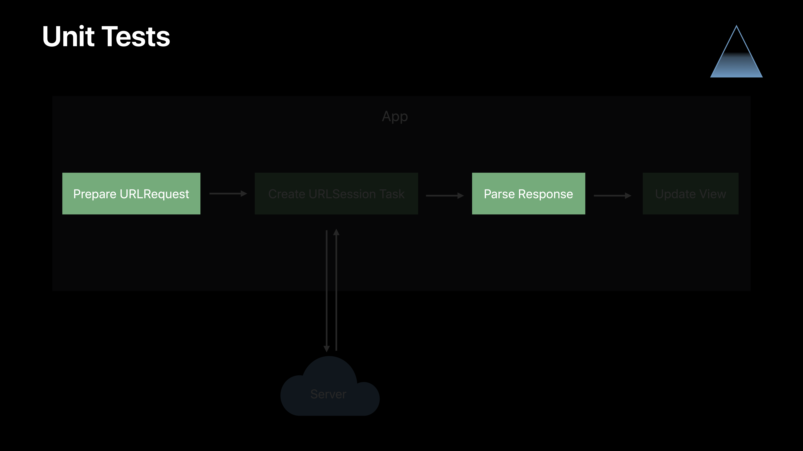
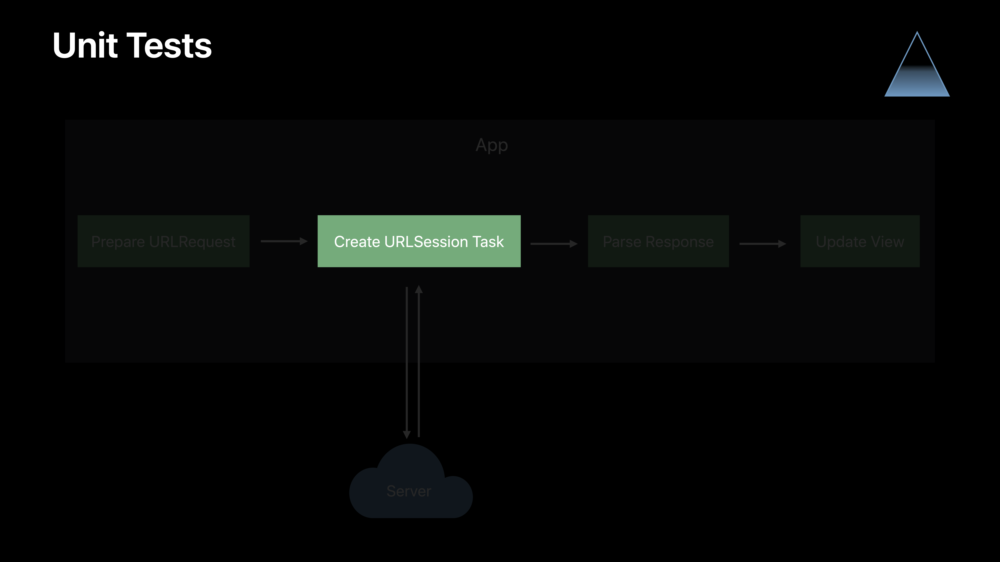
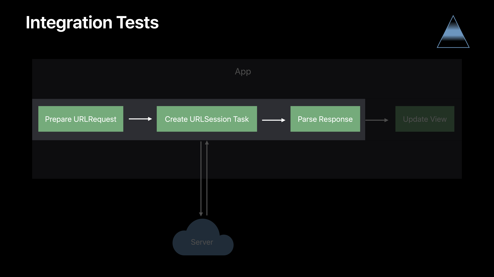
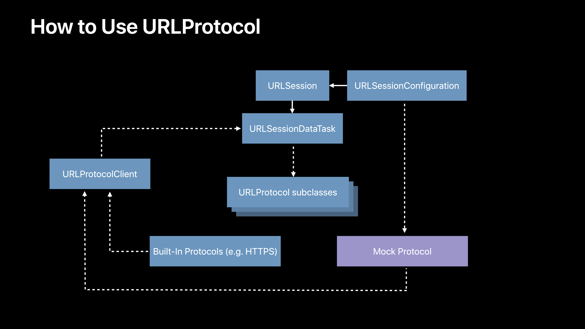

# [Testing Tips & Tricks](https://developer.apple.com/videos/play/wwdc2018/417/)

@ WWDC 18


## Teesting network requests






```swift
func loadData(near coord: CLLocationCoordinate2D) {
  let url = URL(string: "/locations?lat=\(coord.latitude)&long=\(coord.longitude)")!
  URLSession.shared.dataTask(with: url) { data, response, error in
    guard let data = data else { self.handleError(error); return }
    do {
      let values = try JSONDecoder().decode([PointOfInterest].self, from: data)
      
      DispatchQueue.main.async {
        self.tableValues = values
        self.tableView.reloadData()
      } catch {
        self.handleError(error)
      }
    }
  }.resume()
}
```



이 두 과정에 대한 테스트를 진행해보자.

```swift
struct PointsOfInterestRequest {
  func makeRequest(from coordinate: CLLocationCoordinate2D) throws -> URLRequest {
    guard CLLocationCoordinate2DIsValid(coordinate) else {
      throw RequestError.invalidCoordinate
    }
    
    var components = URLComponents(string: "https://example.com/locations")!
    components.queryItems = [
      URLQueryItem(name: "lat", value: "\(coordinate.latitude)"),
      URLQueryItem(name: "long", value: "\(coordinate.longitude)")
    ]
    return URLRequest(url: components.url!)
  }
  
  func parseResponse(data: Data) throws -> [PointOfInterest] {
    return try JSONDecoder().decode([PointOfInterest].self, from: data)
  }
}
```

테스트를 하기 위해 위에서 보았던 코드를 뷰컨트롤러로부터 분리할거다. 새로 작성하는 함수는 side effect가 없게 작성해라.

```swift
class PointOfInterestRequestTests: XCTestCase {
  let request = PointsOfInterestRequest()
  
  func testMakingURLRequest() throws {
    let coordinate = CLLocationCoordinate2D(latitude: 37.3293, longitude: -121.8893)
    
    let urlRequest = try request.makeRequest(from: coordinate)
    
    XCTAssertEqual(urlRequest.url?.scheme, "https")
    XCTAssertEqual(urlRequest.url?.host, "example.com")
    XCTAssertEqual(urlRequest.url?.query, "lat=37.3293&long=-121.8893")
  }
  
  func testParsingResponse() throws {
    // mock json을 넘겨준다.
    let jsonData = "[{\"name\":\"My Location\"}]".data(using: .utf8)!
    let response = try request.parseResponse(data: jsonData)
    XCTAssertEqual(response, [PointOfInterest(name: "My Location")])
  }
}
```

빰!! 테스트하기 용이해졌다.




URLSession과 interact 해보자

```swift
protocol APIRequest {
  associatedtype RequestDataType
  associatedtype ResponseDataType
  
  func makeRequest(from data: RequestDataType) throws -> URLRequest
  func parseResponse(datta: Data) throws -> ResponseDataType
}

class APIRequestLoader<T: APIRequest> {
  let apiRequest: T
  let urlSession: URLSession
  
  init(apiReqest: T, urlSession: URLSession = .shared) {
    self.apiRequest = apiReqest
    self.urlSession = urlSession
  }
  
  func loadAPIRequest(reqestData: T.RequestDataType, completionHandler: @escaping (T.ResponseDataType?, Error?) -> Void) {
    do {
      let urlRequest = try apiRequest.makeRequest(from: requestData)
      urlSession.dataTask(with: urlRequest) { data, response, error in
        guard let data = data else { return completionHandler(nil, error) }
        do {
          let parsedResponse = try self.apiRequest.parseResponse(data: data)
          completionHandler(parseResponse, nil)
        } catch {
          completionHandler(nil, error)
        }
      }.resume()
    } catch { return completionHandler(nil, error) }
  }
}
```




이제 Integration test를 진행해보자




```swift
class MockURLProtocol: URLProtocol {
  override class func canInit(with request: URLRequest) -> Bool {
    return true
  }
  
  override class func canonicalRequest(for request: URLRequest) -> URLRequest {
    return request
  }
  
  override func startLoading() { 
  	// ...
  }
  
  override func stopLoading() {
		// ...
  }
}
```

```swift
class MockURLProtocol: URLProtocol {
    static var requestHandler: ((URLRequest) throws -> (HTTPURLResponse, Data)?)
  override func startLoading() {
    guard let handler = MockURLProtocol.requestHandler else {
      XCTFail("Received unexpected request with no handler set")
      return
    }
    do {
      let (response, data) = try handler(request)
      client?.urlProtocol(self, didReceive: response, cacheStoragePolicy: .notAllowed)
      client?.urlProtocol(self, didLoad: data)
      client?.urlProtocolDidFinishLoading(self)
    } catch {
      client?.urlProtocol(self, didFailWithError: error)
    }
  }
}
```

```swift
class APILoaderTests: XCTestCase {
  var loader: APIRequestLoader<PointsOfInterestRequest>!
  
  override func setUp() {
		let request = PointsOfInterestRequest()
    
    let configuration = URLSessionConfiguration.ephemeral
    configuration.protocolClasses = [MockProtocol.self]
    let urlSession = URLSession(configuration: configuration)
    
    loader = APIRequestLoader(apiRequest: request, urlSession: urlSession)
  }
  
  func testLoaderSuccess() {
    let inputCoordinate = CLLocationCoordinate2D(latitude: 37.3293, longitude: -121.8893)
    let mockJSONData = "[{\"name\":\"MyPointOfInterest\"}]".data(using: .utf8)!
    MockURLProtocol.requestHandler = { request in
      XCTAssertEqual(request.url?.query?.contains("lat=37.3293"), true)
      return (HTTPURLResponse(), mockJSONData)
    }
    
    let expectation = XCTestExpectation(description: "response")
    loader.loadAPIRequest(requestData: inputcoordinate) {
      XCTAssertEqual(pointsOfInterest, [PointOfInterest(name: "MyPointOfInterest")])
      expectation.fulfill()
    }
    wait(for: [expectation], timeout: 1)
  }
}
```

UI Testing을 통해서 End-To-End test도 진행할 수 있다.


### Testing Network Requests

* Decompose code for testability
* `URLProtocol` as a mocking tool
* Tiered testing strategy


## Working with Notifcations

### Working with Notifications

* Test the subject properly observes or posts a `Notification`
* Important to test notifications in isolation
* Isolation avoids unreliable or "flaky" tests


### Testing Notification Observers

* How to use
  * Create separate `NotificationCenter`, instead of `.default`
  * Pass to `init()` and store in a new property
  * Replace all uses of `NotificationCenter.default` with new property
* Limits scope of tests by avoiding external effects


```swift
class PointsOfInterestTableViewController {
  var observer: AnyObject?
  init() {
    
    let name = CurrentLocationProvider.authChangedNotification
    observer = NotificationCenter.default.addObserver(forName: name, object: nil, queue: .main) { [weak self] _ in
      self?.handleAuthChanged()
    }  
  }
  
  var didHandleNotification = false
  func handleAuthChanged() {
    didHandleNotification = true
  }
}
```

```swift
class PointsOfInterestTableViewControllerTests: XCTestCase {
  
  func testNotification() {
    
    let observer = PointsOfInterestTableViewCoontroller()
    XCTAssertFalse(observer.didHandleNotification)
    
    let name = CurrentLocationProvider.authChangedNotification
    NotificationCenter.default.post(name: name, object: nil)
    
    XCTAssertTrue(observer.didHandleNotification)
  }
}
```

위의 코드는 의도하지 않은 side effect가 발생할 수 있다.

`NotificationCenter.default` 대신 다른 프로퍼티를 사용하자.

```swift
class PointsOfInterestTableViewControllerTests: XCTestCase {
  
  func testNotification() {
    let noficationCenter = NotificationCenter()
    let observer = PointsOfInterestTableViewCoontroller(notificationCenter: notificationCenter)
    XCTAssertFalse(observer.didHandleNotification)
    
    let name = CurrentLocationProvider.authChangedNotification
    notificationCenter.post(name: name, object: nil)
    
    XCTAssertTrue(observer.didHandleNotification)
  }
}
```


### Testing Notification Posters

* How to validate that a subject posts a `Notification`?
* Use a separate `NotificationCenter` again
* Use `XCTNSNotificationExpectation`


```swift
class CurrentLocationProvider {
  
  static let authChangedNotification = Notification.name("AuthChanged")
  
  func notifyAuthChanged() {
    let name = CurrentLocationProvider.authChangedNotification
    NotificationCenter.default.post(name: name, object: self)
  }
}
```

```swift
class CurrentLocationProviderTests: XCTestCase {
  func testNotifyAuthChanged() {
    let poster = CurrentLocationProvider()
    var observer: AnyObject?
    let expectation = self.expectation(description: "auth changed notification")
    
    let name = CurrentLocationProvider.authChangedNotification
    observer = NotificationCenter.default.addObserver(forName: name, object: poster, queue: .main) { _ in
      NotificationCenter.default.removeObserver(observer!)
      expectation.fulfill()
    }
    
    poster.notifyAuthChanged()
    wait(for: [expectation], timeout: 0)
  }
}
```

built-in API를 이용해서 고쳐보자.


```swift
class CurrentLocationProvider {
  
  static let authChangedNotification = Notification.name("AuthChanged")
  
  let notificationCenter: NotificationCenter
  init(notificationCenter: NotificationCenter = .default) {
    self.notificationCenter = notificationCenter
  }
  
  func notifyAuthChanged() {
    let name = CurrentLocationProvider.authChangedNotification
    NotificationCenter.default.post(name: name, object: self)
  }
}
```

```swift
class CurrentLocationProviderTests: XCTestCase {
  func testNotifyAuthChanged() {
    let notificationCenter = NotificationCenter() // separated notificationCenter
    let poster = CurrentLocationProvider(notificationCenter: notificationCenter)
    
   	let name = CurrentLocationProvider.authChangedNotification
    let expectation = XCTNSNotificationExpectation(name: name, object: poster, notificationCenter: notificationCenter)
    
    poster.notifyAuthChanged()
    wait(for: [expectation], timeout: 0)
  }
}
```


## Mocking with Protocols

### Mocking with Protocols

* Classes often nteract with other classes in app or SDK
* Many SDK classes cannot be created directly
* Delegate protocols make testing more challengng
* Solution: Mock interface or external class using protocol


```swift
import CoreLocation

class CurrentLocationProvider: NSObject {
  let locationManager = CLLocationManager()
  override init() {
    super.init()
    self.locationManager.desiredAccuracy = kCLLocationAccuracyHundredMeters
    self.locationManager.delegate = self
  }
  
  var currentLocationCheckCallback: ((CLLocationo) -> Void)?
  func checkCurrentLocation(completion: @escaping (Bool) -> Void) {
    self.currentLocationCheckCallback = { [unowned self] location in
      completion(self.isPointOfInterest(location))
    }
  }
  
  func isPointOfInterest(_ location: CLLocation) -> Bool {
    // Perform check
  }
}

extension CurrentLocationProvider: CLLocationManagerDelegate {
  func loationManager(_ manager: CLLocationManager, didUpdateLocations: locs: [CLLocation]) {
    guard let location = locs.first else { return }
    self.currentLocationCheckCallback?(location)
    self.currentLocationCheckCallback = nil
  }
}
```

delegate 를 사용하고 있는 이런 코드는 어떻게 테스트해야할까? `checkCurrentLocation` 코드가 불리는 것이 delegate를 통해 불리기 때문에 문제가 발생한다. 또한 CoreLocation은 permission을 요구함


### Mocking Using a Subclass - 비추! 다음과 같은 이유로.

* Subclassing the external class n tests and overriding methods
* Can work, but risky
* Some SDK classes cannot be subclassed
* Easy to forget to override methods


```swift
protocol LocationFetcher {
  var locationFetcherDelegate: LocationFetcherDelegate? { get set }
}

protocol LocationFetcherDelegate: class {
  func locationFetcher(_ fetcher: LocationFetcher, didUpdateLocations locs: [CLLocation])
}

extension CLLocationManager: LocationFetcher {
  var locationFetcherDelegate: LocationFetcherDelegate? {
    get { return delegate as! LocationFetcherDelegate? }
    set { delegate = newValue as! CLLocationManagerDelegate? }
  }
}

class CurrentLocationProvider: NSObject {
  var locationFetcher: LocationFetcher
  init(locationFetcher: LocationFetcher = CLLocationManager()) {
    // ...
    self.locationFetcher.delegate = self
  }
}

extension CurrentLocationProvider: LocationFetcherDelegate {
  func locationFetcher(_ fetcher: LocationFetcher, didUpdateLocaitions locks: [CLLocation]) {
    guard let location = locks.frst else { return }
    self.currentLocationCheckCallback?(location)
    self.currentLocationCheckCallback = nil
  }
}

extension CurrentLocationProvider: CLLocationManagerDelegate {
  func locationManager(_ manager: CLLocationManager, didUpdateLocations locs: [CLLocation]) {
    self.locationFetcher(manager, didUpdateLocations: locs)
  }
}
```

```swift
class CurrentLocationProviderTests: XCTestCase {
  struct MockLocationFetcher: LocationFetcher {
    weak var locationFetcherDelegate: LocationFetcerDelgate?
    
    var desiredAccuracy: CLLocationAccuracy = 0
    
    var handleRequestLocation: (() -> CLLocation)?
    func requestLocation() {
      guard let location = handleRequestLocation?() else { return }
      locationFetcherDelegate?.locationFetcher(self, didUpdateLocations: [location])
    }
  }
  
  func testCheckCurrentLocation() {
    var locationFetcher = MockLocationFetcher()
    let requestLocationExpectation = expectation(description: "request location")
    locationFetcher.handleRequestLocatiion = {
      requestLocationExpectation.fulfill()
      return CLLocation(latitude: 37.3293, longitude: -121.8893)
    }
    let provider = CurrentLocationProvider(locationFetcher: locationFetcher)
    let completionExpectation = expectation(description: "completion")
    provider.checkCurrentLocation { isPointOfInterest in
      XCTAssertTrue(isPointOfInterest)
      completionExpectation.fulfill()
    }
    
    wait(for: [requestLocationExpectation, completionExpectation], timeout: 1)
  }
}
```


### Mocking with Protocols

* Define a protocol representing the external interface
* Define extension on the external class conforming to the protocol
* Replace all usage of external class with the protocol
* Set the external reference via initializer or a property, using the protocol type
* Define delegate protocol with interfaces your code implements
* Replace subject type with mock protocol defined earlier
* In mock protocol, rename delegate property
* In extension on original type, implement mock delegate property and convert


## Test Execution Speed

### Test Execution Speed

* Slow tests hinder developer productvity
* Want test to run fast
* Artificial delays should not be necessary with sufficient mocking


```swift
class FeaturedPlaceManager {
  var currentPlace: Place
  
  func scheduleNextPlace() {
    // Show next place after 10 seconds
    Timer.scheduledTimer(withTimeInteerval: 10, repeats: false) { [weak self] _ in
      self?.showNextPlace
    }
  }
  
  func showNextPlace() {
    // Set currentPlace to next place
  }
}
```

### Teesting Delayed Actions

* How to use
  * Identify the "delay" technique (e.g. `Timer`, `DispatchQueue.asyncAfter`)
  * Mock this mechanism during tests
  * Invoke delayed action immediately


Timer를 사용하는 부분을 쪼개자!

```swift
protocol TimerScheduler {
  func add(_ timer: Timer, forMode mode: RunLoop.Mode)
}

extension RunLoop: TimerScheduler {}

class FeaturedPlaceManager {
  let runLoop = RunLoop.current
  let timerScheduler: TimerScheduler
  init(timerScheduler: TimerScheduler) {
    self.timerScheduler = TimerScheduler
  }
  
  func scheduleNextPlace() {
    let timer = Timer(timeInterval: 10, repeats: false) {
      self?.showNextPlace()
    }
    timerScheduler.add(tmer, forMode: .default)
  }
  
  func showNextPlace() { /* */ }
}
```

```swift
class FeaturedPlaceManagerTests: XCTestCase {
  struct MockTimerScheduler: TimerScheduler {
    var handleAddTimer: ((_ timer: Timer) -> Void)?
    
    func add(_ timer: Timer, forMode mode: RunLoop.Mode) {
      handleAddTimer?(timer)
    }
  }
  
  func testScheduleNextPlace() {
    var timerScheduler = MockTimerScheduler()
    var timerDelay = TimeInterval(0)
    timeScheduler.handleAddTimer = { timer in
      timerDelay = timer.fireDate.timeIntervalSinceNow
      timer.fire()
    }
    
    let manager = FeaturedPlaceManager(timeScheduler: timeScheduler)
    let beforePlace = manager.currentPlace
    manager.scheduleNextPlace()
    
    // No delay!
    XCTAssertEqual(timerDelay, 10, accuracy: 1)
    XCTAssertNotEqual(manager.currentPlace, beforePlace)
  }
}
```


### Testing Delayed Actions

* Delay is eliminated using this technique
* Majority of tests shoule be direct, without mocking delays


### Setting Expectations

* Be mindful when using `XCTNSPredicateExpectation`
* Slower and best suited for UI tests
* Use faster, callback-based expectations in unit tests:
  * `XCTestExpectation`
  * `XCTNSNotificationExpectation`
  * `XCTKVOExpectation`


### Optimizing App Launch When Testing

* Avoid unnecessary work when app is launched as unit test host
* Testing begins after 'app did finish lanching'
* Set custom scheme environment variables/launch arguments for testing


```swift
func application(_ applicatioin: UIApplication, didFinishLaunchingWithOptions opts: ...) -> Bool {
  let isUnitTesting = ProcessInfo.processInfo.environment["IS_UNIT_TESTING"] == "1"
  if isUnitTesting == false {
    // Do UI-related setup, which can be skipped when testing
  }
  return true
}
```

