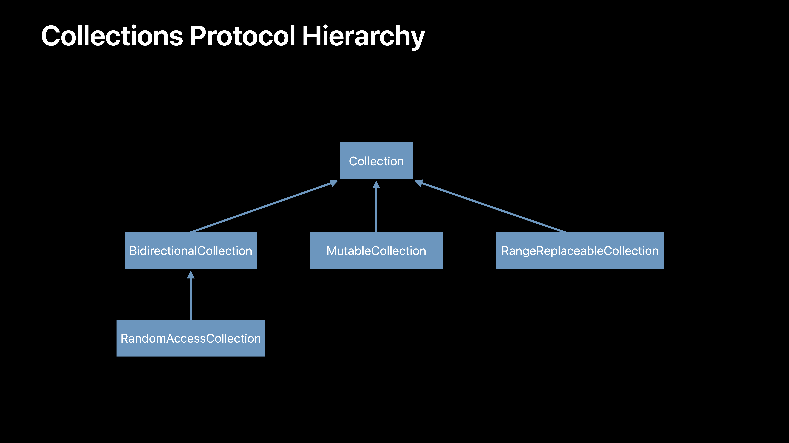

# [Using Collections Effectively](https://developer.apple.com/videos/play/wwdc2018/229/)

@ WWDC 18


### Collections Store Elements

```swift
// Declaraton of Collection
protocol Collection: Sequence {
  associatedtype Element
  associatedtype Index: Comparable
  
  subscrippt(position: Index) -> Element { get }
  
  var startIndex: Index { get }
  var endIndex: Index { get }
  
  func index(after i: Index) -> Index
}
```


### Every Other Element

```swift
extension Collection {
  func everyOther(_ body: (Element) -> Void) {
    let start = self.startIndex
    let end = self.endIndex
    
    var iter = start
    while iter != end {
      body(self[iter])
      let next = index(after: iter)
      if next == end { break }
      iter = index(after: next)
    }
  }
}

(1...10).everyOther { print($0) }
```


### Collections Protocol Hierarchy




### Indices

* Each collection defines its own index
* Must be `Comparable`
* Think of these as opaque


### Find the Second Element of a `Collection`

```swift
extension Collection {
  var secnod: Element? {
    guard self.startIndex != self.endIndex else { return nil }
    let index = self.index(after: self.startIndex)
    guard index != self.endIndex else { return nil }
    return self[index]
  }
}
```


### Forming a Slice

```swift 
let array = [1, 2, 3, 4, 5]

let subarray = array.dropFirst()
let secondIndex = array.index(after: array.startIndex)

print(secondIndex == subarray.startIndex)
```


### Find the Second Element of a Collection ver.2

```swift
var second: Element? {
  return self.dropFirst().first
}
```


### Slices

* Produce `Collection-` like peers of original collection

* Array -> ArraySlice
* String -> Substring
* Set -> Slice<Set>
* Data -> Data
* Range -> Range


### Slices Keep Underlying Storage Alivee

```swift
extension Array {
  var firstHalf: ArraySliice<Element> {
    return self.droppLast(self.count / 2)
  }
}

var array = [1, 2, 3, 4, 5, 6, 7, 8]
var firstHalf = array.firstHalf
array = []

print(firstHalf.first!) // 1

let copy = Array(firstHalf)
firstHalf = []
print(copy.first!) // 1
```


### Eager Functions

싹 다 계산함

```swift
let items = (1...4000).map { $0 * 2 }.filter { $0 < 10 }
```


### Lazy Functions

필요한 거서 위주로

```swift
let items = (1...4000).lazy.map { $0 * 2 }.filter { $0 < 10 }
items.first
```


### Advice: When to Be Lazy?

* Chained computation
* Only need part of a result (전체 결과 필요 없을 때!)
* No side effects
* Avoid API boundaries


### 왜 collection 다루면서 crash 나냐!

* collection을 mutating 시키고 있지 않는 지 체크해봐라
* 여러 thread에서 collections을 접근하고 있지는 않은가?


### Advice: Indices and Slices

* Use caution when keeping indices/slices
* Mutation invalidates
* Calculate only as needed 딱 필요할 때만 계산해서 접근해라


### Multithreaded Mutable Collections

* Our collections optimized for single-threaded access
* This is a Good Thing
* Undefined behavior without mutual exclusion


```swift
// Thread-Unsafe Ppractices
var sleepingBears = [String]()
let queue = DispatchQueue.global()

queue.async { sleepingBears.append("Grandpa") }
queue.async { sleepingBears.append("Cub") }

// Avoid concurrent mutation
let queue = DispatchQueue(label: "Bear-Cave")
```


### Advice: Multithreading

* Prefer state accessible from a single thread
* When this is not possible:
  * Ensure mutual exclusion
  * Use TSAN


### Advice: Prefer Immutable Collection

* Easier to reason about data that can't change
* Less surface area for bugs
* Emulate mutation with slices and lazy
* The compiler will help you


### Advice: Forming New Collections

* Use capacity hints if possible

```swift
Array.reserveCapacity(_:)
Set(minimumCapacity:)
Dictionary(minimumCapacity:)
```


### Bridging between Objective-C and Swift

* Converts between runtime types
* Bidirectional
* Bridging of collections
  * Is necessary
  * Can be cheap, but is never free


### Two Kinds of Bridging

* Eager when element types are bridged
* Otherwise lazy
  * Bridged on first use


### Identifying Bridging Problems

* Measure your performance with Instruments
* Especially inside loops at language boundaries
* Look for hotspots like:
  * `_unconditionallyBridgeFromObjectiveC`
  * `bridgeEverything`


```swift
let story = NSString(string: "뭐라뭐라 뭐라뭐라뭐라러라ㅏ라라뭐라라라ㅏ")

let text = NSMutableAttributedString(string: story)

// 첫 번째 버전 (Bridging overhead가 큼)
let range = text.string.range(of: "Brown")!
let nsrange = NSRange(range, in: text.string)

// 두 번째 버전
let string = text.string // 여기서 오버헤드 한 번 발생
let range = text.string.range(of: "Brown")!
let nsrange = NSRange(range, in: text.string)

// 세 번째 버전
let string = text.string as NSString
let nsrange = string.range(of: "Brown")

text.addAttribute(.forgroundColor, value: NSColor.brown, range: nsrange)
```


### Advice: When to Use Foundation Collections

* You need reference semantics
* You are working with known proxies
  * `NSAttributedString.string`
  * Core Data Managed Objects
* You've measured and identified bridging costs


### Now It's Your Turn

* Explore your existing collections
* Measure your code
* Audit your mutable state
* Gain mastery in Playgrounds