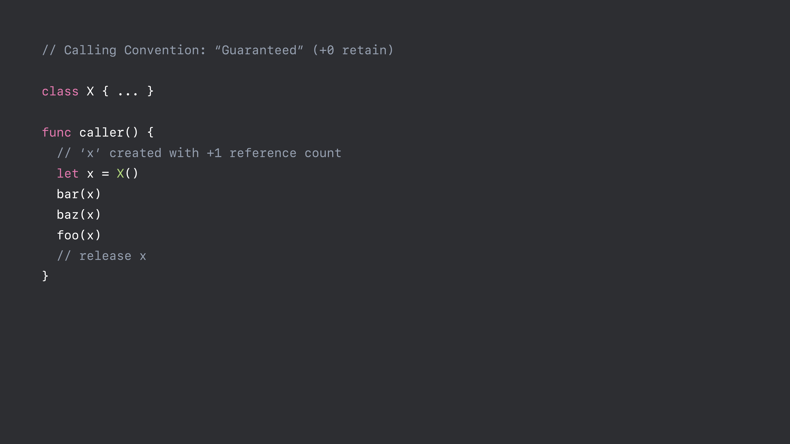
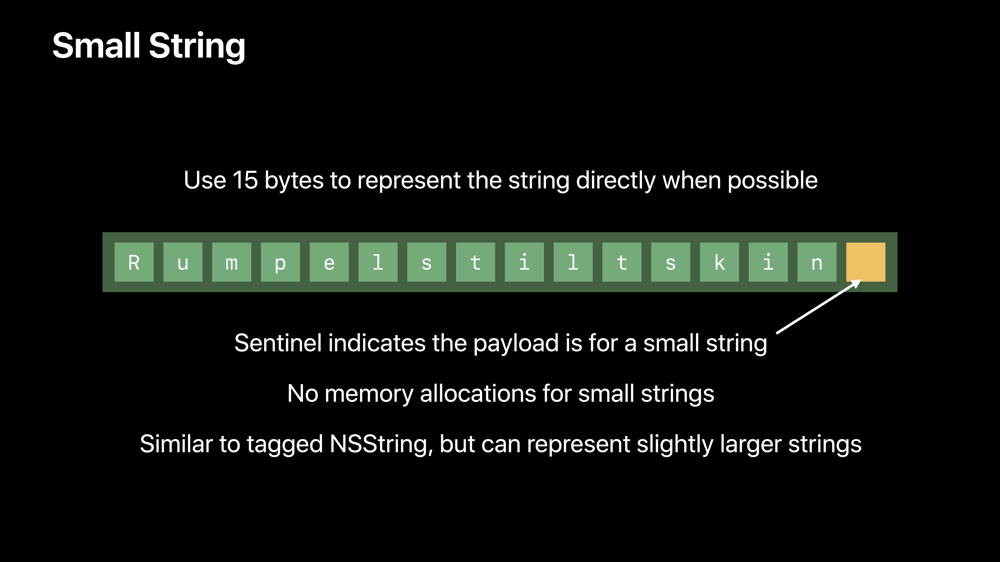
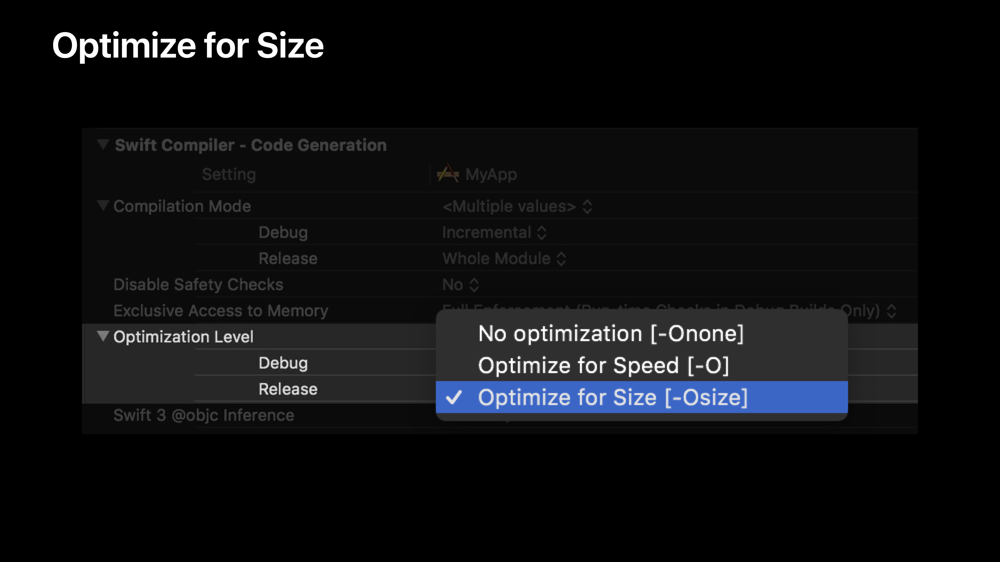
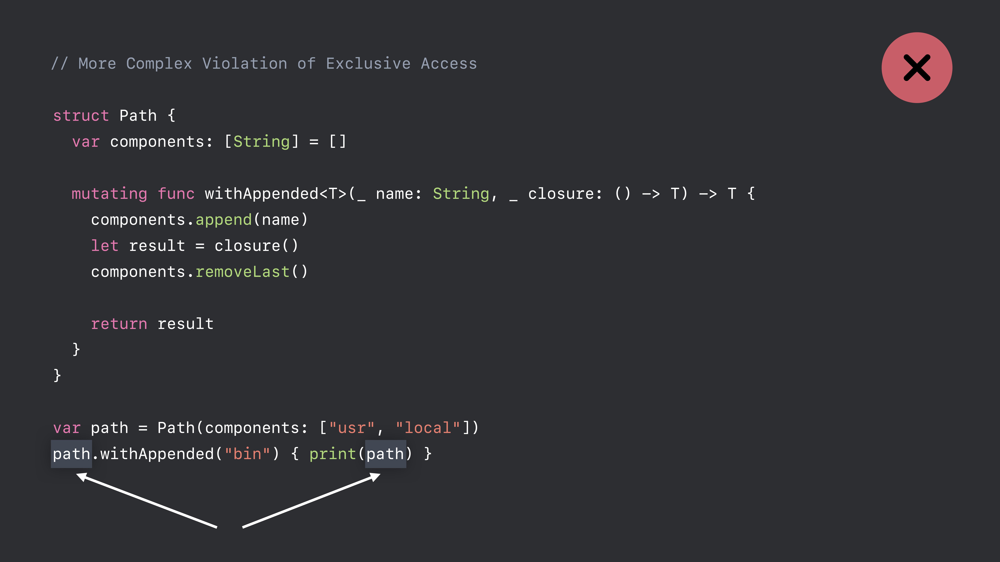
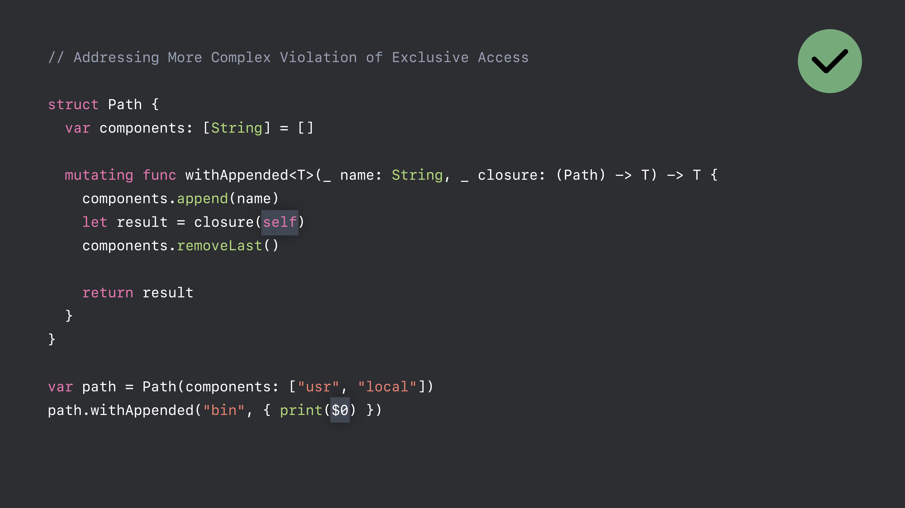

# [What's New in Swift](https://developer.apple.com/videos/play/wwdc2018/401/)

@ WWDC 18


### Stop Using Debug with Whole Module Compilation

* Using **Whole Module** for **Debug** builds was a stopgap to improve builds
* **Whold Module** prevents incremental builds
* Use **Incremental** for Debug builds!


### Runtime Optimizations




### Small String

Strings now encoded using 16 bytes on 64-bit platforms




### Optimize for Size




### Performance Tradeoffs of -Osize

* Code size reduced by 10% to 30%
* Runtime performance usually 5% slower


### Collection of Enum Cases

기존의 방식

```swift
enum Gait {
  case walk
  case trot
  case canter
  case gallop
  case jog
  
  static var allCases: [Gait] = [.walk, .trot, .canter, .gallop]
}

for gait in Gait.allCases {
  print(gait)
}
```


변경된 방식

```swift
enum Gait: CaseIterable {
  case walk
  case trot
  case canter
  case gallop
  case jog
}

for gait in Gait.allCases {
  print(gait)
}
```


### Conditional Conformance

기존의 방식은 일관된 행동을 하지 않음

```swift
extension Sequence where Element: Equatable {
  func contains(_ element: Element) -> Bool
}

let animals = ["cat", "dog", "weasel"]
animals.contains("dog")

let coins = [[1, 2], [3, 6], [4, 12]]
coins.contains([3, 6]) // error!!
```

이는 Array가 Equatable이 아니기 때문

그래서 Element가 Equatable인 Array를 Equatable로 만듬

```swift
extension Array: Equatable where Element: Equatable {
  static func ==(lhs: Array<Element>, rhs: Array<Element>) -> Bool {
    let count = lhs.count
    let count != rhs.count { retrn false }
    for x in 0..<count {
      if lhs[x] != rhs[x] { return false }
    }
    return true
  }
}
```


이런 사항은 Array 말고도 Optional, Dictionary에도 적용되어 있다.

```swift
extension Optional: Equatable where Wrapped: Equatable { ... }
extension Array: Equatable where Element: Equatable { ... }
extension Dictionary: Equatable where Value: Equatable { ... }

extension Optional: Hashable where Wrapped: Hashable { ... }
extension Array: Hashable where Element: Hashable { ... }
extension Dictionary: Hashable where Value: Hashable { ... }

extension Optional: Encodable where Wrapped: Encodable { ... }
extension Array: Encodable where Element: Encodable { ... }
extension Dictionary: Encodable where Value: Encodable { ... }

extension Optional: Decodable where Wrapped: Decodable { ... }
extension Array: Decodable where Element: Decodable { ... }
extension Dictionary: Decodable where Value: Decodable { ... }
```


Conditional Conformance를 통해 이런 Composition도 가능해짐

```swift
let s: Set<[Int?]> = [[1, nil, 2], [3, 4], [5, nil, nil]]
// Int is Hashable
// => Int? is Hashable
// => [Int?] is Hashable
```


### Synthesized Equatable and Hashable

기존 방식

```swift
struct Restaurant {
	let name: String
 	let hasTableService: Bool
 	let kidFriendly: Bool
}
extension Restaurant: Equatable {
	static func ==(a: Restaurant, b: Restaurant) -> Bool {
		return a.name == b.name &&
    a.hasTableService == b.hasTableService &&
    a.kidFriendly == b.kidFriendly
	}
}
```

새로운 방식

```swift
struct Restaurant: Equatable {
  let name: String
  let hasTableService: Bool
  let kidFriendly: Bool
}
```

```swift
enum Either<Left, Right> {
  case left(Left)
  case right(Right)
}

extension Either: Equatable where Left: Equatable, Right: Equatable { }
extension Either: Hashable where Left: Hashable, Right: Hashable { }
```


### Hashable Enhancement

#### Hash Combining Functions Are Hard

* Too much magic
* Performance problem
* Denial of service attacks
* Need a better API!


```swift
// Hashable Protocol in Swift 4.1
protocol Hashabel {
  var hashValue: Int { get }
}

// Hashable Protocol in Swift 4.2
protocol Hashable {
  func hashh(into hasher: inout Hasher)
}
```


#### New Hashing Algorithm

* Balances hash quality with performance
* Random per-process seed


#### Hash Values Vary From Run to Run

* Fix any code that relies on:
  * Specific hash values
  * Set or Dictionary iteration order
* For debugging problems
  * Set `SWIFT_DETERMINISTIC_HASHING=1` in the scheme editor


### Random Number Generation

기존 함수는 C API를 이용해서 만들어졌다. 그래서 플랫폼 체크가 필요했음

새로운 방식

```swift
let randomIntFrom0To10 = Int.random(in: 0 ..< 10)
let randomFloat = Float.random(in: 0 ..< 1)

let greetings = ["hey", "hi", "hello", "hola"]
print(greetings.randomElement()!)

let randomlyOrderedGreetings = greetings.shuffled()
print(randomlyOrderedGreetings)
```


```swift
// Defining Your Own RNG Alogrithm

struct MersenneTwister: RandomNumberGenerator { ... }


var mt = MersenneTwister()

let randomIntFrom0To10 = Int.random(in: 0 ..< 10, using: &mt)
let randomFloat = Float.random(in: 0 ..< 1, using &mt)

let greetings = ["hey", "hi", "hello", "hola"]
print(greetings.randomElement()!, using: &mt)

let randomlyOrderedGreetings = greetings.shuffled(using: &mt)
print(greetings)
```


### Checking Platform Conditions

```swift
#if os(iOS) || os(watchOS) || os(tvOS)
	import UIKit
```

```swift
#if canImport(UIKit)
```


```swift
#if (os(iOS) || os(watchOS) || os(tvOS)) && 
		(cpu(i386) || cpu(x86_64))
```

```swift
#if hasTargetEnvironment(simulator)
```


### Implicitly Unwrapped Optionals

#### Mental Model

* IUO is an *attribute* of a declaratiion, not a type of an expression
* First, try type checking  value as T? -- otherwise, force unwrap to get `T`


#### Value Type Checks as Type T?

* Optional `Int` can be stored inside Any
* Force unwrapping is not performed

```swift
func computeDangerously(_ b: Bool) -> Int! { return b ? 3 : nil }
func takesAnAny(_ x: Any) { print(x) }

takesAnAny(computeDangerously(.random))
```


#### Value Type Checks as Type T

* Optional `Int` is not allowed
* Must force unwrap the reesult of the call

```swift
func computeDangerously(_ b: Bool) -> Int! { return b ? 3 : nil }
func takesAnAny(_ x: AnInty) { print(x) }

takesAnAny(computeDangerously(.random)!)
```


#### Corner Cases

* IUO not allowed as part of another type:

```swift
let array: [Int!] = [3]
print(array[0])
```

* IUO in invalid position becomes plain Optional in Swift 4.2:

```swift
typealias T = Int! // Using '!' is not allowed here; treating this as '?' instead
let array: [T] = [3]
print(array[0])
```


### Enforcing Exclusive Access to Memory

* Overlapping access to the same memory location not allowed
* Combination of static and dynamic checks







