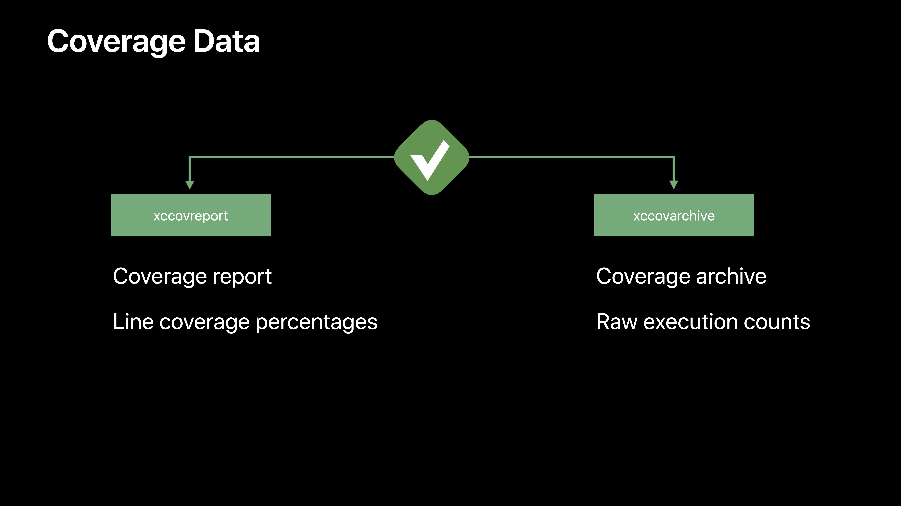
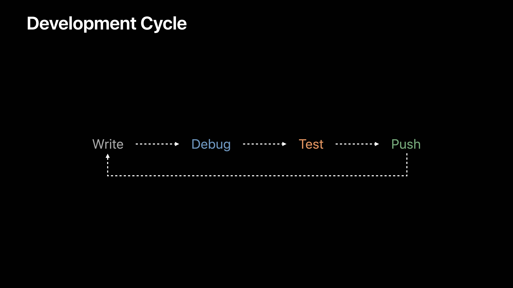
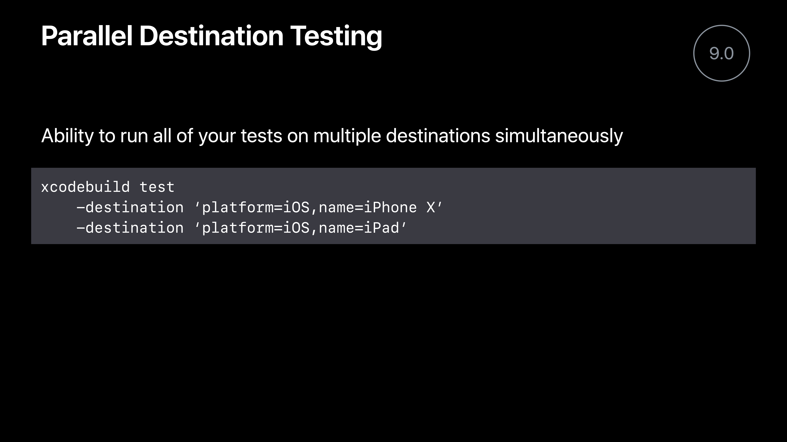
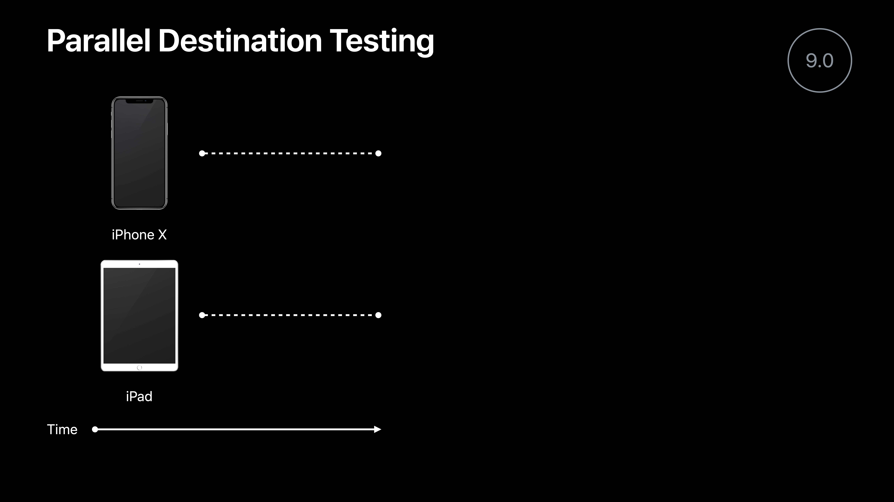
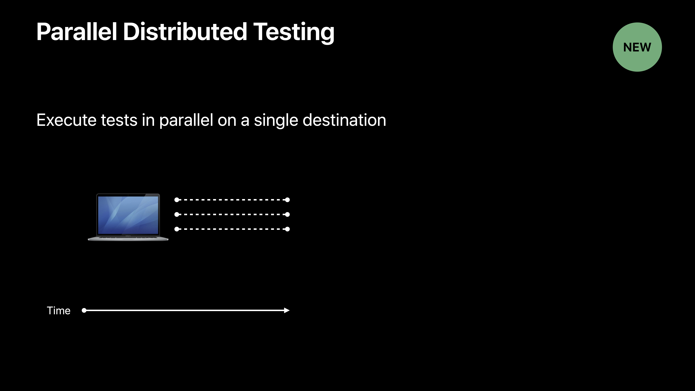
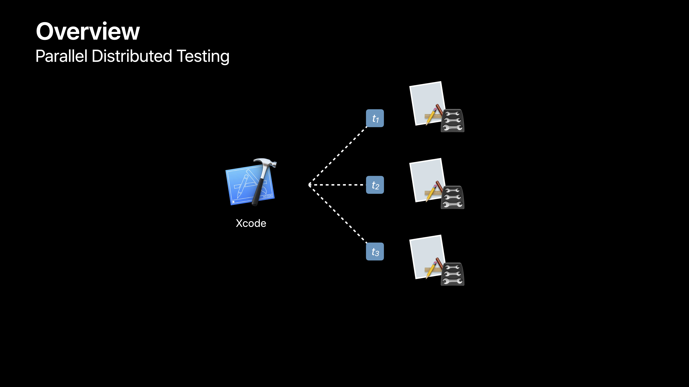
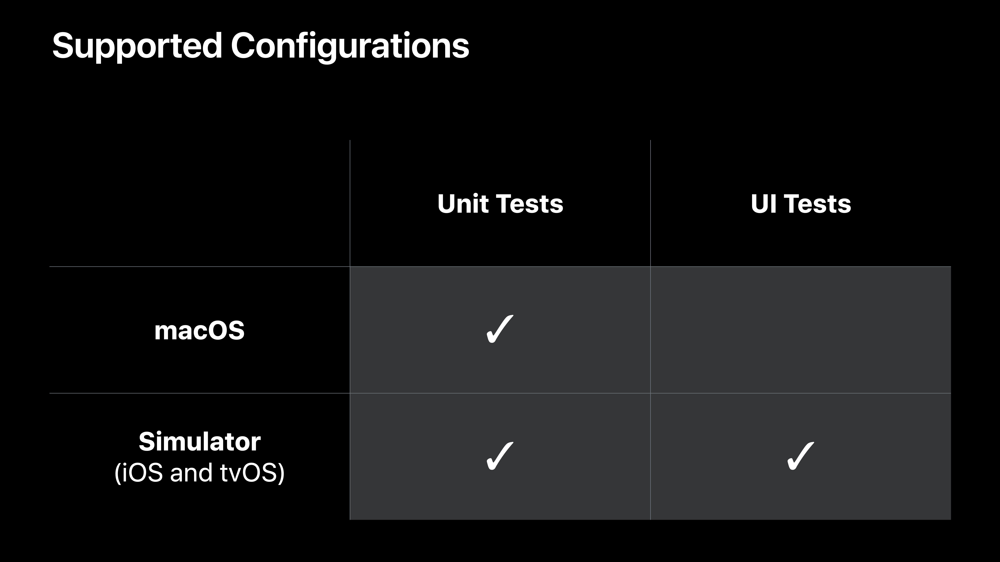

# [What's New in Testing](https://developer.apple.com/videos/play/wwdc2018/403/)

@ WWDC 18


## Code Coverage

### Code Coverage

* Xcode 9.3
* Performance and accuracy
* Target selection
* xccov
* Source editor


### Time to Load

많이 많이 줄음!


### File Size

많이 많이 줄음!


### Target Selection

* Code Coverage
  * Enabled for all targets
  * Enabled for selected targets
  * Disabled

### xccov

* Command line tool
* Output formats
  * Human-readable
  * Machne-parseable (JSON)
* View coverage data


### Coverage Data



code coverage가 enabled된 상태에서 xcode를 실행시키면 위와 같이 두 개의 파일을 만든다.

* Derived data
* Result bundle


Xcode를 이용해서 어떤 타겟을 테스트 코드가 얼만큼 커버하고 있는지 파악할 수 있다.


## Test selection and ordering

### Test Selection

* Not all tests are equal
  * 1000 unit tests
  * 10 UI tests
* Different tests in different situations
  * Pre-commit
  * Nightly


### Test selection with Schemes

* "Tests to skip"
  * Automatically includes new tests
* "Tests to run"
  * Explicit opt-in for tests


### Test Ordering

* Alphabetical
  * Default
  * Deterministic
  * Can hide implicit dependencies
* Randomized
  * Nondeterministic
  * Can uncover implicit dependencies


## Parallel Testing









### Parallel Destination Testng - 한계 존재!

* Only beneficial if testing on multipl destinations
* Only available from xcodebuild


### Parallel Distributed Testing




### Testiing Architecture

Your App + Test Bundle = Runner





 ### Classes Execute in Parallel

* Hidden dependencies between tests iin a class
* Avoid unnecessary +setUp and +tearDown computation


### Parallel Testing on Simulator

* Original simulator is not used duriing testing
* Separate data containers





### Demo Recap

* Enabling parallelization
* Viewing results in the test log and test report
* Multiple instances of a Mac app running unit tests
* Multiple simulator clones running UI tests


### xcodebuild

* Override the number of workers
```
-parallel-testing-worker-count n
```
* Force parallel testing on or off
```
-parallel-testing-enabled YES | NO
```


### Tips and Tricks

* Consider splitting a long running class into two classes
* Put performance tests into their own bundle, with parallelization disabled
* Understand which tests are not safe for parallelization
