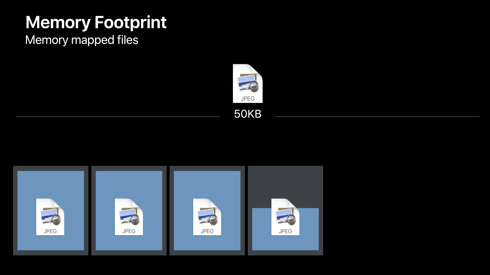
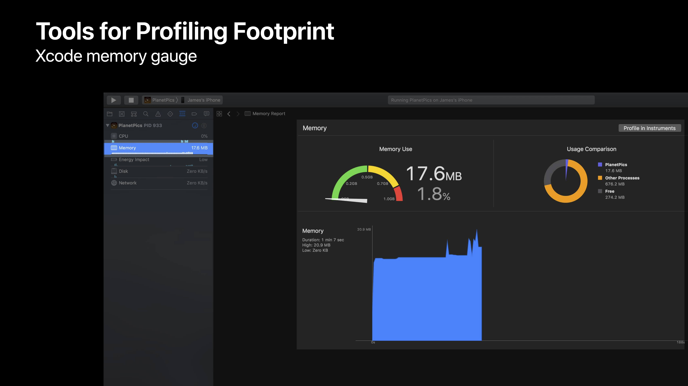
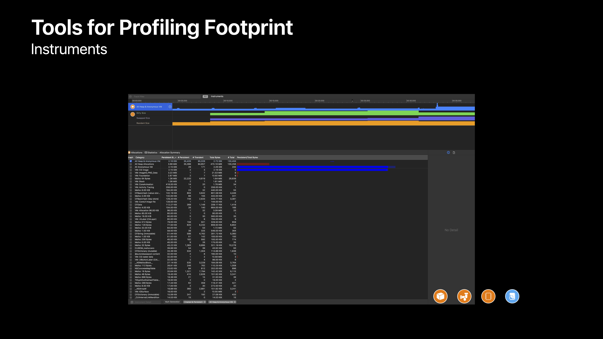
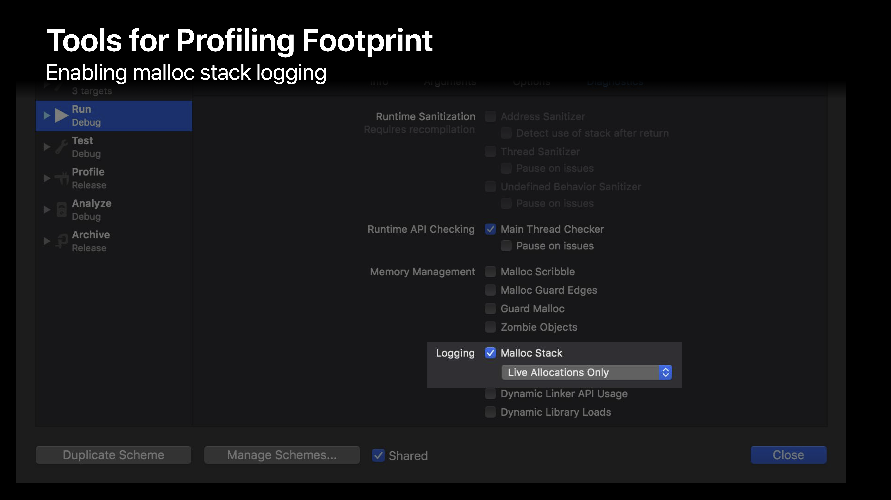

# [iOS Memory Deep Dive](https://developer.apple.com/videos/play/wwdc2018/416/)

@ WWDC 18


### 왜 메모리를 줄여야 할까

유저들이 더 좋은 경험을 할 수 있다. 메모리를 줄이면 모든 것이 좋아진다. 앱의 런치가 빨라질 뿐만 아니라 전체적인 성능도.


### Memory Footprint

> Not all memory is created equal


#### Pages

* Typically 16KB
* Page types
  * Clean
  * Dirty
* Memory in use = Number of pages * Page size

```swift
int *array = malloc(20000 * sizeof(int));
array[0] = 32 // <- this page becomes dirty
array[19999] = 64 // <- this page too
```


#### Memory mapped files

* File-backed memory
* Read-only files are clean
* Kernel manages when file is in RAM



50KB일 때, 16*3 + 2, 마지막 페이지는 꽉 차지 않는다.


#### Clean memory

* Data that can be paged out of memory
* Memory mapped files (Image, Blob, Training, ...)
* Frameworks (__DATA_CONST)


#### Dirty Memory

* Memory written by an app
* All heap allocations (malloc, Array, NSCache, UIViews, String, ...)
* Decoded image buffers (CGRasterData, ImageIO, ...)
* Frameworks (__ DATA, __DATA_DIRTY)


#### Frameworks

* Frameworks는 dirty memory를 만든다.
* Singleton과 global initializer는 dirty memory의 양을 줄이는 데 도움이 된다.


#### Compressed memory

* iOS doesn't have traditional disk swap system. Instead it uses memory compressor
* Memory compressor
  * Compresses unaccessed pages > 공간을 만들어 줌
  * Decompresses pages upon access


#### Memory warnings

* 앱이 항상 memory warning의 원인은 아니다. 메모리가 적은 디바이스를 사용하고 있을 때 전화가 온다면 이것이 memory warning의 원인이 될 수도 있다.
* Compressor complicates freeing memory
* Prefer policy changes over cache purging

```swift
override func didReceiveMemoryWarning() {
  cache.removeAllObjects()
  super.didReceiveMemoryWarning()
}
```


#### Caching

* Trade-offs between CPU and memory
* Remember the compressor
* Prefer NSCache over dictionary


#### Typical app memory profile

* 모든 앱은 Footprint limits 를 가진다
  * Limits vary by device
  * Apps have a fairly high footprint limit
  * Extensions have a much lower limit
* Exception upon exceeding limit
  * `EXC_RESOURCE_EXCEPTION`


### Tools for Profiling Footprint

#### Xcode memory gauge




#### Instruments



* Allocation: 메모리 할당 관련
* Leaks: 메모리 릭
* VM Tracker: dirty, swapped(compressed), resident size를 볼 수 있다.
* Virtual Memory Trace: Virtual Memory systems performance


#### Xcode Debugger 

* Memory resource exceptions
* `EXC_RESOURCE RESOURCE_TYPE_MEMORY`


#### Xcode Memory Debugger

* Dependencies, cycles and leaks
* MEMGRAPH file format


#### vmmap

* Shows virtual memory regions allocated in a process

```
vmmap App.memgraph
vmmap --summary App.memgraph
vmmap -pages App.memgraph | grep '.dylib' | awk '{ sum += $6 } END { print "Total Dirty Pages: " sum }'
```


#### leaks

* Shows objects that are allocated, but no longer referenced

```
leaks App.memgraph
```


#### heap

* Shows objects allocated on the heap
* Useful for identifying large objects in memory and what allocated it

```
heap App.memgraph
heap App.memgraph -sortBySize
heap App.memgraph -addresses all | <classes-pattern>
```


#### Enabling malloc stack logging



enabled -> 각각의 allocation들에 대해 backtrace를 기록한다.


#### malloc_history <memgraph> <address>

* Shows backtraces for malloc and anonymous VM region allocations

```
malloc_history App.memgraph [address]
```


#### Which tool to pick?

|    Creation    | Reference |    Size     |
| :------------: | :-------: | :---------: |
| malloc_history |   leaks   | vmmap, heap |


### Images

> Memory use is related to the dimensions of the image, not the file size.

590KB file size의 이미지가 있고 이 이미지의 dimension은 2048px * 1536px 이라면, 

메모리는 2048 pixels * 1536 pixels * 4 bytes per pixel. -> 10MB를 사용한다.


ㅎ,, 여기 WWWDC 2018 이라고 오타 났지롱


#### Image-rendering formats

* SRGB format
  * Four bytes per pixel
  * Full color images
* Wide format
  * Eight bytes per pixel
  * Super accurate colors
  * Only useful with wide color displays
  * Wide color caputre cameras
    * iPhone 7, iPhone 8, iPhone X, iPad Pro 10.5, iPad Pro 13 
* Luminance and alpha 8 format
  * Two bytes per pixel
  * Single-core images and alpha (grayscaled)
  * Metal shaders
* Alpha 8 Format
  * One byte per pixel
  * Useful for monochrome images
    * masks
    * Emoji-free text
  * 75 percent smaller than SRGB

* Optimized formats reduce memory use
  * One byte: Alpha 8
  * Two bytes: luminance and alpha 8
  * Four bytes: SRGB
  * Eight bytes: wide format


#### Picking the right format

* Don't pick the format, let the format pick you
* Stop using `UIGraphicsBeginImageContextWithOptions`
  * Four bytes per pixel format
* Start or keep using `UIGraphicsImageRenderer` // 이걸 사용했을 때 메모리가 더 많이 아껴진다.
  * Introduced in iOS 10
  * Automatically picks best graphics format in iOS 12

```swift
// Circle via UIGraphicsImageRenderer
// UIGraphicsBeginImageContextWithOptions를 사용했다면 SRGB를 이용하겠지만,
// UIGraphicsImageRenderer를 사용했기 때문에 Alpha 8을 사용한다. (75%!!)

let bounds = CGRect(x: 0, y: 0, width: 300, height: 100)
let renderer = UIGraphicsImageRenderer(size: bounds.size)
let image = renderer.image { context in
	UIColor.black.setFill()
	let path = UIBezierPath(roundedRect: bounds, byRoundingCorners: UIRectCorner.allCorners, cornerRadii: CGSize(width: 20, height: 20))
	path.addClip()
	UIRectFill(bounds)                            
}

// 렌더링 되는 컬러를 blue로 바꿨지만 여전히 Alpha 8!
let imageView = UIImageView(image: image)
imageView.tintColor = .blue
```


#### Downsampling

* `UIImage` is expensive for sizing and to resizing
  * Will decompress original image into memory
  * Internal coordinate space transforms are expensive
* `ImageIO` can read image sizes and metadata information without dirtying memory
* `ImageIO` can resize images at cost of resized image only

```swift
// Image size with UIImage

import UIKit

// Getting image size
let filePath = "/path/to/image.jpg"
let image = UIImage(contentsOfFile: filePath)
let imageSize = image.size

// Resizing image
let scale = 0.2
let size = CGSize(image.size.width * scale, image.size.height * scale)
let renderer = UIGraphicsImageRenderer(size: size)
let resizedImage = renderer.image { context in
	image.draw(in: CGRect(x: 0, y: 0, width: size.width, height: size.height))
}
```

```swift
// Image size with ImageIO

import ImageIO

let filePath = "/path/to/image.jpg"
let url = NSURL(fileURLWithPath: path)

let imageSource = CGImageSourceCreateWithURL(url, nil)
let properties = CGImageSourceCopyPropertiesAtIndex(imageSource, 0, nil)
let options: [NSString: Any] = [
  kCGImageSourceThumbnailMaxPixelSize: 100,
  kCGImageSourceCreateThumbnailFromImageAlways: true
]

let scaledImage = CGImageSourceCreateThumbnailAtIndex(imageSource, 0, options)
```


### Optimizing when in the background

> Unload large resources you cannot see.


#### Unloading when off-screen

* App lifecycle
  * Listen for `UIApplicationWillEnterForeground` and `UIApplicationDidEnterBackground` notifications
  * Applies to on-screen views
* `UIViewController` appearance cycle
  * Leverage `viewWillAppear` and `viewDidDisappear`
  * Off-screen view controllers in `UITabBarController` and `UINavigationController`


```swift
// Unloading resources on foreground/background
NotificationCenter.default.addObserver(forName: .UIApplicationDidEnterBackground, object: nil, queue: .main) { [weak self] in
	self?.unloadImages()                                                                                                             }

NotificationCenter.default.addObserver(forName: .UIApplicationWillEnterForeground, object: nil, queue: .main) { [weak self] in
	self?.loadImages()                                                                                                              }

// Unload large resource when off-screen
override func viewDidDisappear(_ animaged: Bool) {
  unloadImages()
  super.viewDidDisappear(animated)
}

// Load large resources when on-screen
override func viewWillAppear(_ animated: Bool) {
  loadImages()
  super.viewWillAppear(animated)
}
```


### Summary

* Memory is a finite and shared resource
* Monitor memory use when running from Xcode
* Let iOS pick your image formats
* Use ImageIO for downsampling images
* Unload large resources that are off-screen
* Use memory graphs to further understand and reduce memory footprint