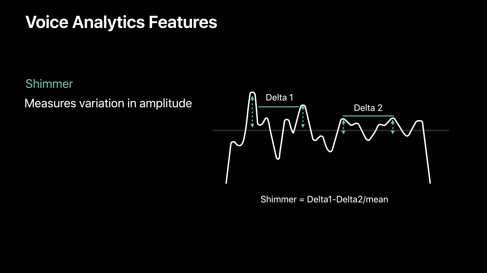

# [Advances in Speech Recognition](https://developer.apple.com/videos/play/wwdc2019/256/)

@ WWDC 19


### Support for macOS

* Supports both aAppKit and iPad apps
* 50+ languages supported
* Requires privacy approval

* Must have Siri enabled


### On-Device Speech Recognition

* Speech is private, stays on-device
* Network connection not required
* No cellular data consumption


|           | Server                                               | On-device |
| --------- | ---------------------------------------------------- | --------- |
| Accuracy  | Best                                                 | Good      |
| Limits    | 1 minute max audio duration Limited requests per day | None      |
| Languages | 50+                                                  | 10+       |

전에 Speech Recognition을 사용해 보았을 때는 on-device recognition이 지원되지 않았었는데 지금은 지원이 된다. 하지만 여전히 한국어는 포함되어 있지 않다. 영어, 스페인어, 이탈리아어, 브라질식 포르투갈어, 러시아어, 터키어, 중국어가 지원된다.


```swift
guard let recognizer = SFSpeechRecognizer() else {
  return
}

if !recoognizer.isAvailable {
  return
}

let request = SFSpeechURLRecognitionRequesT(url: url)

if speechRecongizer.supportsOnDeviceRecognition {
  requuest.requiresOnDeviceRecognition = true
}
```


### Speech Recognition Results: iOS 10

* Transcription
* Alternative interpretations
* Confidence levels
* Timing information


### Speech Recognition Results: iOS 13

* Speaking rate
* Average pause duration
* Voice Analytics features





### Summary

* Access to speech recognition in macOS
* Run speech recognition on-device
* Access to rich voice analytics features