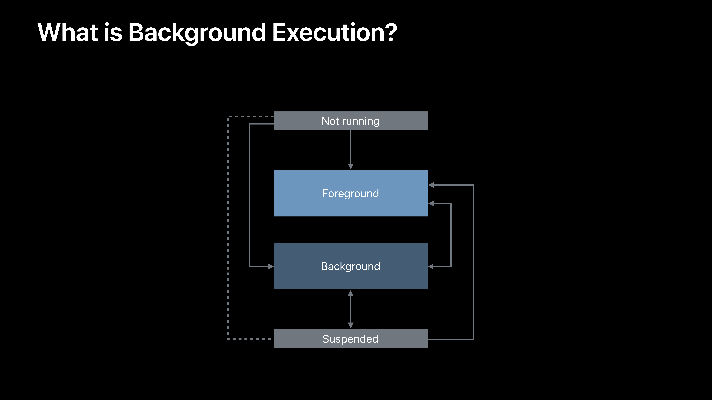
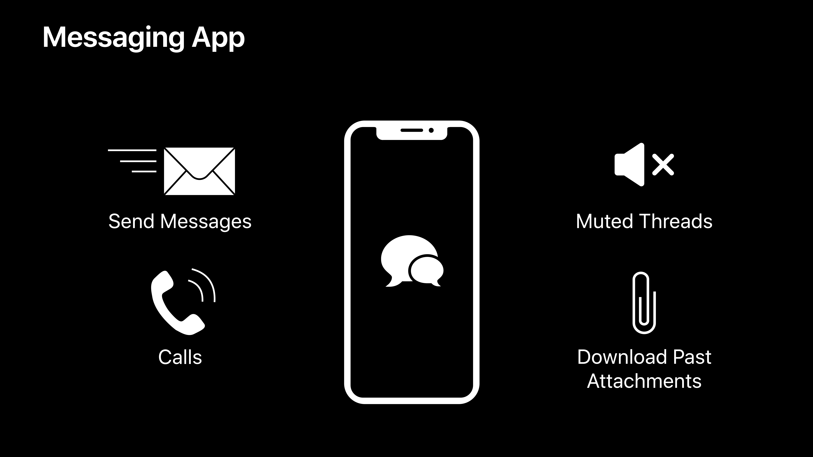
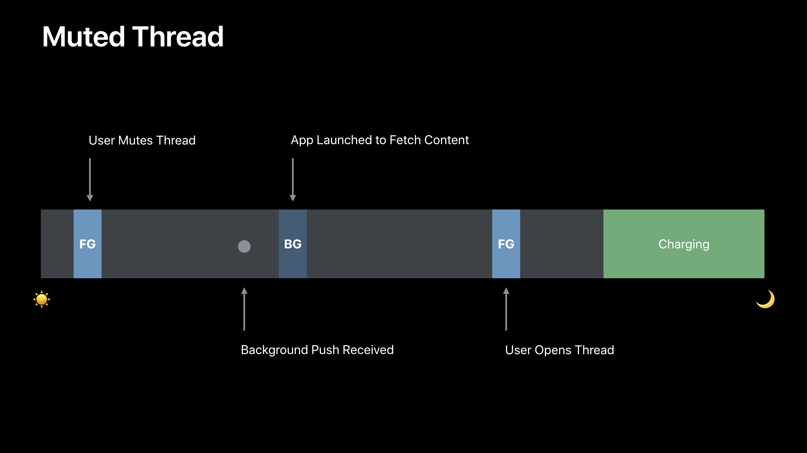
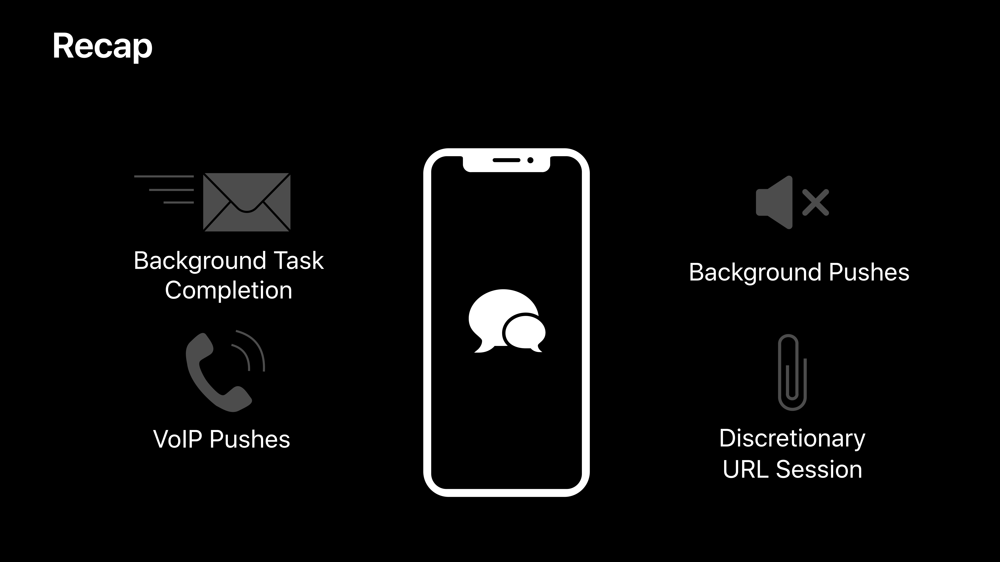

# [Advances in App Background Execution](https://developer.apple.com/videos/play/wwdc2019/707/)

### 목차

* Overview of Background Execution
* Best practices
* New BackgroundTasks framework


[Apple Document: BackgroundTasks](https://developer.apple.com/documentation/backgroundtasks) 참고

### Overview of Background Execution



* background execution이란 앱이 foreground 상태가 아닌 상황에서 동작하고 실행되는 것을 말한다.

#### Why Do We Enter This State?

* App request
* Event trigger

#### Important Considerations for Background Execution

* Power
* Performance
* Privacy


### Best Practices



#### Send Messages

* User expects immediate completion
* Protect completion
* Protect by using Background Task Completion
* Start based on user action


#### Background Task Completion

Gives app additional time to run in the background before being suspended

* `UIApplication.beginBackgroundTask(expirationHandler:)`
* `ProcessInfo.performExpiringActivity(withReason:using:)`

Complete work started in the foreground

* Saving files to disk, completing user-initiated requests

```swift
// Guarding Important Tasks while App is Still in the Foreground
func send(_ message: Message) {
    var sendOperation = SendOperation(message: message)
    var identifier: UIBackgroundTaskIdentifier!
    identifier = UIApplication.shared.beginBackgroundTask(expirationHandler: {
        sendOperation.cancel()
        postUserNotification("Message not sent, please resend")
        // Background task will be ended in the operation's completion block below
    })
    sendOperation.completionBlock = {
        UIApplication.shared.endBackgroundTask(identifier)
    }
    operationQueue.addOperation(sendOperation)
}
```


#### Phone Calls

* VoIP push notificatons
* Special type of push that launches your app

```swift
func registerForVoIPPushes() {
    self.voipRegistry = PKPushRegistry(queue: nil)
    self.voipRegistry.delegate = self
    self.voipRegistry.desiredPushTypes = [.voIP]
}
```


#### VoIP Pushes

* Must report incoming call with CallKit in `didReceiveIncomingPush` callback
* If not, system may stop launching your app for VoIP pushes

```swift
let provider = CXProvider(configuration: providerConfiguration)

func pushRegistry(_ registry: PKPushRegistry, didReceiveIncomingPushWith payload: PKPushPayload, for type: PKPushType, completion: @escaping () -> Void) {
    if type == .voIP {
        if let handle = payload.dictionaryPayload["handle"] as? String {
            let callUpdate = CXCallUpdate()
            callUpdate.remoteHandle = CXHandle(type: .phoneNumber, value: handle)
            let callUUID = UUID()
            provider.reportNewIncomingCall(with: callUUID, update: callUpdate) { _ in
                completion()
            }
            establishConnection(for: callUUID)
        }
    }
}
```

* Other tips
  * Caller info in push payload
  * Set `apns-expiration` on push to `0` or something small
  * Prefer a banner? Use standard pushes
    * Notification Service Extension to modify content


#### Muted Threads

* Many different threads
* User may not want alerts for specific thread
* Message content may be relevant
* Alert device, not user
* Use background push as best effort way to download content

* Can always download when app re-enters foreground


#### Background Pushes

* Mechanism to tell device new data is available without alerting user

* Send push with `"content-available: 1"` without `"alert"`, `"sound"`, or `"badge"`

* System intelligently decides when to launch app to download content

* Must set `apns-priority = 5` or app will not launch
* Should set `apns-push-type = background`



#### Download Past Attachments

* User signs into account
* Download conversation list, recent messages immediately
* Defer download of older content
* Defer work if possible to minimize user-visible impact
* Same principles to any deferrable download or upload
  * Batching analytics uploads
  * Photos


#### Discretionary Background URL Session

* Allows the system to defer the download until a better time

* Provide information to system for smarter scheduling

  ```swift
  // Set up background URL session
  let config = URLSessionConfiguration.background(withIdentifier: "com.app.attachments")
  let session = URLSession(configuration: config, delegate: ..., delegateQueue: ...)
  
  // Set discretionary
  config.discretionary = true
  
  // Set timeout intervals
  config.timeoutIntervalForResource = 24 * 60 * 60
  config.timeOutIntervalForRequest = 60
  
  // Create request and task
  var request = URLRequest(url: url)
  request.addValue("...", forHTTPHeaderField: "...")
  let task = session.downloadTask(with: request)
  
  // Set time window
  task.earliestBeginDate = Date(timeIntervalSinceNow: 2 * 60 * 60)
  
  // Set workload size
  task.countOfBytesClientExpectsToSend = 160
  task.countOfBytesClientExpectsToReceive = 4096
  task.resume()
  ```




### New BackgroundTasks Framework

BackgroundTasks가 실행되는 시점 조절

#### BackgroundTasks

* A new framework for scheduling background work
* Available on iOS, iPadOS, tvOS, and iPad Apps on Mac


#### Background Processing Tasks

* Several minutes of runtime at system-friendly times
  * Deferrable maintenance work
  * Core ML training/inference
* Can turn off CPU Monitoring for intensive work
* Eligible if requested in foreground or if app has been recently used


#### Background App Refresh Task

* New API, same policies

  * 30 seconds of runtime
  * Keep app up-to-date throughout the day

* Eligibility based on usage patterns

* Old UIApplication fetch API is deprecated, and not supported on Mac

  ```swift
  UIApplication.setMinimumBackgroundFetchInterval(_:)
  UIApplicationDelegate.application(_:performFetchWithCompletionHandler:)
  ```


#### Additional Considerations

* Don't set `earliestBeginDate` too far into the future
* Ensure files are accessible while device is locked
  * `FileProtectionType.completeUntilFirstUserAuthentication`
* UIScene apps should call `UIApplication.requestSceneSessionRefresh(_:)`
* Consider calling `BGTaskScheduler.submit(_:)` on a background queue if submitting at launch


### Summary

* Be conscientious when running in the background
* Use the right background mode for the job
* Schedule deferrable work with BackgroundTasks


BackgroundTasks에 대한 경험이 거의 전무하다 보니 이해에 좀 부족함이 있는 것 같다. 문서랑 예제 코드를 다시 살펴볼 필요가 있다.