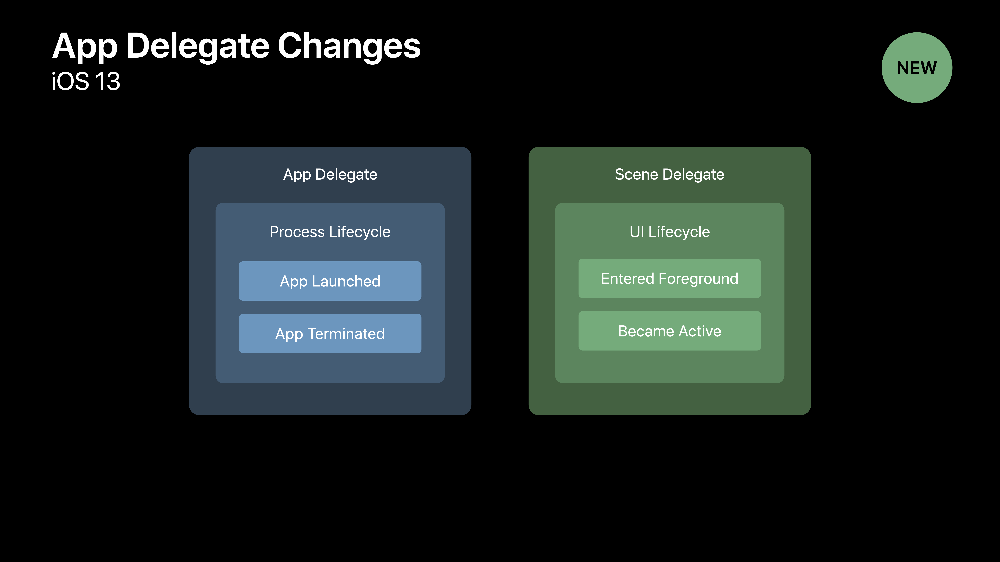
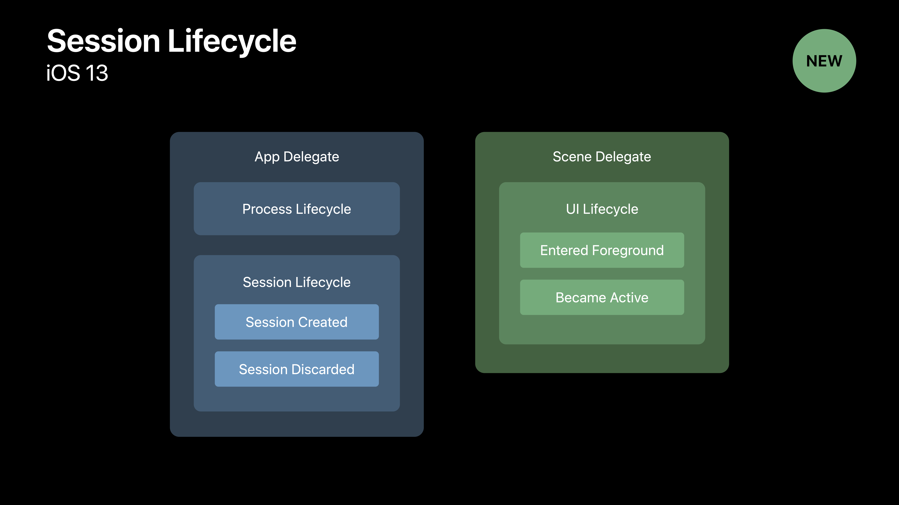
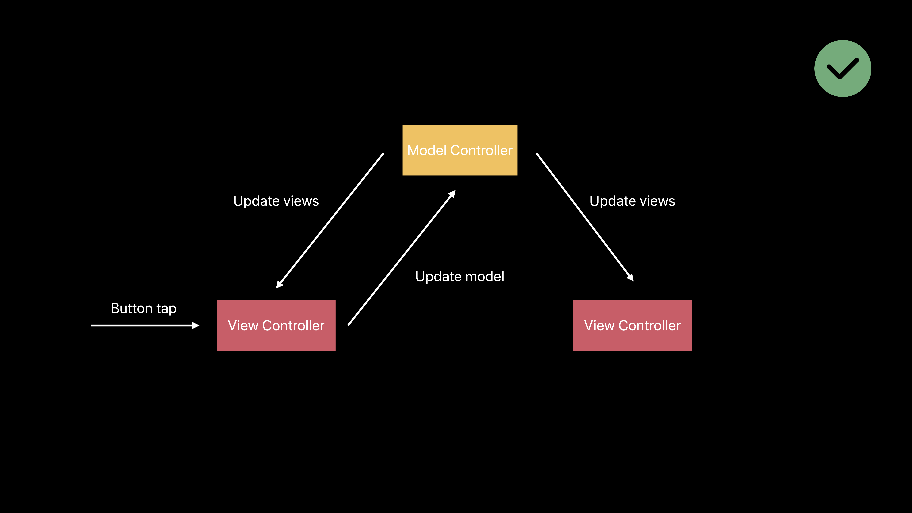

# [Architecting Your App for Multiple Windows](https://developer.apple.com/videos/play/wwdc2019/258/)

### App Delegate Responsibilities

기존에는 App Delegate에서 Process Lifecycle과 UI Lifecycle을 모둗 관리했다.

```swift
@UIApplicationMain
class AppDelegate: UIResponder, UIApplicationDelegate {
  var window: UIWindoow?
  
  func application(_ appplication: UIApplication, didFinishLaunchingWithOptions launchOptions: [UIApplication.LaunchOpptionKey: Any]?) -> Bool {
    // Do some global setup
    Database.connect()
    
    // Set up the UI
    window = UIWindow()
  }
}
```


### App Delegate Changes



| UIApplicationDelegate           | UISceneDelegate           |
| ------------------------------- | ------------------------- |
| application:willEnterForeground | scene:willEnterForeground |
| application:didEnterBackground  | scene:didEnterBackground  |
| application:willResignActive    | scene:willResignActive    |
| application:didBecomeActive     | scene:didBecomeActive     |


### Session Lifecycle




### Configuring New Sessions

* Select a scene configuration
* Provdes user activities, URLs
* Static and dynamiic definition


```swift
class SceneDelegate: UIResponder, UIWindowSceneDelegate {
  var window: UIWindow?
  
  func scene(_ scene: UIScene, willConnectTo session: UISession, options: .ConnectionOptions) {
    window = UIWindow(windowScene: scene as! UIWindowScene)
    
    if let activity = options.userActivities.first ?? session.stateRestorationActivity {
      configure(window: window, with: activity)
    }
  } 
}
```


### Scene Disconnection

```swift
func sceneDidDisconnect(_ scene: UIScene)
```


* System is releasing the scene
* May be called any time
* Release associated resources
* The scene may return!


### Cleaning up Discarded Sessions

```swift
func application(_ application: UIApplication, didDiscardSceneSessions sceneSessions: Set<UISceneSessions>)
```

* For permanently discarded sessions
* Delete associated data
* May be called after next launch


### Per-Scene State Restoration

```swift
func stateRestorationActivity(for scene: UIScene) -> NSUserActivity?
```

* Called on scene background
* Encode state via NSUserActivity
* Data protection


```swift
class SceneDelegate: UIResponder, UIWindowSceneDelegate {
  func stateRestorationActivity(for scene: UIScene) -> NSUserActivity? {
    let currentActivity = fetchCurrentUserActivity(for: self.window)
    return currentActivity
  }
  
  func scene(_ scene: UIScene, willConnectTo session: UISceneSession, otions: .ConnectionOptions) {
    if let restorationActivity = session.stateRestorationActivity {
      self.configure(window: window, with: restorationActivity)
    }
  }
}
```


### Keeing Scenes in Sync



이 순서대로가 맞다! view를 먼저 update하는 방식은 x!


```swift
enum UpdateEvent {
  case NewMessage(message: Message)
  
  static let NewMessageNotificationName = Notification.Name(rawValue: "NewMessage")
  
  func post() {
    // Notify subscribers
    switch self {
      case .NewMessage(message: _): NotificationCenter.default.post(name: UpdateEvent.NewMessageNotificationName, object: self)
    }
  }
}

class ChatModelController {
  static let shared = ChatModelCntroller()
  
  func add(message: Message) {
    saveToDisk(message)
    
    let event = UpdateEvent.NewMessage(message: message)
    event.post()
  }
}

class ChatViewController: UIViewController {
  override func viewDidLoad() {
    NotificationCenter.default.addObserver(selector: ..., name: .NewMessageNotificationName)
  }
  
  @objc func handle(notification: Notification) {
    let event = notification.object as! UpdateEvent
    
    switch event {
      case .NewMessage(message: newMessage):
      	self.animateNewRow(for: newMessage)
      	self.updateBadgeCount()
    }
  }
  
  @objc func didEnterMessage(sender: UITextField) {
    let message = Message(text: sender.text)
    
    // Update the model
    ChatModelController.shared.add(message: message)
  }
}
```

