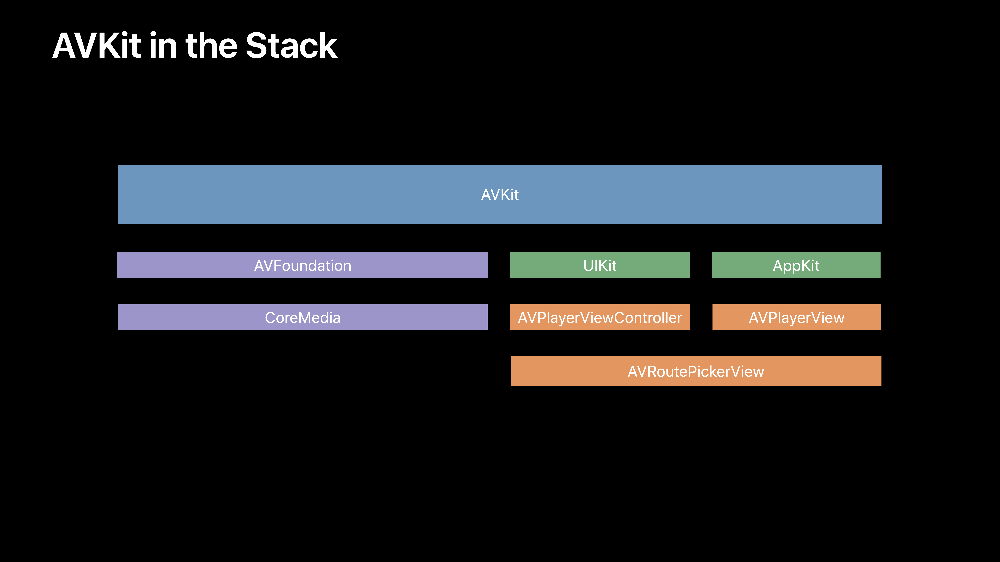

# [Delivering Intuitive Media Playback with AVKit](https://developer.apple.com/videos/play/wwdc2019/503/)

@ WWDC 19


### AVKit in the Stack




```swift
import AVKit

// 실제로는 url 생성 후 넣어줘야 함 구라쟁이 아저씨 흥
// 1) Create an AVPlayer
let player = AVPlayer(url: "https://my.example.video.m3u8") 

// 2) Create an AVPlayerViewController
let playerViewController = AVPlayerViewController()
playerViewController.player = player

// 3) Show it
present(playerViewController, animated: true)
```


## AVPlayerViewController on iOS: What's new for iOS 13

### Full screen callbacks (풀스크린 enter, exit 감지)

* Extends `AVPlayerViewControllerDelegate`
* Notifies delegate when beginning or ending full screen presentation

```swift
@available(iOS 12.0, *)

func playerViewController(_ playerViewController: AVPlayerViewController, willBeginFullScreenPresentationWithAnimationCoordinator coordinator: UIViewControllerTransitionCoordinator)

func playerViewController(_ playerViewController: AVPlayerViewController, willEndFullScreenPresentationWithAnimationCoordinator coordinator: UIViewControllerTransitionCoordinator)

// Implementing AVPlayerViewControllerDelegate's full screen callbacks

func playerViewController(_ playerViewController: AVPlayerViewController, willBeginFullScreenPresentationWithAnimationCoordinator coordinator: UIViewControllerTransitionCoordinator) {
  coordinator.animate(alongsideTransition: { (context) in
		// Add coordinated animations
  }) { (context) in
     if context.isCancelled {
       // Still embedded inline
     } else {
       // Presented full screen
       // Take strong reference to playerViewController if needed
     }
	}
}
```

* Keep embeded player view controller alive when full screen (풀스크린으로 띄웠는데 원래 플레이어가 사라지면 안 되겠지?!)
  * Deallocating will stop full screen playback
  * Okay to be offscreen or removed from superview / parent
* Use delegate to restore playerViewController or retarget animation

```swift
func playerViewController(_ playerViewController: AVPlayerViewController, willEndFullScreenPresentationWithAnimationCoordinator coordinator: UIViewControllerTransitionCoordinator) {
  // If scrolled away, update playerViewController's layout here
}
```

* Track full screen presentation state with `AVPlayerViewControllerDelegate`
  * Do not rely on `viewWillAppear(_:)` and friends
* Works for both embedded and full screen presentations
* Keep embedded player view controller alive when full screen
* Can retarget dismissal animation when embedding inline


### AVPlayerViewController in iPad Apps on the Mac

* Exact same API as on iOS
* Picture-in-picture support
  * Including AVPictureInPictureController (also for AppKit)
  * And AVPlayerView, for AppKit-based apps
* Touch Bar, keyboard, and Now Playing support
* Audio and Airplay routing
* Available in macOS 10.15


### External Metadata

: 잠금 화면에 표시되는 플레이어 알지? 그런 데에 정보를 잘 보여주려면 메타데이터를 추가해야 돼.

* Supplement missing metadata
  * Title, artwork, and more
* Same API as tvOS

```swift
@available(iOS 12.0, *)
extension AVPlayerItem {
  open var externalMetadata: [AVMetadataItem]
}
```


### Improved Support for Custom Controls

* Interactive dismissals
* Landscape support for portrait-only apps
* Keyboard and Touch Bar support
* Now playing management
* Automatic video zoom


### Custom Playback Controls

* Set `showsPlaybackControls` to `false`
* Present modally
* Add controls to `contentOverlayView`
* For the best user experience, you should:
  * Override UIViewController methods for status bar, home indicator
  * Pass unhandled touches through your view
  * Let AVKit handle double-tap for video zoom


### What's New

* Full screen callbacks
* AVPlayerViewController in iPad apps for the Mac
  * Plus picture-in-picture support for AppKit-based apps
* External metadata
* Improved support for custom controls


## AVPlayerViewController on iOS: Best practices

### Showing Full Screen

* Covers `UIWindowScene` coordinate

* Use cases:

  * Splash screen
  * Full screen playback

  

### Splash Screen

* Underneath your UI
* No interaction playback controls
* No need to hide status bar or home indicator
* Possibly looping
* Video should always fill screen
* For video with alpha, custom background color
* Audio is secondary

* Add as child:

  ```swift
  parent.addChild(playerViewController)
  parent.view.addSubview(playerViewController.view) // Or other UIView insertion API
  playerViewController.didMove(toParent: parent)
  ```

* Remove from parent:

  ```swift
  playerViewController.willMove(toParent: nil)
  playerViewController.view.removeFromSuperview()
  playerViewController.removeFromParent()
  ```

* Disable playback controls:

  ```swift
  playerViewController.showsPlaybackControls = false
  ```

* Make video fill entire screen:

  ```swift
  playerViewController.videoGravity = .resizeAspectFill
  ```

* Set background color (if needed):

  ```swift
  playerViewController.view.backgroundColor = .clear // Or any other UIColor
  ```

* Disable `AVPlayer.allowsExternalPlayback`

* Configure `AVAudioSession` for secondary media playback
  * Use `.ambient` category
* Observe `AVAudioSession.silenceSecondaryAudioHintNotification`
  * Honor `AVAudioSession.secondaryAudioShouldBeSilenceHint`


### Full Screen Playback

* Present modally
* Use the default `modalPresentationStyle` <- iOS 13에서 default가 automatic이니까 걍 default 쓰래!
* Do not set `AVPlayerViewController.videoGravity`
* Use `AVPlayerViewControllerDelegate` to track full screen presentation state
  * Do not rely on `viewWillAppear(_:)` and friends
* Set up `AVPlayerItem` before buffering
  * Set `AVPlayer.rate` for setting item
* Observe `AVPlayer.status` and `AVPlayerItem.status`
  * Don't begin playback until status is `.readyToPlay`
  * Check `error` property when staus is `.failed`
    * Rebuild AVFoundation object if `.mediaServicesWereReset`
* Enable `AVPlayer.usesExternalPlaybackWhileExternalScreenIsActive`
* Configure `AVAudioSession` for `.playback`


### Embeding AVPlayerViewController Inline

* Be prepared to begin and end full screen playback

  * Track state using `AVPlayerViewControllerDelegate`
  * Keep strong reference to embedded `AVPlayerViewController` when full screen
  * Retarget dismissal animations when ending full screen presentation

* Leave `modalPresentationStyle` as `.fullScreen`

* Can style embedded content without impacting full screen:

  * `videoGravity`
  * `view.layer.cornerRadius`, `cornerCurve`, and `maskedCorners`
  * `view.backgroundColor`

* For automatically entering and exiting full screen:

  * `entersFullScreenWhenPlaybackBegins`
  * `exitsFullScreenWhenPlaybackEnds`

* Adopt UIViewController containment API

* Add as child:

  ```swift
  parent.addChild(playerViewController)
  containerView.addSubview(playerViewController.view) // Don't put views on top
  playerViewController.didMove(toParent: parent)
  ```

* Remove from parent:

  ```swift
  playerViewController.willMove(toParent: nil)
  playerViewController.view.removeFromSuperview()
  playerViewController.removeFromParent()
  ```

* Use `.contentOverlayView` <- 약간 내가 찾던 느낌쓰, 좀 더 공부해 보자.

  * Okay to use before setting player or player item

* Observe `.isReadyForDisplay`

  * Returns `true` when first frame is ready

  ```swift
  let token = pvc.observe(\.isReadyForDisplay, options: [.initial]) { [weak self] in
    if observed.isReadyForDisplay {
      // Hide any poster frame or placeholder
    }
  }
  ```

  

### Picture-in-picture

* Configure AVAudioSession for `.playback`

* Add background audio mode entitlement in Xcode

* Don't pause playback when entering background

  * Picture-in-picture may be starting!

* If you must pause, wait until in background

  * Only if picture-in-picture hasn't started
  * Pre-iOS 13: `UIApplicationStateBackground`
  * iOS 13 and later: `UISceneActivationStateBackground`

* Track state using `AVPlayerViewControllerDelegate`

* Application can stop picture-in-picture

  * Toggle `AVPlayerViewController.allowsPictureInPicturePlayback`

* Be prepared for dismissal when starting

  * AVKit prevents deallocation while active

* Always restore user interface when requested by user

  ```swift
  // Restoring from picture-in-picture using AVPlayerViewControllerDelegate
  func playerViewController(_ playerViewController: AVPlayerViewController, restoreUserInterfaceForPictureInPictureStopWithCompletionHandler completionHandler: @escaping (Bool) -> Void) {
    presentingViewController.present(playerViewController, animated: true) {
      // Must invoke completionHandler
      completionHandler(true)
    }
  }
  ```

  


tvOS 내용은 정리는 딱히 정리하지 않겠다!