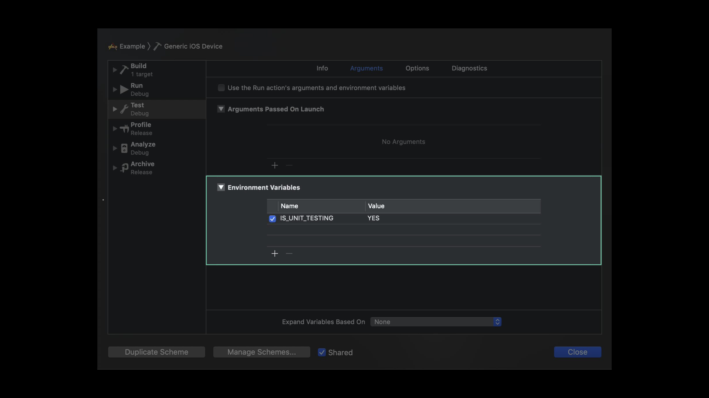
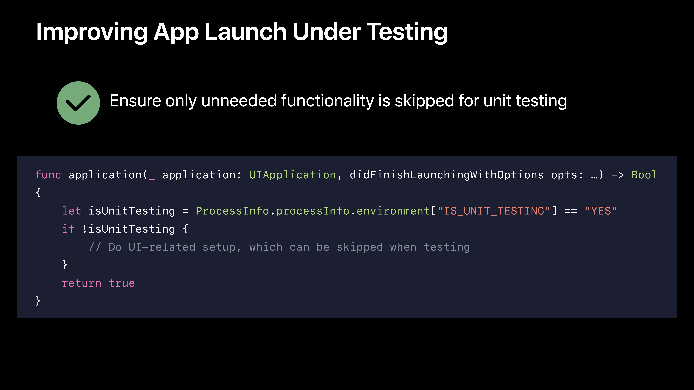
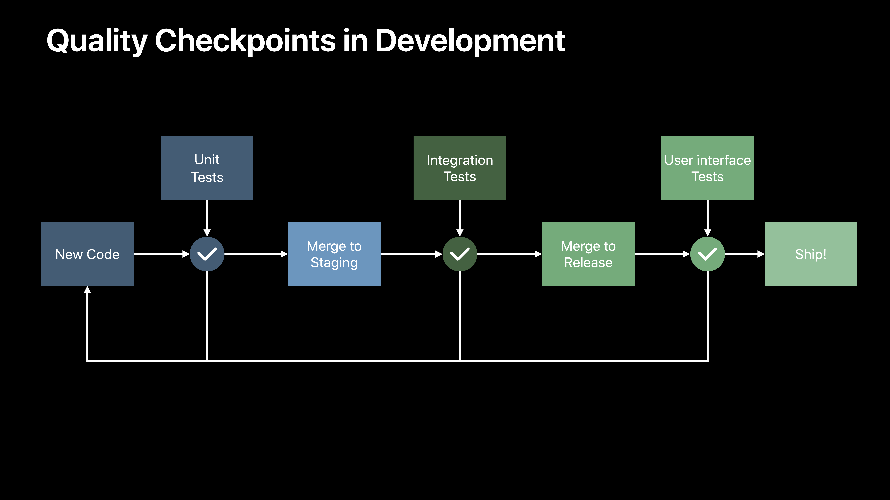
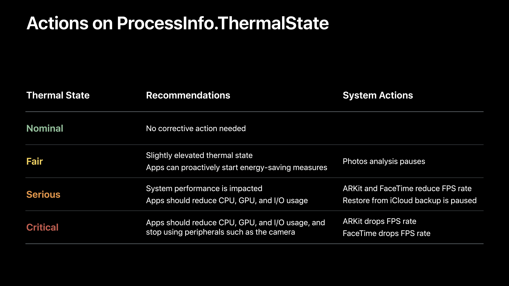

# [Designing for Adverse Network and Temperature Conditions](https://developer.apple.com/videos/play/wwdc2019/422/)

@ WWDC 19


### Real-World Network Conditions

* Reduced responsiveness
* Perceived app freezing
* Functional problems







### Qualities of Good Tests

* Repeatable
* Deterministic
* Low variance
* Representative





### Testing Under Network Conditiions

* Conditioning the network infrastructure
  * Custom routers
  * Can be prohibitively complex


### Designing for Adverse Network Conditions

* Use Optimistic DNS and TLS 1.3
* Use HTTP/2
* Set reasonable timeouts
* Avoid reachability checks
* Consider differences between testing conditions and the real world
* Use your app with different Link conditions
* Be aware of functional and performance degradation
* Include 3G Network Link in test runs
* Optimize towards progressing app behavior


### Defensive Design

* Reduce your app's energy impact and contribution to excessive thermal states
* Implement progressive optimizations under elevated thermal states
* Listen to `ProcessInfo.ThermalState` notifications





### Designing for Adverse Thermal Conditions

* Register for `ProcessInfo.thermalStateDidChangeNotification`
* Use the `ProcessInfo.ThermalState` cases to react to thermal state changes
* Switch off background and unneeded functionaliity when thermal state is elevated


```swift
NotificationCenter.default.addObserver(self, selector: #selector(reactToThermalStateChange(_:)), name: ProcessInfo.thermalStateDidChangeNotification, object: nil)

@objc fnc reactToThermalStateChange(_ notification: Notification) {
  thermalState = ProcessInfo.processInfo.thermalState
}

var thermalState = ProcessInfo.ThermalState.nominal {
  didSet {
    switch thermalState {
    case .nominal, .fair:
      configuration.userFaceTrackingEnabled = true
      configuration.frameSemantics = .personSegmentation
      sceneView.renderMotionBlur = true
    case .serious:
      configuration.userFaceTrackingEnabled = false
      configuration.frameSemantics = .init()
      sceneView.renderMotionBlur = true
    case .critical:
      configuration.userFaceTrackingEnabled = false
      configuration.frameSemantics = .init()
      sceneView.renderMotionBlur = false
    }
  }
}
```


### Testing Under Temperature Conditions

* Doon't extrapolate behavior from nominal conditions
* Avoid running a dummy CPU load to warm the device
* Don't overlook the energy impact of your app


### Summary

* Add test runs with adverse device conditions
* Look for progressions in your application behavior
* Activate different Network Links such as 3G
* Activate elevated temperature states such as the Serious state