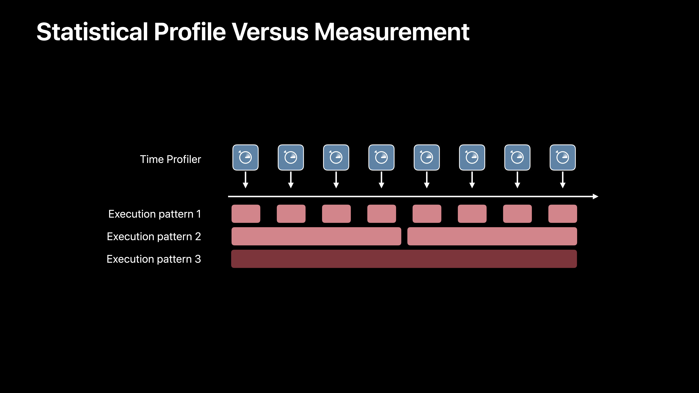
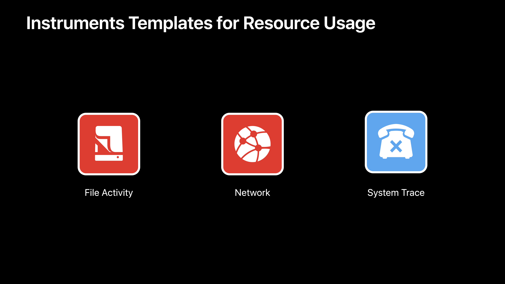
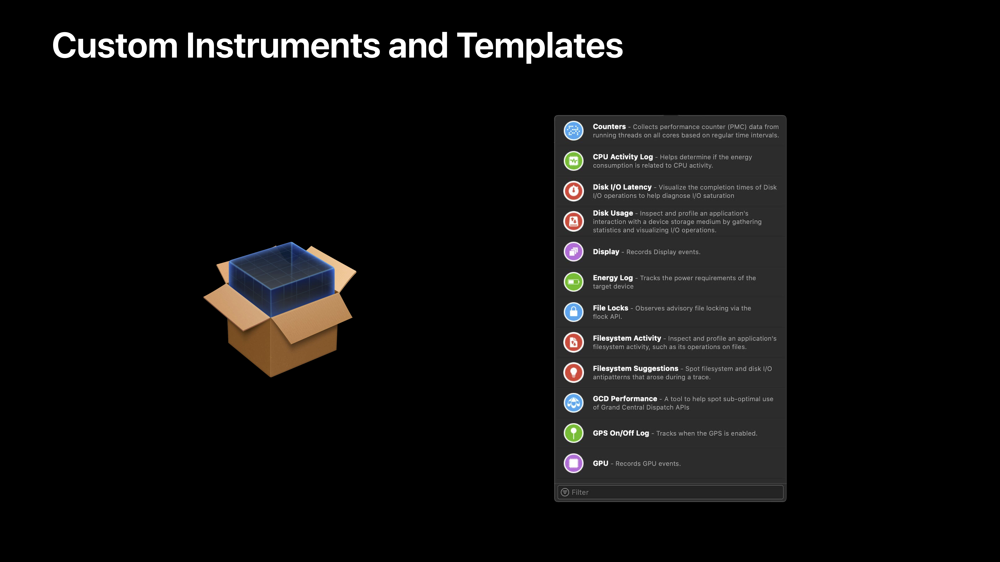

# [Getting Started with Instruments](https://developer.apple.com/videos/play/wwdc2019/411/)

@ WWDC 19

### Profiling Tips

* Time Profiler shows how your app is spending time
* Check main thread when responsiveness issues occur
* Profile release builds
* Profile with difficult workloads and older device

### What About Efficiency?

* Main thread responsiveness isn't the whole story
* High CPU use can
  * Drain the battery
  * Heat up the device
  * Spin up fans

precise measurement 필요!

### Features of Signposts

* Simpller and more efficient than printing
* Built-in support for measuring time
* Traced by Instruments

### Concepts

* Statistical profiles show which code is most commonly executed
* Exact measurements show how and why code is executed
* XCTests reliably reproduce workloads for profiling

소개된 템플릿 외에도 다양한 템플릿들 존재

커스텀해서 사용할 수도 있다!

### Summary

* Profile eqrly and often
* Try out Instruments today