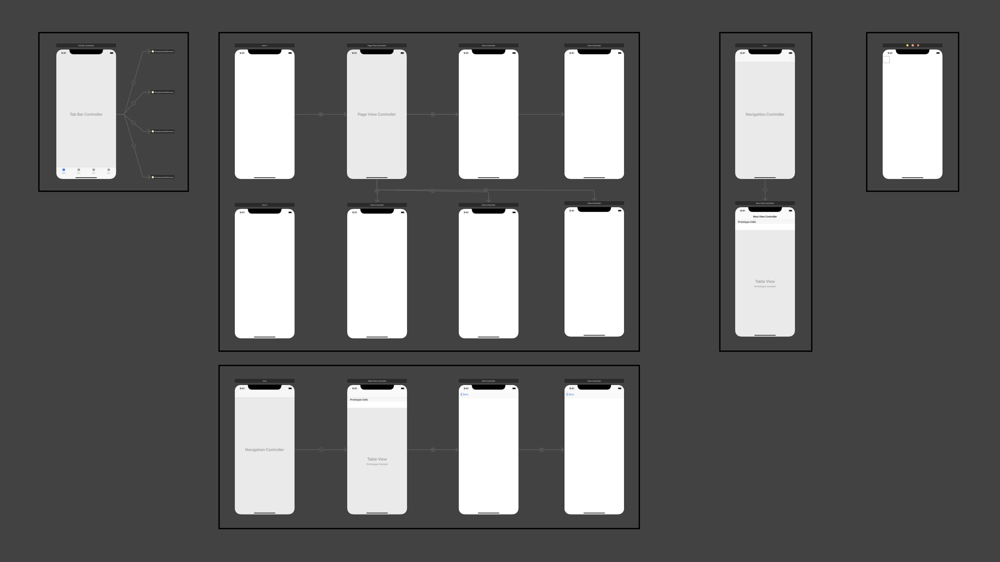

# [Great Developer Habits](https://developer.apple.com/videos/play/wwdc2019/239/)

## Organize

* Functional organization with groups

* Mirror project structure and file structure

* Break apart large storyboards

  

* Modernize your project file

* Thorw away from code scraps

* Address the root cause of warnings


## Track

* Use source control
* Keep commits small and isolated
* Write useful commit messages
* Utilize branches for bug and feature work


## Document

* Comments are critical for future understanding

* Good comments provide background and reasoning

  ```swift
  // A constant string id value
  let id = "2ADA155F-1529-4D2D-98C4-0E4BD06940E8"
  ```

  ```swift
  // The permanent identifier for this application when interacting
  // with the CMS, provided by the vendor of the CMS.
  let id = "2ADA155F-1529-4D2D-98C4-0E4BD06940E8"
  ```

* Use descriptive variable and constant names

  ```swift
  // The permanent identifier for this application when interacting
  // with the CMS, provided by the vendor of the CMS.
  let cmsApplicationIdentifier = "2ADA155F-1529-4D2D-98C4-0E4BD06940E8"
  ```

* Include documentation

  * cmd + option + /


## Test

* Write unit tests

* Run unit tests before commiting code
* Build a foundation for continuous integration


## Analyze

* Simulate poor networks with Network Link Conditioner
* Use sanitizers and checkers
* Measure performance and efficiency with Debug Gauges
* Investigate issues with Instruments


## Evaluate

* Include code review as part of your practice
* Understand each line
* Build it
* Run tests
* Proofread for style, spelling, and syntax


## Decouple

* Determine functional segments and break them out
* Scale your work across multiple apps
* Improve efficiency with extensions
* Share your efforts with the broader community
* Documentation is critical


## Manage

* Use community and open source projects responsibly
* Understanding dependencies thoroughly
* Ensure that privacy is respected
* Have a plan if a dependency goes away or is no longer maintained