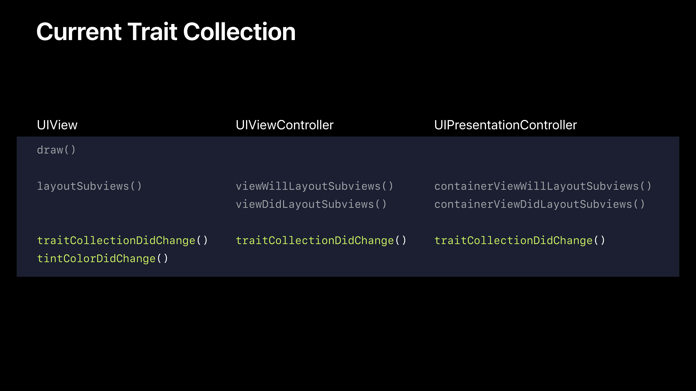
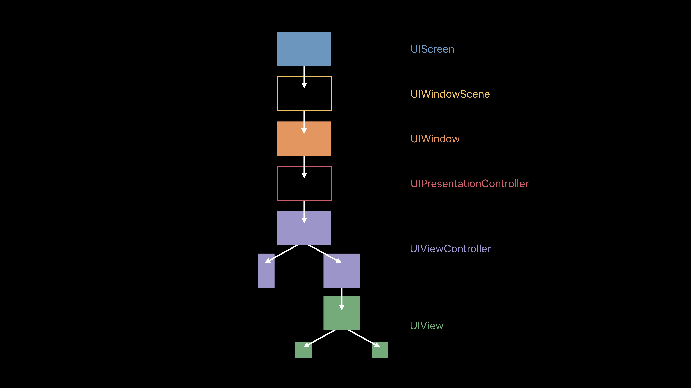

# [Implementing Dark Mode on iOS](https://developer.apple.com/videos/play/wwdc2019/214/)

@ WWDC 19

### Dark Mode is a new look

* Color
  * 적절한 semantic dynamic color를 사용해야 한다. 
  * 다크 모드는 단순히 라이트 모드의 역이 아니다. 의미와 계층을 표현할 수 있는 모드이다.
  * 라이트 모드의 `systemBackground`, `secondarySystemBackground`, `tertiarySystemBackground` 가 다크 모드에서 그 의미에 맞게 변화한다.
  * Text의 경우에도 `Primary`, `Secondary`, `Tertiary`, `Quaternary` 이런 식으로 계층이 나눠져 있다.
* Materials
  * 단순한 색상 변화가 아니다. blur effect가 들어간다. 
* Built-in views and controls provided by UIKit

#### Designing for Dark Mode

* UIKit colors, materials, views, controls를 사용해라
* 필요할 때 color나 image를 커스텀해라


### It's easy to implement

#### Implementing Dark Mode

* Using iOS 13 SDK implies Dark Mode support
* You decide your app's appearance

#### Dynamic colors 사용하기

* 원래 컬러는 하나의 색만 가지고 있었다면, 다이나믹 컬러는 라이트 모드일 때의 컬러와 다크 모드일 때의 컬러 두 개를 가진다.

#### Blurs

* `Thick`, `Regular`, `Thin`, `Ultrathin` 의 4가지 BlurEffect를 제공한다.
* `UIBlurEffect`, `UIVibrancyEffect`

#### Level

* 같은 `systemBackground` 컬러인데도 위에 올라온 뷰의 색은 더 밝다. 그 이유는 레벨이 다르기 때문이다.
* base level, elevated level (lighter than base level)


### Flexible and powerful

#### Resolving Dynamic Colors

다이나믹 컬러가 자동적으로 모드가 바뀌면 컬러를 바꾸는 것을 확인할 수 있었다. 어떻게 이것이 가능할까? 각각의 뷰와 뷰 컨트롤러는 trait collection을 가진다.

* `UITraitCollection`
  * `userInterfaceIdiom`
  * `userInterfaceStyle`
  * `userInterfaceLevel`
* 다이나믹 컬러는 trait collection에 의해 resolve 된다.

```swift
let dynamicColor = UIColor.systemBackground
let traitCollection = view.traitCollection
let resolvedColor = dynamicColor.resolvedColor(with: traitCollection)
```

#### Custom Dynamic Colors

```swift
let dynamicColor = UIColor { (traitCollection: UITraitCollection) -> UIColor in
	if traitCollection.userInterfaceStyle == .dark {
    return .black
  } else {
    return .white
  }
}
```

#### Current Trait Collection

```swift
class BackgroundView: UIView {
  override func draw(_ rect: CGRect) {
    // UIKit sets UITraitCollection.current to self.traitCollection
    UIColor.systemBackground.setFill()
    UIRectFill(rect)
  }
}
```



```swift
let layer = CALayer()
let traitCollection = view.traitCollection

// Option 1
let resolvedColor = UIColor.label.resolvedColor(with: traitCollection)
layer.borderColor = resolvedColor.cgColor

// Option 2
traitCollection.performAsCurrent {
  layer.borderColor = UIColor.label.cgColor
}

// Option 3
let savedTraitCollection = UITraitCollection.current

UITraitCollection.current = traitCollection
layer.borderColor = UIColor.label.cgColor

UITraitCollection.current = savedTraitCollection
```

#### When Dynamic Color Might Change

```swift
override func traitCollectionDidChange(_ previousTraitCollection: UITraitCollection?) {
  super.traitCollectionDidChange(previousTraitCollection)
  
  if traitCollection.hasDifferentColorAppearance(comparedTo: previousTraitCollection) {
    // Resolve dynamic colors again
  }
}
```

#### Resolving Dynamic Images

```swift
let image = UIImage(named: "HeaderImage")
let asset = image?.imageAsset
let resolvedImage = asset?.image(with: traitCollection)
```

#### Trait Collection

기억해야 할 것은 Trait collection이 앱에 한 개만 존재하는 것이 아니라는 것이다. 



계층마다 존재하고, TraitCollection의 변화가 생기면 traitCollectionDidChange가 불린다.

뷰를 생성하고 어떤 계층에 addSubview 되기 전에, 예상되는 traitCollection을 그 뷰에 설정한다. 그 후, 뷰가 subview로 설정되면 윗 계층의 traitCollection을 받는다.

#### Trait Collection Change in iOS 13

* 초기화 중에 traits는 예측된다.
* `traitCollectionDidChange(_:)` 는 변화가 생겼을 때만 호출된다.
* launch argument를 설정해서 디버그 로그를 남기는 것이 가능하다.
  * `-UITraitCollectionChangeLoggingEnabled YES`

#### Using Trait Collections

* Layout is the best time to use traits
  * `UIViewController.viewWillLayoutSubviews()`
  * `UIView.layoutSubviews()`
  * `UIViewController.viewDidLayoutSubviews()`

#### Overriding User Interface Style

```swift
class UIViewController {
  var overrideUserInterfaceStyle: UIUserInterfaceStyle
}

class UIView {
  var overrideUserInterfaceStyle: UIUserInterfaceStyle
}
```

전체 앱에 대해서 설정을 하고 싶다면 Info.plist key를 추가해라

* `UIUserInterfaceStyle` to `Light` or `Dark`

#### Overriding Traits

Existing API to override any traits

```swift
class UIPresentationController {
  var overrideTraitCollection: UITraitCollection?
}

class UIViewController {
  func setOverrideTraitCollection(_: UITraitcollection?, forChild: UIViewController)
}
```


### Dark Mode API Updates

#### Status Bar

* Before iOS 13
  * `.default`, `.lightContent` 두 개
* iOS 13
  * `.default` -> `.darkContent`, `.lightContent` 

#### UIActivityIndicatorView

* New dynamic styles `.medium` and `.large`
* Use the `color` property to set your own

#### Drawing Text

```swift
let attributes: [NSAttributedString.Key: Any] = [
  .font: UIFont.systemFont(ofSize: 36.0)
  .foregroundColor: UIColor.label
]
```

#### Web Content

* Must opt in to dark mode
* Declare supported color schemes with `color-scheme`
* Use `prefers-color-scheme` media query for custom colors and images

> Supporting Dark Mode in Web Content (WWDC 2019)

#### tvOS

* Apps bult using tvOS 13 SDK are expected to support dark mode
* Most new API is available

#### iPad Apps for Mac

* Same API
* Follows system setting
* Matches AppKit colors and materials


### Summary

* Apps on iOS 13 are expected to support dark mode
* Use system colors and materials
* Create your own dynamic colors and images
* Leverage flexible infrastructure