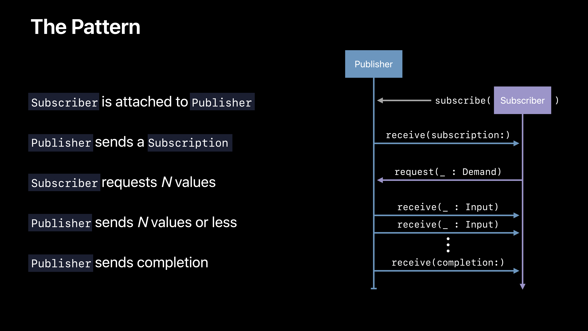

# [Introducing Combine](https://developer.apple.com/videos/play/wwdc2019/722/)

@ WWDC 19


### Asynchronous Inteerfaces

* Target/Action
* Notification center
* URLSession
* Key-value observing
* Ad-hoc callbacks


### Combine: A unified, declarative API for processing values over time


### Combine Features

* Generic
* Type safe
* Composition first
* Request driven


### Key Concepts

* Publishers
* Subscribers
* Operators


### Publisher

* Defines how value and errors are produced
* Value type
* Allows registration of a subscriber


```swift
protocol Publisher {
  associatedtype Output
  associatedtype failure: Error
  
  func subsscribe<S: Subscriber>(_ subscriber: S) where S.Inpuut == Output, S.Faillure == Failure
}

extension NotificationCeneter {
  struct Publisher: Combine.Publisher {
    typealias Output = Notification
    typealias Failure = Never
    
    init(center: NotificationCeneter, name: Notification.Name, object: Any? = nil)
  }
}
```


### Subscriber

* Receives values and a completion
* Reference type

```swift
protocol Subscriber {
  associatedtype Input
  associatedtype Failure: Error
  
  func receive(subscription: Subscription)
  func receive(_ input: Input) -> Subscribes-
}

extension Subscriber {
  class Assign<Root, Input>: Subscriber, Cancellable {
    typealias Failure = Never
    init(object: Root, keyPath: ReferenceWritableKeyPath<Root, Index>)
  }
}
```


### The Pattern




### Operator

* Adopts `Publisher`
* Describes a behavior for changing values
* Subscribes to a `Publisher` ("upstream")
* Sends result to a `Subscriber` ("downstream")
* Value type

```swift
extension Publishers {
  struct Map<Upstream: Publisher, Output>: Publisher {
    typealias Failure = Upstream.Failure
    
    let upstream: Upstream
    let transform: (Upstream.Output) -> Output
  }
}
```

```swift
// Using Opeerators
let graduationPublisher = NotificationCenter.Publisher(center: .default, name: .graduated, object: merlin)

let gradeSubscriber = Subscribers.Assign(object: merlin, keypath: \.grade)

let converter = Publishers.Map(upstream: graduationPublisher) { note in 
	return note.userInfo?["NewGradee"] as? Int ?? 0 
}

converter.subscribe(gradeSubscriber)
```

```swift
// Operator Construction
extension Publisher {
  func map<T>(_ transform: @escaping (Output) -> T) -> Publishers.Map<Self, T> {
    return Publishers.Map(upstream: self, transform: transform)
  }
}
```


### Declarative Operator API

* Functional transformations
* List operations
* Error handling
* Thread or queue movement
* Scheduling and time


### Composition

```swift
// Composing Operators
let cancellable = NotificationCenteer.default.publisher(for: .graduated, object: merlin)
	.compactMap { note in
		return note.userInfo?["NewGrade"] as? Int ?? 0                                                                                             		}
	.filter { $0 >= 5 }
	.prefix(3)
	.assign(to: \.grade, on: merlin)
```


### Zip

* Converts several inputs into a single tuple
* A "when/and" operation
* Requires input from all to proceed


### Combine Latest

* Converts several inputs into a single value
* A "when/or" operation
* Requires input from any to proceed
* Stores last value


### Try It

* Process a `NotificationCenter` post with `filter`
* Await comletion of two network requests with `zip`
* `decode` the data of a `URLResponse`


### Move to Combine

* Error handling and cancellation
* Schedulers and time
* Design patterns