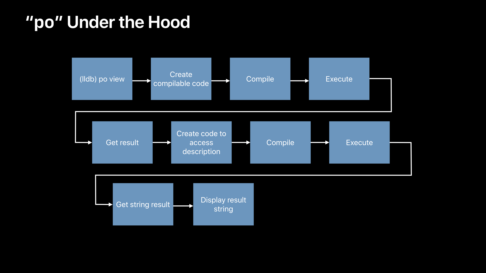
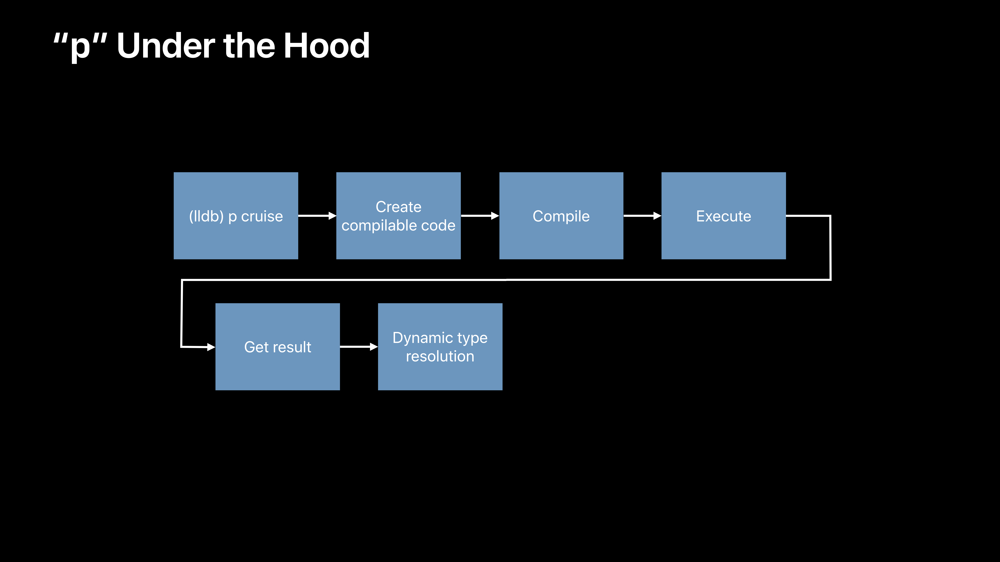
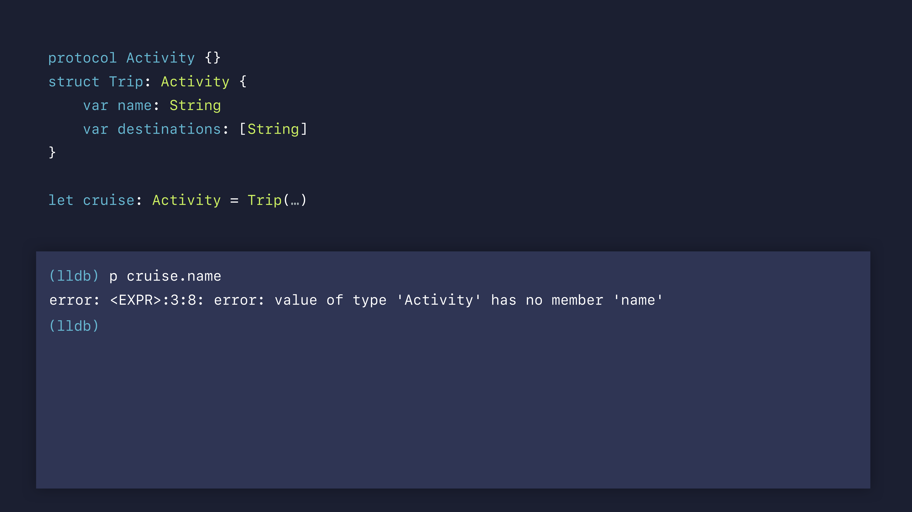
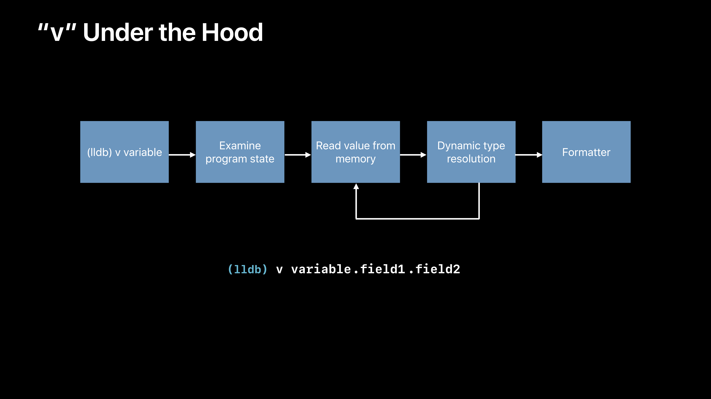
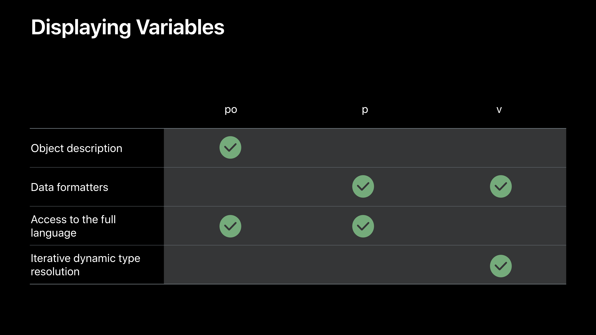
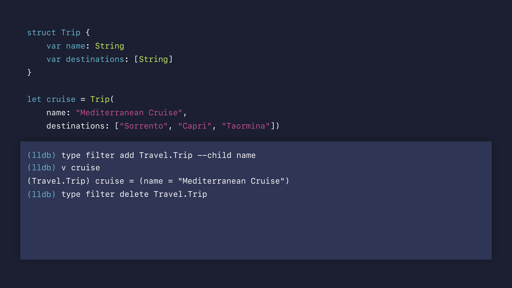
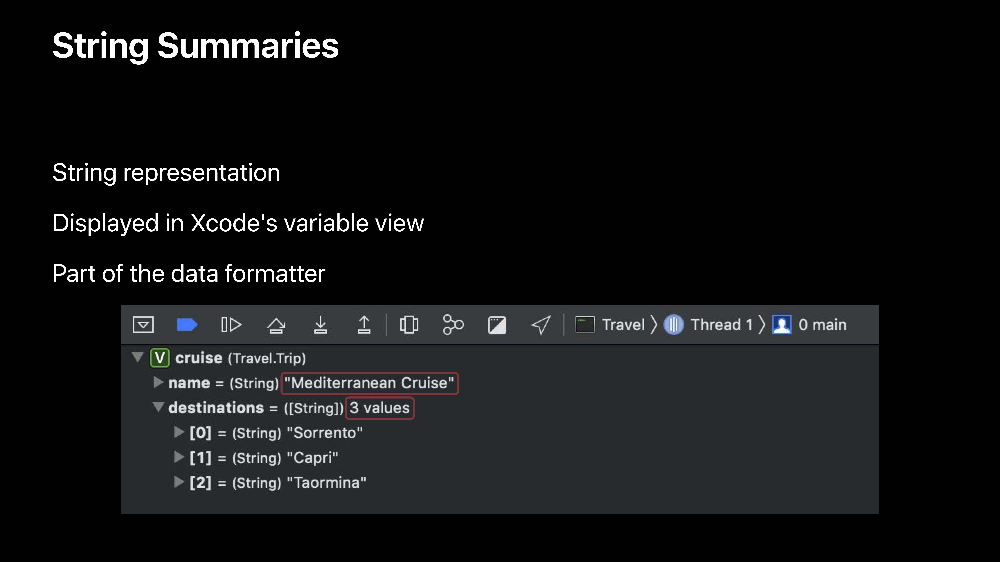
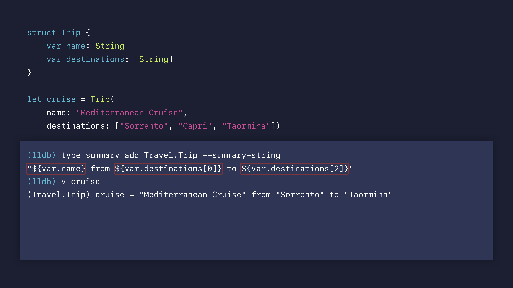
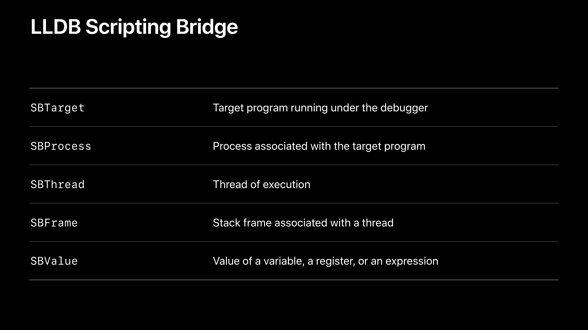
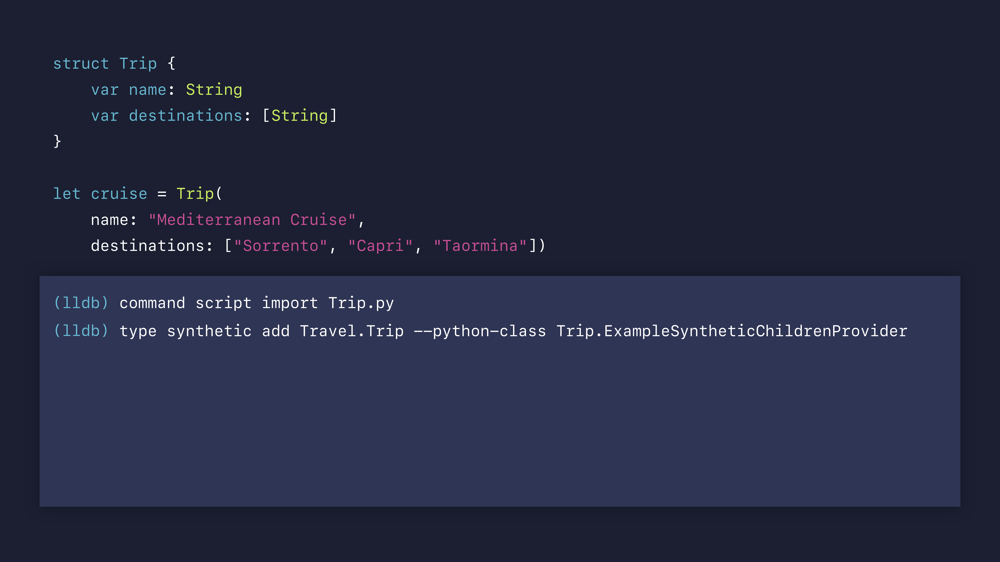

# [LLDB: Beyond "po"](https://developer.apple.com/videos/play/wwdc2019/429/)

@ WWDC 19


`po`: print object description

`CustomDebugStringConvertible` 프로토콜을 채택하고, `debugDescription` 을 작성하면 기본 description 대신 `debugDescription` 이 보여진다.

`po` 는 `expression --object-description`의 alias이다.

```
command alias my_po expression --object-description
```

으로 `po` 대신 `my_po`를 사용할 수도 있다.



이런 방식으로 `po`가 작동한다. 컴파일 코드를 생성하고 있기 때문에 실행을 시켜볼 수 있다는 이점을 가진다.


`po` 말고 `p` command를 사용하기도 한다. `$R0`, `$R1` 과 같은 표현을 볼 수 있다.

`po`와 마찬가지로 `p`도 `expression`의 alias이다.



`p`는 상대적으로 `po`보다 거치게 되는 프로세스가 짧다. 실행 속도도 `po`에 비해 이점이 있다. 하지만 런타임에 아래와 같은 타입 추론이 불가능하다.




`v`는 `p`보다 조금 더 빠르다. 그 이유는 컴파일을 하지 않기 때문이다. 하지만 컴파일을 하지 않고 있기 때문에 직접 코드를 실행시켜보는 것은 불가능하다.




각 키워드의 특징을 요약하자면 다음과 같다.




### Customizing Data Formatters

기본적인 data formatter는 이미 훌륭해서 직접 만든 클래스에 대해서나 애플이 제공하는 클래스에서나 데이터들을 잘 보여주고 있다. 하지만 debugging을 할 때 보여지는 data들이 어떻게 보여질 지에 대해 data formatter를 커스텀해서 결정할 수 있다.

* filters
* string summaries
* synthetic children


#### filters

filter를 추가하고 삭제하는 예시




#### String summaries

Xcode의 variable view에 나오는 내용을 커스텀한다.






#### Python Formatter

Python 3를 이용해서 LLDB의 Python API에 접근하면 좀 더 정교한 formatting이 가능하다.



script 키워드를 이용하면 python formatting을 시작할 수 있다.

```
command script import Trip.py
```
위와 같은 키워드를 이용하면 script import도 가능하다.


#### Synthetic Children

Python API를 이용해서 children을 커스텀한다. 


