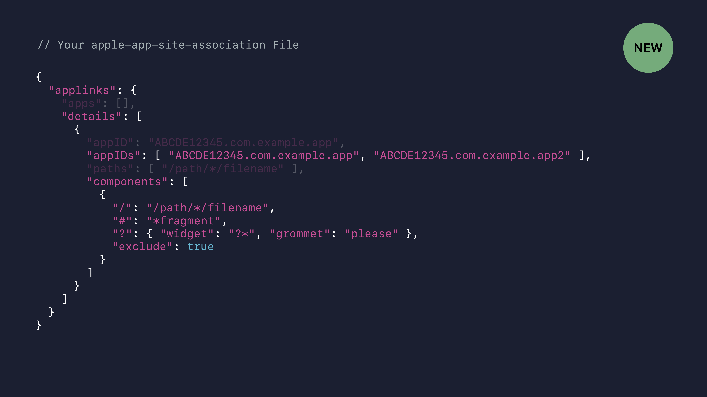
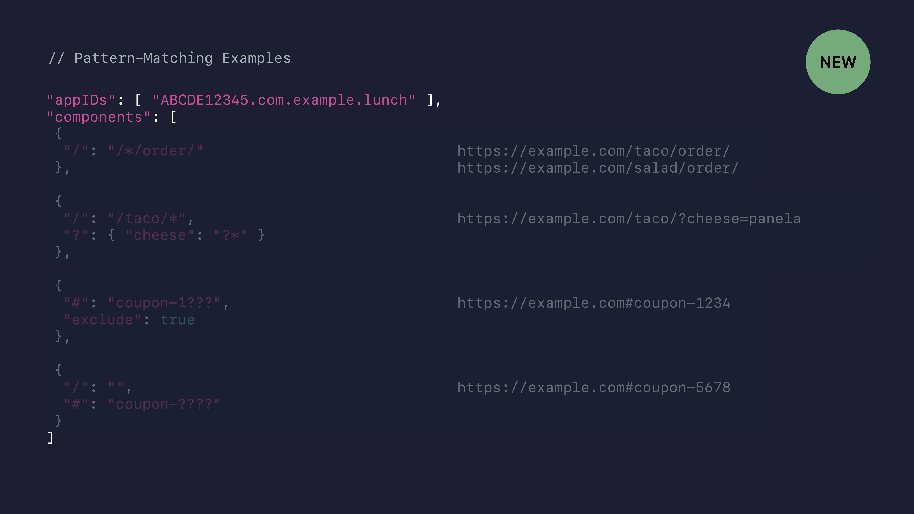

# [What's New in Universal Links](https://developer.apple.com/videos/play/wwdc2019/717/)

@ WWDC 19


### Overview

* URLs that represent your content both on the Web and in your app
* Available in your iOS, tvOS, and macOS apps
* Securely associated between your app and your website
* Recommended over custom URL schemes


### Configuring Your Web Server

* Install a valid HTTPS certificate (HTTP is not secure and cannot be used to validate an association between app and website.)

* Add your apple-appp-site-association file (json file)

  * ```
    https://example.com/.well-known/apple-aapp-site-association
    ```







### Configuring Your Web Server

* URLs and pattern-matching are ASCII

* Reduce download size when internationalizing

  * ```
    { "en", "fr", "mx", ... } -> "??"
    { "en_US", "fr_CA", "de_CH", ... } -> "??_??"
    ```

* iOS and macOS prioritize downloads from .com, .net, .org, and the user's ccTLD(s)


### Configure Your App

```
<array>
	<string>applinks:www.example.com</string>
	<string>applinks:*.example.com</string>
	<string>appliinks:xn--fhqz97e.example.xn--fiqs8x</string><!--上海海.example.中国-->
</array>
```

* More specific subdomains have higher priority
* Internationalized domains must be encoded as Punycode


```swift
// Confguring Your app
func applicatioin(_ application: UIApplication, continue userActivity: NSUserActivity, reestorationHandler: @escaping ([UIUserActivityRestoring]?) -> Void) -> Bool {
  guard userActivity.activityType == NSUserActivityTypeBrowsingWeb,
  	let url = userActivity.webpageURL,
  	let components = URLComponents(url: url, resolvingAgainstBaseURL: true) else {
      return false
    }
  
  for queryItem in components.queryItems ?? [] {
    ...
  }
  
  return true
}
```


### Configuring Your App

* Open in the browsing by default
* App must be on a local volume
* App store distribution recommended
* Developer ID-signed apps must be launched first


#### Opening Universal Links

```swift
UIApplication.shared.open(url, options: [.universalLinksOnly: true]) {
  ...
}
```

```swift
let configuration = NSWorkspace.OpenConfiguraation()
configuration.requiresUniversalLinks = true
NSWorkspace.shared.open(url, configuration: configuration) {
  ...
}
```


### Best Practices

* Fail gracefully
* Use the Smart App Banner
* Feedback is appreciated!